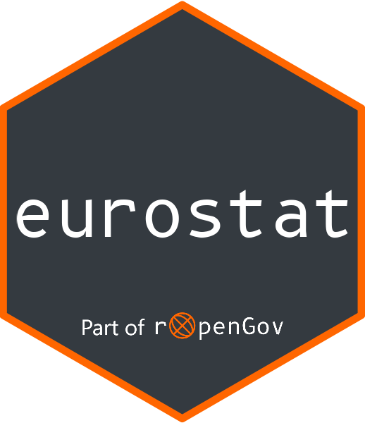

<!-- README.md is generated from README.Rmd. Please edit that file -->
<!-- badges: start -->

<!---->
<!---->
<!---->
<!---->
<!--[![PRs Welcome][prs-badge]][prs]-->
<!--[![Code of Conduct][coc-badge]][coc]-->
<!---->
<!---->
<!---->
<!---->
<!-- badges: end -->

# eurostat R package 

R tools to access open data from
[Eurostat](https://ec.europa.eu/eurostat). Data search, download,
manipulation and visualization.

### Installation and use

Install stable version from CRAN:

    install.packages("eurostat")

Alternatively, install development version from GitHub:

    # Install from GitHub
    library(devtools)
    devtools::install_github("ropengov/eurostat")

Development version can be also installed using the
[r-universe](https://ropengov.r-universe.dev):

    # Enable this universe
    options(repos = c(
      ropengov = "https://ropengov.r-universe.dev",
      CRAN = "https://cloud.r-project.org"
    ))

    install.packages("eurostat")

The package provides several different ways to get datasets from
Eurostat. Searching for data is one way, if you know what to look for.

    # Load the package
    library(eurostat)

    # Perform a simple search and print a table
    passengers <- search_eurostat("passenger transport")
    knitr::kable(head(passengers))

<table>
<colgroup>
<col style="width: 43%" />
<col style="width: 6%" />
<col style="width: 4%" />
<col style="width: 10%" />
<col style="width: 14%" />
<col style="width: 5%" />
<col style="width: 4%" />
<col style="width: 4%" />
<col style="width: 5%" />
</colgroup>
<thead>
<tr class="header">
<th style="text-align: left;">title</th>
<th style="text-align: left;">code</th>
<th style="text-align: left;">type</th>
<th style="text-align: left;">last.update.of.data</th>
<th style="text-align: left;">last.table.structure.change</th>
<th style="text-align: left;">data.start</th>
<th style="text-align: left;">data.end</th>
<th style="text-align: right;">values</th>
<th style="text-align: right;">hierarchy</th>
</tr>
</thead>
<tbody>
<tr class="odd">
<td style="text-align: left;">Air passenger transport - ENP-South
countries</td>
<td style="text-align: left;">enps_avia_pa</td>
<td style="text-align: left;">dataset</td>
<td style="text-align: left;">05.03.2026</td>
<td style="text-align: left;">05.03.2026</td>
<td style="text-align: left;">2005</td>
<td style="text-align: left;">2025</td>
<td style="text-align: right;">425</td>
<td style="text-align: right;">6</td>
</tr>
<tr class="even">
<td style="text-align: left;">Air passenger transport by type of
schedule, transport coverage and country</td>
<td style="text-align: left;">avia_paoc</td>
<td style="text-align: left;">dataset</td>
<td style="text-align: left;">17.09.2026</td>
<td style="text-align: left;">10.09.2026</td>
<td style="text-align: left;">1993</td>
<td style="text-align: left;">2026-Q2</td>
<td style="text-align: right;">2666317</td>
<td style="text-align: right;">5</td>
</tr>
<tr class="odd">
<td style="text-align: left;">Air passenger transport by type of
schedule, transport coverage and main airports</td>
<td style="text-align: left;">avia_paoa</td>
<td style="text-align: left;">dataset</td>
<td style="text-align: left;">17.09.2026</td>
<td style="text-align: left;">14.09.2026</td>
<td style="text-align: left;">1993</td>
<td style="text-align: left;">2026-Q2</td>
<td style="text-align: right;">22395010</td>
<td style="text-align: right;">5</td>
</tr>
<tr class="even">
<td style="text-align: left;">Air passenger transport between reporting
and partner countries by type of schedule</td>
<td style="text-align: left;">avia_paocc</td>
<td style="text-align: left;">dataset</td>
<td style="text-align: left;">17.09.2026</td>
<td style="text-align: left;">10.09.2026</td>
<td style="text-align: left;">1993</td>
<td style="text-align: left;">2026-Q2</td>
<td style="text-align: right;">11696875</td>
<td style="text-align: right;">5</td>
</tr>
<tr class="odd">
<td style="text-align: left;">Air passenger transport between main
airports and partner reporting countries</td>
<td style="text-align: left;">avia_paoac</td>
<td style="text-align: left;">dataset</td>
<td style="text-align: left;">17.09.2026</td>
<td style="text-align: left;">14.09.2026</td>
<td style="text-align: left;">1993</td>
<td style="text-align: left;">2026-Q2</td>
<td style="text-align: right;">22026776</td>
<td style="text-align: right;">5</td>
</tr>
<tr class="even">
<td style="text-align: left;">Air passenger transport by aircraft model,
distance bands and transport coverage</td>
<td style="text-align: left;">avia_paodis</td>
<td style="text-align: left;">dataset</td>
<td style="text-align: left;">03.12.2025</td>
<td style="text-align: left;">29.10.2025</td>
<td style="text-align: left;">2008</td>
<td style="text-align: left;">2024</td>
<td style="text-align: right;">907536</td>
<td style="text-align: right;">5</td>
</tr>
</tbody>
</table>

See the
[Tutorial](https://ropengov.github.io/eurostat/articles/articles/eurostat_tutorial.html)
and other resources at the [package
homepage](https://ropengov.github.io/eurostat/) for more information and
examples.

### Recommended packages

It is recommended to install the `giscoR` package
(<https://dieghernan.github.io/giscoR/>). This is another API package
that provides R tools for Eurostat geographic data to support geospatial
analysis and visualization.

### Contribute

Contributions are very welcome:

-   [Use issue tracker](https://github.com/ropengov/eurostat/issues) for
    feedback and bug reports.
-   [Send pull requests](https://github.com/ropengov/eurostat/)
-   [Discuss with developers and other users in GitHub
    Discussions](https://github.com/rOpenGov/eurostat/discussions)
-   [Star us on the Github page](https://github.com/ropengov/eurostat/)

### Acknowledgements

**Kindly cite this work** as follows:

    print(citation("eurostat"), bibtex = TRUE)
    Kindly cite this package by citing the following R Journal article:

      Lahti L., Huovari J., Kainu M., and Biecek P. (2017). Retrieval and
      analysis of Eurostat open data with the eurostat package. The R
      Journal 9(1), pp. 385-392. doi: 10.32614/RJ-2017-019

    A BibTeX entry for LaTeX users is

      @Article{10.32614/RJ-2017-019,
        title = {Retrieval and Analysis of Eurostat Open Data with the eurostat Package},
        author = {Leo Lahti and Janne Huovari and Markus Kainu and Przemyslaw Biecek},
        journal = {The R Journal},
        volume = {9},
        number = {1},
        pages = {385--392},
        year = {2017},
        doi = {10.32614/RJ-2017-019},
        url = {https://doi.org/10.32614/RJ-2017-019},
      }

    In addition, please provide a citation to the specific software version
    used:

      Lahti L, Huovari J, Kainu M, Biecek P, Hernangomez D, Antal D,
      Kantanen P (2026). "eurostat: Tools for Eurostat Open Data."
      doi:10.32614/CRAN.package.eurostat
      <https://doi.org/10.32614/CRAN.package.eurostat>. R package version
      4.1.1, <https://github.com/rOpenGov/eurostat>.

    A BibTeX entry for LaTeX users is

      @Misc{R-eurostat,
        title = {eurostat: Tools for Eurostat Open Data},
        doi = {10.32614/CRAN.package.eurostat},
        author = {Leo Lahti and Janne Huovari and Markus Kainu and Przemyslaw Biecek and Diego Hernangomez and Daniel Antal and Pyry Kantanen},
        url = {https://github.com/rOpenGov/eurostat},
        type = {Computer software},
        year = {2026},
        note = {R package version 4.1.1},
      }

We are grateful to all
[contributors](https://github.com/ropengov/eurostat/graphs/contributors),
including Daniel Antal, Joona Lehtomäki, Francois Briatte, and Oliver
Reiter, and for the [Eurostat](https://ec.europa.eu/eurostat/) open data
portal! This project is part of [rOpenGov](https://ropengov.org).

This project has received funding from the European Union under grant No
101095295 (OpenMUSE), the FIN-CLARIAH research infrastructure and the
Strategic Research Council’s YOUNG program by the Research Council of
Finland (decisions 345630, 358720, 367756, 352604).

### Disclaimer

This package is in no way officially related to or endorsed by Eurostat.

When using data retrieved from Eurostat database in your work, please
indicate that the data source is Eurostat. If your re-use involves some
kind of modification to data or text, please state this clearly to the
end user. See Eurostat policy on [copyright and free re-use of
data](https://ec.europa.eu/eurostat/help/copyright-notice) for more
detailed information and certain exceptions.
