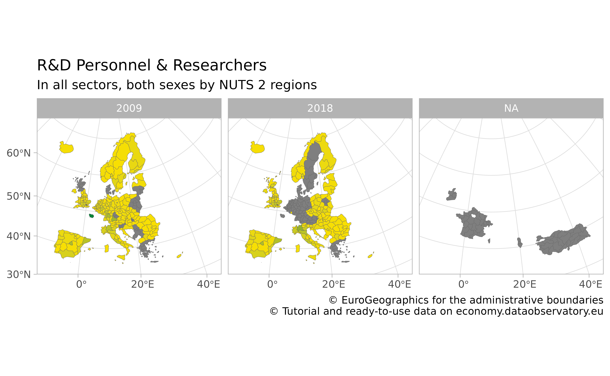
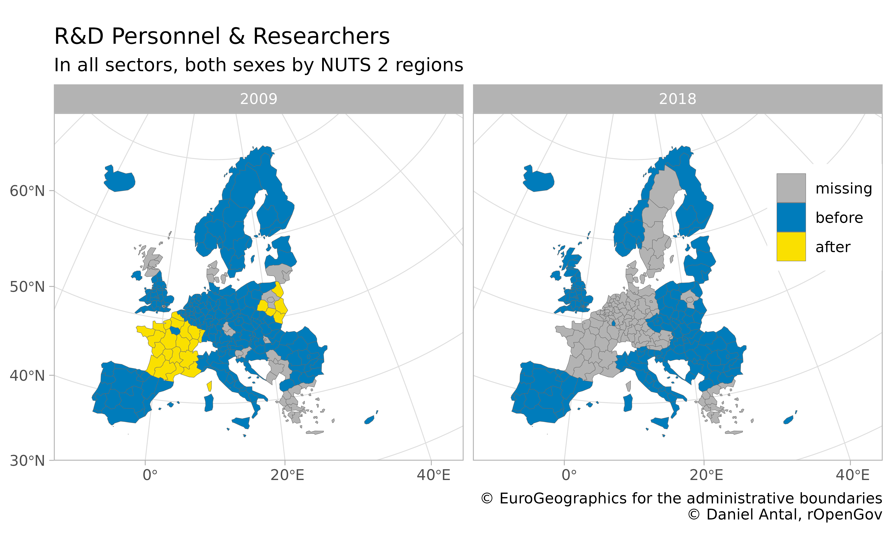

# Mapping Regional Data, Mapping Metadata Problems

The [regions](https://regions.dataobservatory.eu/) package offers tools
two work with regional statistics. It is an offspring of the
[eurostat](https://ropengov.github.io/eurostat/) package of
[rOpenGov](https://ropengov.org/), which offers data search, download,
manipulation and visualization for Eurostat’s [European
statistics](https://ec.europa.eu/eurostat). While you can use
[regions](https://regions.dataobservatory.eu/) for any European regional
statistics, and with a limited functionality, any regional statistics
from other parts of the world, this article provides a combined use case
for the two packages.

``` r
library(regions)
library(eurostat)
library(dplyr)
#> 
#> Attaching package: 'dplyr'
#> The following objects are masked from 'package:stats':
#> 
#>     filter, lag
#> The following objects are masked from 'package:base':
#> 
#>     intersect, setdiff, setequal, union
```

Eurostat’s main function for data access is
[`get_eurostat()`](https://ropengov.github.io/eurostat/reference/get_eurostat.md),
but in this case we will use the more specific
[`get_eurostat_json()`](https://ropengov.github.io/eurostat/reference/get_eurostat_json.md)
to avoid downloading unnecessary aspects of this data product. Let us
get a long-established regional dataset, the full-time equivalent (FTE)
R&D workforce, in both sexes, in all sectors and all professional
positions, and limit our data to two years only:

``` r
regional_rd_personnel <- get_eurostat_json(
  id = "rd_p_persreg",
  filters = list(
    sex = "T",
    prof_pos = "TOTAL",
    sectperf = "TOTAL",
    unit = "FTE"
  )
)

regional_rd_personnel <- regional_rd_personnel %>%
  filter(time %in% c("2009", "2018"))
```

We have saved this filtered datasets as
[`regions::regional_rd_personnel`](https://regions.dataobservatory.eu/reference/regional_rd_personnel.html)
in the [regions](https://regions.dataobservatory.eu/) package.

``` r
data("regional_rd_personnel")
```

We have quiet a few missing cases:

``` r
summary(is.na(regional_rd_personnel$values))
#>    Mode   FALSE    TRUE 
#> logical     673     283
```

But this is not the only problem with the dataset.

### Choropleth Map

Let us try to place the data on a `ggplot2` map.

``` r
library(ggplot2)
```

Let us download a map with
[`get_eurostat_geospatial()`](https://ropengov.github.io/eurostat/reference/get_eurostat_geospatial.md).
We will use the `NUTS2016`, i.e., `year = 2016`, which is the regional
boundary definition set in 2016 and used in the period 2018-2020. This
is the most used definition in 2021.

``` r
# Need to load sf for using dplyr methods with sf objects
library(sf)
#> Linking to GEOS 3.12.1, GDAL 3.8.4, PROJ 9.4.0; sf_use_s2() is TRUE

map_nuts_2 <- get_eurostat_geospatial(
  resolution = "60", nuts_level = "2",
  year = 2016
)
#> Extracting data from eurostat::eurostat_geodata_60_2016
```

You should always join your data with the geometric information of the
regions starting from left with the map:

``` r
indicator_with_map <- map_nuts_2 %>%
  left_join(regional_rd_personnel, by = "geo")
```

Huge parts of Europe are not covered, but the missing values are not
randomly missing. France went under a regional reform; Turkey and
Albania did not provide this data earlier. Ireland has no regional
statistics available.

``` r
indicator_with_map %>%
  ggplot() +
  geom_sf(aes(fill = values),
    color = "dim grey", linewidth = .1
  ) +
  scale_fill_gradient(low = "#FAE000", high = "#00843A") +
  facet_wrap(facets = "time") +
  labs(
    title = "R&D Personnel & Researchers",
    subtitle = "In all sectors, both sexes by NUTS 2 regions",
    caption = "\ua9 EuroGeographics for the administrative boundaries
                \ua9 Tutorial and ready-to-use data on economy.dataobservatory.eu",
    fill = NULL
  ) +
  theme_light() +
  theme(legend.position = "none") +
  coord_sf(
    xlim = c(2377294, 7453440),
    ylim = c(1313597, 5628510),
    crs = 3035
  )
```



### Missing Values and Seemingly Missing Values

Some of these problems are real missing data problems, but some of them
are coding problem. In other words, the data is there, but it is not
conforming the boundaries that you have on the `NUTS2016` map. First we
need to validate the geographical coding of the dataset. This is the
task of
[`regions::validate_nuts_regions()`](https://regions.dataobservatory.eu/reference/validate_nuts_regions.html).

``` r
validated_indicator <- regions::validate_nuts_regions(regional_rd_personnel)
```

If we validate the dataset, we will see many interesting metadata
observations.

``` r
library(dplyr)
validation_summary_2016 <- validated_indicator %>%
  group_by(time, typology) %>%
  summarize(
    observations = n(),
    values_missing = sum(is.na(values)),
    values_present = sum(!is.na(values)),
    valid_present = values_present / observations
  )
```

Even though the dataset is called [R&D personnel and researchers by
sector of performance, sex and NUTS 2 regions
(rd_p_persreg)](https://appsso.eurostat.ec.europa.eu/nui/show.do?dataset=rd_p_persreg&lang=en),
in fact, it contains data on country and `NUTS1` levels. And it has data
on non-EU countries that in 2009 were not part of the NUTS system.

``` r
validation_summary_2016 %>%
  ungroup() %>%
  filter(time == "2009")
#> # A tibble: 7 × 6
#>   time  typology        observations values_missing values_present valid_present
#>   <chr> <chr>                  <int>          <int>          <int>         <dbl>
#> 1 2009  country                   28              1             27         0.964
#> 2 2009  non_eu_country             7              2              5         0.714
#> 3 2009  non_eu_nuts_le…            7              4              3         0.429
#> 4 2009  non_eu_nuts_le…           10              5              5         0.5  
#> 5 2009  nuts_level_1             105             14             91         0.867
#> 6 2009  nuts_level_2             265             49            216         0.815
#> 7 2009  NA                        56              3             53         0.946
```

The situation is not better in 2018:

``` r
validation_summary_2016 %>%
  ungroup() %>%
  filter(time == "2018")
#> # A tibble: 7 × 6
#>   time  typology        observations values_missing values_present valid_present
#>   <chr> <chr>                  <int>          <int>          <int>         <dbl>
#> 1 2018  country                   28              0             28         1    
#> 2 2018  non_eu_country             7              1              6         0.857
#> 3 2018  non_eu_nuts_le…            7              1              6         0.857
#> 4 2018  non_eu_nuts_le…           10              0             10         1    
#> 5 2018  nuts_level_1             105             45             60         0.571
#> 6 2018  nuts_level_2             265            113            152         0.574
#> 7 2018  NA                        56             45             11         0.196
```

The dataset is plagued with data that has no place in the `NUTS2016`
boundary definition, and therefore on a `NUTS2016` map!

What are the non-conforming bits?

``` r
validated_indicator %>%
  filter(!valid_2016) %>%
  pull(geo)
#>   [1] "BA"        "BA"        "CN_X_HK"   "CN_X_HK"   "EA19"      "EA19"     
#>   [7] "EU27_2020" "EU27_2020" "EU28"      "EU28"      "FR2"       "FR2"      
#>  [13] "FR21"      "FR21"      "FR22"      "FR22"      "FR23"      "FR23"     
#>  [19] "FR24"      "FR24"      "FR25"      "FR25"      "FR26"      "FR26"     
#>  [25] "FR3"       "FR3"       "FR30"      "FR30"      "FR4"       "FR4"      
#>  [31] "FR41"      "FR41"      "FR42"      "FR42"      "FR43"      "FR43"     
#>  [37] "FR5"       "FR5"       "FR51"      "FR51"      "FR52"      "FR52"     
#>  [43] "FR53"      "FR53"      "FR6"       "FR6"       "FR61"      "FR61"     
#>  [49] "FR62"      "FR62"      "FR63"      "FR63"      "FR7"       "FR7"      
#>  [55] "FR71"      "FR71"      "FR72"      "FR72"      "FR8"       "FR8"      
#>  [61] "FR81"      "FR81"      "FR82"      "FR82"      "FR83"      "FR83"     
#>  [67] "FRA"       "FRA"       "HR02"      "HR02"      "HU10"      "HU10"     
#>  [73] "IE01"      "IE01"      "IE02"      "IE02"      "JP"        "JP"       
#>  [79] "KR"        "KR"        "LT00"      "LT00"      "NO01"      "NO01"     
#>  [85] "NO03"      "NO03"      "NO04"      "NO04"      "NO05"      "NO05"     
#>  [91] "PL1"       "PL1"       "PL11"      "PL11"      "PL12"      "PL12"     
#>  [97] "PL3"       "PL3"       "PL31"      "PL31"      "PL32"      "PL32"     
#> [103] "PL33"      "PL33"      "PL34"      "PL34"      "RU"        "RU"       
#> [109] "UKM2"      "UKM2"      "UKM3"      "UKM3"
```

- Plenty of French units. France went under a regional administrative
  reform, and we have data about its past, but not in the current
  boundaries and coding.
- To a lesser extent, we have the same problem with Poland and the UK.
- We have comparative data from Asia on country level, which ended up in
  a regional dataset.
- We have Norway, which is a member of the EEA, and from 2021 it is
  officially part of the NUTS2021 system. They were nice to provide
  their data consistently for the past.
- We have aggregates like the entire EU or the eurozone.

### Recoding and Renaming

The question is, can we save some of the French data? If the boundaries
of regions changed, then we cannot: somebody must reaggregate the number
of researchers who used to work in the newly defined region back then,
before the reform.

But in some cases, the regional boundaries did not change, only the name
and the code of the region, which is the task performed by
[`regions::recode_nuts()`](https://regions.dataobservatory.eu/reference/recode_nuts.html):

``` r
recoded_indicator <- regional_rd_personnel %>%
  regions::recode_nuts(
    geo_var = "geo", # your geograhical ID variable name
    nuts_year = 2016 # change this for other definitions
  )
```

``` r
recoding_summary <- recoded_indicator %>%
  mutate(observations = nrow(.data)) %>%
  mutate(typology_change = ifelse(grepl("Recoded", typology_change),
    yes = "Recoded",
    no = typology_change
  )) %>%
  group_by(typology_change, time) %>%
  summarize(
    values_missing = sum(is.na(values)),
    values_present = sum(!is.na(values)),
    pct = values_present / (values_present + values_missing)
  )
```

Let us take a look at the problems identified by
[`regions::recode_nuts()`](https://regions.dataobservatory.eu/reference/recode_nuts.html):

``` r
recoding_summary
#> # A tibble: 12 × 5
#> # Groups:   typology_change [6]
#>    typology_change        time  values_missing values_present   pct
#>    <chr>                  <chr>          <int>          <int> <dbl>
#>  1 Not found in NUTS      2009               1             11 0.917
#>  2 Not found in NUTS      2018               1             11 0.917
#>  3 Recoded                2009              12             42 0.778
#>  4 Recoded                2018              32             22 0.407
#>  5 Used in NUTS 1999-2013 2009               1              7 0.875
#>  6 Used in NUTS 1999-2013 2018               8              0 0    
#>  7 Used in NUTS 2006-2013 2009               0              5 1    
#>  8 Used in NUTS 2006-2013 2018               5              0 0    
#>  9 Used in NUTS 2021-2021 2009               0              1 1    
#> 10 Used in NUTS 2021-2021 2018               1              0 0    
#> 11 unchanged              2009              64            334 0.839
#> 12 unchanged              2018             158            240 0.603
```

- We were able to recode quite a few data points to the `NUTS2016`
  definition for the time of observation 2009 as well as 2018. Sometimes
  we are recoding rows that have missing values, which does not help
  that much: we know where the data should be, but it is missing anyway.
  But particularly for the year 2009 we can save plenty of data by
  recorded the obsolete coding.

- We identify further problems. We have coding the that was used in
  various time periods, but there is no clear recoding possibility,
  because the regions boundaries have changed. To have the history of
  the data, we would need to recalculate them, say, by adding up the R&D
  personnel from each settlement in the new regional boundary.

The following non-empty cases were present in the dataset, just not with
the coding that we used in the 2018-2020 period (i.e., the `NUTS2016`
coding.) We are able to save 27 observations just by fixing the regional
codes!

``` r
recoded_indicator %>%
  filter(typology == "nuts_level_2") %>%
  filter(!is.na(typology_change)) %>%
  filter(
    # Keep only pairs where we actually save
    # non-missing observations
    !is.na(values)
  ) %>%
  distinct(geo, code_2016) %>%
  filter(
    # We filter out cases of countries who
    # joined the NUTS system later
    geo != code_2016
  )
#> # A tibble: 27 × 2
#>    geo   code_2016
#>    <chr> <chr>    
#>  1 FR21  FRF2     
#>  2 FR22  FRE2     
#>  3 FR23  FRD2     
#>  4 FR24  FRB0     
#>  5 FR25  FRD1     
#>  6 FR26  FRC1     
#>  7 FR3   FRE1     
#>  8 FR30  FRE1     
#>  9 FR41  FRF3     
#> 10 FR42  FRF1     
#> # ℹ 17 more rows
```

So, let us do the trick: change the `geo` variable to `code_2016`, which
is, whenever there is an equivalent `geo` code in the `NUTS2016`
definition, the data that you should have. Your original `geo` variable
contains codes that were used, for example, in the `NUTS2010` or
`NUTS2013` boundary definitions.

``` r
recoded_with_map <- map_nuts_2 %>%
  left_join(
    recoded_indicator %>%
      mutate(geo = code_2016),
    by = "geo"
  )
```

Let us make our work visible by creating three observation `type`
variables:

- `missing` which is not present in the dataset;
- `before` which were correctly coded before our recoding;
- `after` which became visible after recoding.

``` r
regional_rd_personnel_recoded <- recoded_indicator %>%
  mutate(geo = code_2016) %>%
  rename(values_2016 = values) %>%
  select(-typology, -typology_change, -code_2016) %>%
  full_join(
    regional_rd_personnel,
    by = c("prof_pos", "sex", "sectperf", "unit", "geo", "time")
  ) %>%
  mutate(type = case_when(
    is.na(values_2016) & is.na(values) ~ "missing",
    is.na(values) ~ "after",
    TRUE ~ "before"
  ))
```

And let’s place it now on the map:

``` r
map_nuts_2 %>%
  left_join(regional_rd_personnel_recoded, by = "geo") %>%
  # remove completely missing cases
  filter(!is.na(time)) %>%
  ggplot() +
  geom_sf(aes(fill = type),
    color = "dim grey", linewidth = .1
  ) +
  scale_fill_manual(values = c("#FAE000", "#007CBB", "grey70")) +
  guides(fill = guide_legend(reverse = T, title = NULL)) +
  facet_wrap(facets = "time") +
  labs(
    title = "R&D Personnel & Researchers",
    subtitle = "In all sectors, both sexes by NUTS 2 regions",
    caption = "\ua9 EuroGeographics for the administrative boundaries
                \ua9 Daniel Antal, rOpenGov",
    fill = NULL
  ) +
  theme_light() +
  theme(legend.position = c(.93, .7)) +
  coord_sf(
    xlim = c(2377294, 7453440),
    ylim = c(1313597, 5628510),
    crs = 3035
  )
```



### Conclusion

We did improve our dataset, and this improvement would not have worked
with traditional imputation techniques very well. For example, replacing
the missing French data with the median value of Europe would have
created a huge bias in our dataset.

This example is a simplification. There are many territorial typologies
in use in Europe and globally, but the main takeaway is clear:
sub-national boundaries are changing very fast, and you must make sure
that you join datasets, or data with a map with the same boundary
definitions.

## Citations and related work

#### Citing the data sources

Eurostat data: cite [Eurostat](https://ec.europa.eu/eurostat/).

Administrative boundaries: cite
[EuroGeographics](https://ec.europa.eu/eurostat/web/gisco/geodata/reference-data/administrative-units-statistical-units).

#### Citing the eurostat R package

For main developers and contributors, see the [package
homepage](https://ropengov.github.io/eurostat).

This work can be freely used, modified and distributed under the
BSD-2-clause (modified FreeBSD) license:

``` r
citation("eurostat")
#> Kindly cite the eurostat R package as follows:
#> 
#>   Lahti L., Huovari J., Kainu M., and Biecek P. (2017). Retrieval and
#>   analysis of Eurostat open data with the eurostat package. The R
#>   Journal 9(1), pp. 385-392. doi: 10.32614/RJ-2017-019
#> 
#>   Lahti, L., Huovari J., Kainu M., Biecek P., Hernangomez D., Antal D.,
#>   and Kantanen P. (2023). eurostat: Tools for Eurostat Open Data
#>   [Computer software]. R package version 4.0.0.
#>   https://github.com/rOpenGov/eurostat
#> 
#> To see these entries in BibTeX format, use 'print(<citation>,
#> bibtex=TRUE)', 'toBibtex(.)', or set
#> 'options(citation.bibtex.max=999)'.
```

#### Citing the regions R package

For main developer and contributors, see the
[package](https://regions.dataobservatory.eu/).

This work can be freely used, modified and distributed under the GPL-3
license:

``` r
citation("regions")
#> To cite package 'regions' in publications use:
#> 
#>   Antal D (2021). _regions: Processing Regional Statistics_. R package
#>   version 0.1.8, <https://regions.dataobservatory.eu/>.
#> 
#> A BibTeX entry for LaTeX users is
#> 
#>   @Manual{,
#>     title = {regions: Processing Regional Statistics},
#>     author = {Daniel Antal},
#>     year = {2021},
#>     note = {R package version 0.1.8},
#>     url = {https://regions.dataobservatory.eu/},
#>   }
```

#### Contact

For contact information, see the [package
homepage](https://ropengov.github.io/eurostat).

## Version info

This tutorial was created with

``` r
sessioninfo::session_info()
#> ─ Session info ───────────────────────────────────────────────────────────────
#>  setting  value
#>  version  R version 4.5.2 (2025-10-31)
#>  os       Ubuntu 24.04.3 LTS
#>  system   x86_64, linux-gnu
#>  ui       X11
#>  language en
#>  collate  C.UTF-8
#>  ctype    C.UTF-8
#>  tz       UTC
#>  date     2026-02-01
#>  pandoc   3.1.11 @ /opt/hostedtoolcache/pandoc/3.1.11/x64/ (via rmarkdown)
#>  quarto   NA
#> 
#> ─ Packages ───────────────────────────────────────────────────────────────────
#>  package      * version  date (UTC) lib source
#>  assertthat     0.2.1    2019-03-21 [1] RSPM
#>  backports      1.5.0    2024-05-23 [1] RSPM
#>  bibtex         0.5.1    2023-01-26 [1] RSPM
#>  bslib          0.10.0   2026-01-26 [1] RSPM
#>  cachem         1.1.0    2024-05-16 [1] RSPM
#>  cellranger     1.1.0    2016-07-27 [1] RSPM
#>  class          7.3-23   2025-01-01 [3] CRAN (R 4.5.2)
#>  classInt       0.4-11   2025-01-08 [1] RSPM
#>  cli            3.6.5    2025-04-23 [1] RSPM
#>  countrycode    1.6.1    2025-03-31 [1] RSPM
#>  curl           7.0.0    2025-08-19 [1] RSPM
#>  data.table     1.18.2.1 2026-01-27 [1] RSPM
#>  DBI            1.2.3    2024-06-02 [1] RSPM
#>  desc           1.4.3    2023-12-10 [1] RSPM
#>  digest         0.6.39   2025-11-19 [1] RSPM
#>  dplyr        * 1.1.4    2023-11-17 [1] RSPM
#>  e1071          1.7-17   2025-12-18 [1] RSPM
#>  eurostat     * 4.0.0    2026-02-01 [1] local
#>  evaluate       1.0.5    2025-08-27 [1] RSPM
#>  farver         2.1.2    2024-05-13 [1] RSPM
#>  fastmap        1.2.0    2024-05-15 [1] RSPM
#>  fs             1.6.6    2025-04-12 [1] RSPM
#>  generics       0.1.4    2025-05-09 [1] RSPM
#>  ggplot2      * 4.0.1    2025-11-14 [1] RSPM
#>  glue           1.8.0    2024-09-30 [1] RSPM
#>  gtable         0.3.6    2024-10-25 [1] RSPM
#>  here           1.0.2    2025-09-15 [1] RSPM
#>  hms            1.1.4    2025-10-17 [1] RSPM
#>  htmltools      0.5.9    2025-12-04 [1] RSPM
#>  htmlwidgets    1.6.4    2023-12-06 [1] RSPM
#>  httr           1.4.7    2023-08-15 [1] RSPM
#>  httr2          1.2.2    2025-12-08 [1] RSPM
#>  ISOweek        0.6-2    2011-09-07 [1] RSPM
#>  jquerylib      0.1.4    2021-04-26 [1] RSPM
#>  jsonlite       2.0.0    2025-03-27 [1] RSPM
#>  KernSmooth     2.23-26  2025-01-01 [3] CRAN (R 4.5.2)
#>  knitr          1.51     2025-12-20 [1] RSPM
#>  labeling       0.4.3    2023-08-29 [1] RSPM
#>  lifecycle      1.0.5    2026-01-08 [1] RSPM
#>  lubridate      1.9.4    2024-12-08 [1] RSPM
#>  magrittr       2.0.4    2025-09-12 [1] RSPM
#>  otel           0.2.0    2025-08-29 [1] RSPM
#>  pillar         1.11.1   2025-09-17 [1] RSPM
#>  pkgconfig      2.0.3    2019-09-22 [1] RSPM
#>  pkgdown        2.2.0    2025-11-06 [1] any (@2.2.0)
#>  plyr           1.8.9    2023-10-02 [1] RSPM
#>  proxy          0.4-29   2025-12-29 [1] RSPM
#>  purrr          1.2.1    2026-01-09 [1] RSPM
#>  R.cache        0.17.0   2025-05-02 [1] RSPM
#>  R.methodsS3    1.8.2    2022-06-13 [1] RSPM
#>  R.oo           1.27.1   2025-05-02 [1] RSPM
#>  R.utils        2.13.0   2025-02-24 [1] RSPM
#>  R6             2.6.1    2025-02-15 [1] RSPM
#>  ragg           1.5.0    2025-09-02 [1] RSPM
#>  rappdirs       0.3.4    2026-01-17 [1] RSPM
#>  RColorBrewer   1.1-3    2022-04-03 [1] RSPM
#>  Rcpp           1.1.1    2026-01-10 [1] RSPM
#>  readr          2.1.6    2025-11-14 [1] RSPM
#>  readxl         1.4.5    2025-03-07 [1] RSPM
#>  RefManageR     1.4.0    2022-09-30 [1] RSPM
#>  regions      * 0.1.8    2021-06-21 [1] RSPM
#>  rlang          1.1.7    2026-01-09 [1] RSPM
#>  rmarkdown      2.30     2025-09-28 [1] RSPM
#>  rprojroot      2.1.1    2025-08-26 [1] RSPM
#>  S7             0.2.1    2025-11-14 [1] RSPM
#>  sass           0.4.10   2025-04-11 [1] RSPM
#>  scales         1.4.0    2025-04-24 [1] RSPM
#>  sessioninfo    1.2.3    2025-02-05 [1] RSPM
#>  sf           * 1.0-24   2026-01-13 [1] RSPM
#>  stringi        1.8.7    2025-03-27 [1] RSPM
#>  stringr        1.6.0    2025-11-04 [1] RSPM
#>  styler         1.11.0   2025-10-13 [1] RSPM
#>  systemfonts    1.3.1    2025-10-01 [1] RSPM
#>  textshaping    1.0.4    2025-10-10 [1] RSPM
#>  tibble         3.3.1    2026-01-11 [1] RSPM
#>  tidyr          1.3.2    2025-12-19 [1] RSPM
#>  tidyselect     1.2.1    2024-03-11 [1] RSPM
#>  timechange     0.4.0    2026-01-29 [1] RSPM
#>  tzdb           0.5.0    2025-03-15 [1] RSPM
#>  units          1.0-0    2025-10-09 [1] RSPM
#>  utf8           1.2.6    2025-06-08 [1] RSPM
#>  vctrs          0.7.1    2026-01-23 [1] RSPM
#>  withr          3.0.2    2024-10-28 [1] RSPM
#>  xfun           0.56     2026-01-18 [1] RSPM
#>  xml2           1.5.2    2026-01-17 [1] RSPM
#>  yaml           2.3.12   2025-12-10 [1] RSPM
#> 
#>  [1] /home/runner/work/_temp/Library
#>  [2] /opt/R/4.5.2/lib/R/site-library
#>  [3] /opt/R/4.5.2/lib/R/library
#>  * ── Packages attached to the search path.
#> 
#> ──────────────────────────────────────────────────────────────────────────────
```
