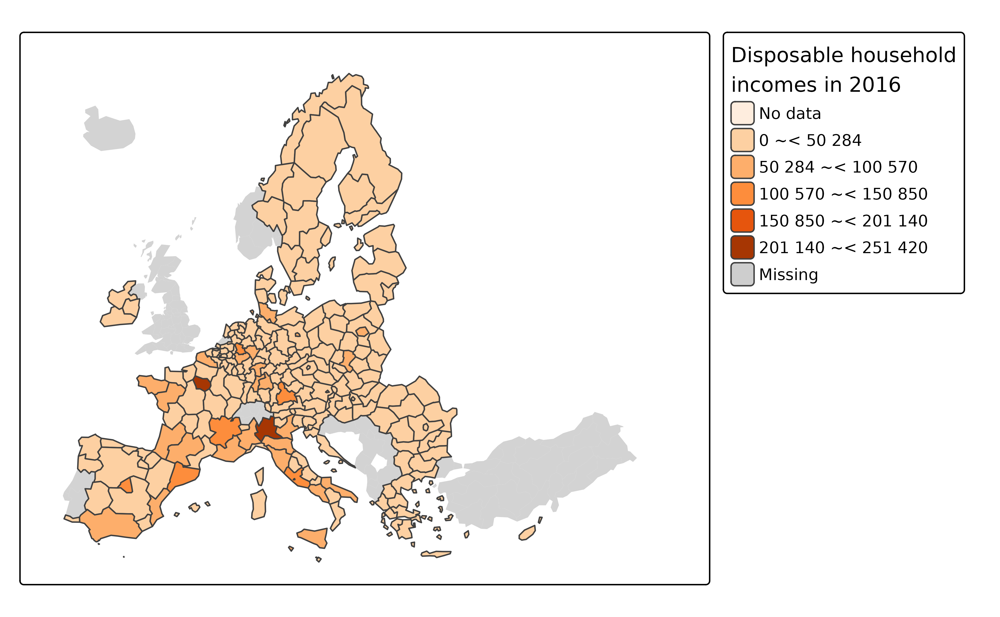
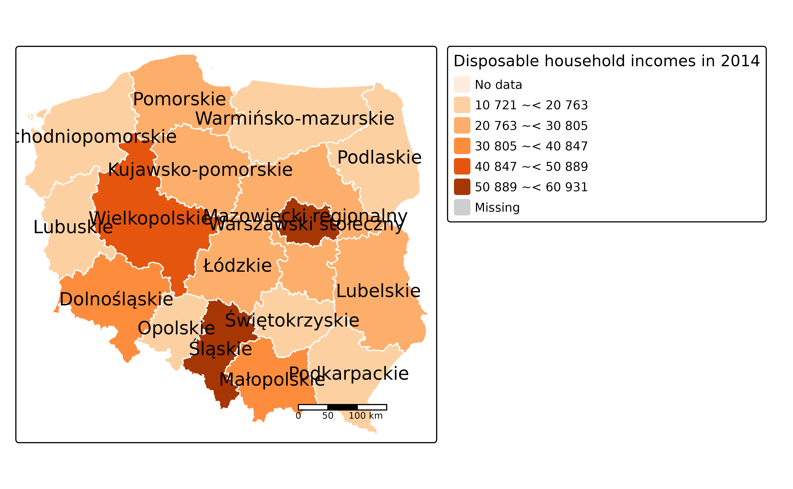
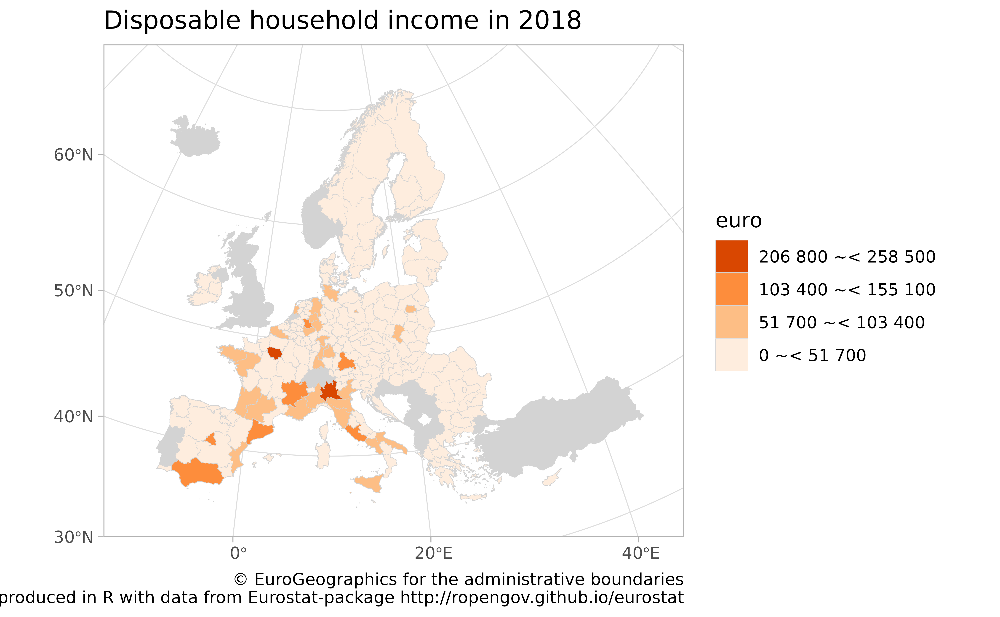

# Map examples for the eurostat R package

``` r
library(eurostat)
```

## R Tools for Eurostat Open Data: maps

This [rOpenGov](http://ropengov.github.io) R package provides tools to
access [Eurostat database](http://ec.europa.eu/eurostat/data/database),
which you can also browse on-line for the data sets and documentation.
For contact information and source code, see the [package
website](http://ropengov.github.io/eurostat/).

See the vignette of eurostat (`vignette(package = "eurostat")`) for
installation and basic use.

### Maps

> NOTE: we recommend to check also the `giscoR` package
> (<https://dieghernan.github.io/giscoR/>). This is another API package
> that provides R tools for Eurostat geographic data to support
> geospatial analysis and visualization.

#### Disposable income of private households by NUTS 2 regions at 1:60mln resolution using tmap

The mapping examples below use
[`tmap`](https://github.com/mtennekes/tmap) package.

``` r
library(dplyr)
#> 
#> Attaching package: 'dplyr'
#> The following objects are masked from 'package:stats':
#> 
#>     filter, lag
#> The following objects are masked from 'package:base':
#> 
#>     intersect, setdiff, setequal, union
library(eurostat)
library(sf)
#> Linking to GEOS 3.12.1, GDAL 3.8.4, PROJ 9.4.0; sf_use_s2() is TRUE
library(tmap)

# Download attribute data from Eurostat
sp_data <- eurostat::get_eurostat("tgs00026", time_format = "raw") %>%
  # subset to have only a single row per geo
  filter(TIME_PERIOD == 2016, nchar(geo) == 4) %>%
  # categorise
  mutate(income = cut_to_classes(values, n = 5))
#> Table tgs00026 cached at /tmp/RtmpnHI0fi/eurostat/96afba8d04b2cc9aa1b8178beb891618.rds

# Download geospatial data from GISCO
geodata <- get_eurostat_geospatial(nuts_level = 2, year = 2016)
#> Extracting data from eurostat::eurostat_geodata_60_2016

# merge with attribute data with geodata
map_data <- inner_join(geodata, sp_data, by = "geo")
```

Construct the map

``` r
# Create and plot the map
map1 <- tm_shape(geodata,
  projection = "EPSG:3035",
  xlim = c(2400000, 7800000),
  ylim = c(1320000, 5650000)
) +
  tm_fill("lightgrey") +
  tm_shape(map_data) +
  tm_polygons("income",
    title = "Disposable household\nincomes in 2016",
    palette = "Oranges"
  )
#> 
#> ── tmap v3 code detected ───────────────────────────────────────────────────────
#> [v3->v4] `tm_shape()`: use `crs` instead of `projection`.
#> [v3->v4] `tm_tm_polygons()`: migrate the argument(s) related to the scale of
#> the visual variable `fill` namely 'palette' (rename to 'values') to fill.scale
#> = tm_scale(<HERE>).
#> [v3->v4] `tm_polygons()`: migrate the argument(s) related to the legend of the
#> visual variable `fill` namely 'title' to 'fill.legend = tm_legend(<HERE>)'

print(map1)
#> [cols4all] color palettes: use palettes from the R package cols4all. Run
#> `cols4all::c4a_gui()` to explore them. The old palette name "Oranges" is named
#> "brewer.oranges"
#> Multiple palettes called "oranges" found: "brewer.oranges", "matplotlib.oranges". The first one, "brewer.oranges", is returned.
```


Interactive maps can be generated as well

``` r
# Interactive
tmap_mode("view")
#> ℹ tmap modes "plot" - "view"
#> ℹ toggle with `tmap::ttm()`
map1
#> [cols4all] color palettes: use palettes from the R package cols4all. Run
#> `cols4all::c4a_gui()` to explore them. The old palette name "Oranges" is named
#> "brewer.oranges"
#> Multiple palettes called "oranges" found: "brewer.oranges", "matplotlib.oranges". The first one, "brewer.oranges", is returned.
```

``` r
# Set the mode back to normal plotting
tmap_mode("plot")
#> ℹ tmap modes "plot" - "view"
print(map1)
#> [cols4all] color palettes: use palettes from the R package cols4all. Run
#> `cols4all::c4a_gui()` to explore them. The old palette name "Oranges" is named
#> "brewer.oranges"
#> Multiple palettes called "oranges" found: "brewer.oranges", "matplotlib.oranges". The first one, "brewer.oranges", is returned.
```



#### Disposable income of private households by NUTS 2 regions in Poland with labels at 1:1mln resolution using tmap

``` r
library(eurostat)
library(dplyr)
library(sf)

# Downloading and manipulating the tabular data
print("Let us focus on year 2016 and NUTS-3 level")
#> [1] "Let us focus on year 2016 and NUTS-3 level"
euro_sf2 <- get_eurostat("tgs00026",
  time_format = "raw",
  filter = list(time = "2016")
) %>%
  # Subset to NUTS-3 level
  dplyr::filter(grepl("PL", geo)) %>%
  # label the single geo column
  mutate(
    label = paste0(label_eurostat(.)[["geo"]], "\n", values, "€"),
    income = cut_to_classes(values)
  )
#> Table tgs00026 cached at /tmp/RtmpnHI0fi/eurostat/7e7e20c31d33ec7cdb9eacad729cc837.rds

print("Download geospatial data from GISCO")
#> [1] "Download geospatial data from GISCO"
geodata <- get_eurostat_geospatial(
  resolution = "01", nuts_level = 2,
  year = 2016, country = "PL"
)
#> Loading required namespace: giscoR
#> Extracting data using giscoR package, please report issues on https://github.com/rOpenGov/giscoR/issues

# Merge with attribute data with geodata
map_data <- inner_join(geodata, euro_sf2, by = "geo")

# plot map
library(tmap)

map2 <- tm_shape(geodata) +
  tm_fill("lightgrey") +
  tm_shape(map_data, is.master = TRUE) +
  tm_polygons("income",
    title = "Disposable household incomes in 2014",
    palette = "Oranges", border.col = "white"
  ) +
  tm_text("NUTS_NAME", just = "center") +
  tm_scale_bar() +
  tm_layout(legend.outside = TRUE)
#> 
#> ── tmap v3 code detected ───────────────────────────────────────────────────────
#> [v3->v4] `tm_tm_polygons()`: migrate the argument(s) related to the scale of
#> the visual variable `fill` namely 'palette' (rename to 'values') to fill.scale
#> = tm_scale(<HERE>).
#> [v3->v4] `tm_polygons()`: use 'fill' for the fill color of polygons/symbols
#> (instead of 'col'), and 'col' for the outlines (instead of 'border.col').
#> [v3->v4] `tm_polygons()`: migrate the argument(s) related to the legend of the
#> visual variable `fill` namely 'title' to 'fill.legend = tm_legend(<HERE>)'
#> [v3->v4] `tm_text()`: migrate the layer options 'just' to 'options =
#> opt_tm_text(<HERE>)'
#> ! `tm_scale_bar()` is deprecated. Please use `tm_scalebar()` instead.
map2
#> [cols4all] color palettes: use palettes from the R package cols4all. Run
#> `cols4all::c4a_gui()` to explore them. The old palette name "Oranges" is named
#> "brewer.oranges"
#> Multiple palettes called "oranges" found: "brewer.oranges", "matplotlib.oranges". The first one, "brewer.oranges", is returned.
```



#### Disposable income of private households by NUTS 2 regions at 1:10mln resolution using ggplot2

``` r
# Disposable income of private households by NUTS 2 regions at 1:1mln res
library(eurostat)
library(dplyr)
library(ggplot2)
data_eurostat <- get_eurostat("tgs00026", time_format = "raw") %>%
  filter(TIME_PERIOD == 2018, nchar(geo) == 4) %>%
  # classifying the values the variable
  dplyr::mutate(cat = cut_to_classes(values))
#> Dataset query already saved in cache_list.json...
#> Reading cache file /tmp/RtmpnHI0fi/eurostat/96afba8d04b2cc9aa1b8178beb891618.rds
#> Table  tgs00026  read from cache file:  /tmp/RtmpnHI0fi/eurostat/96afba8d04b2cc9aa1b8178beb891618.rds

# Download geospatial data from GISCO
data_geo <- get_eurostat_geospatial(
  resolution = "01", nuts_level = "2",
  year = 2016
)
#> Extracting data using giscoR package, please report issues on https://github.com/rOpenGov/giscoR/issues

# merge with attribute data with geodata
data <- left_join(data_geo, data_eurostat, by = "geo")

ggplot(data) +
  # Base layer
  geom_sf(fill = "lightgrey", color = "lightgrey") +
  # Choropleth layer
  geom_sf(aes(fill = cat), color = "lightgrey", linewidth = 0.1, na.rm = TRUE) +
  scale_fill_brewer(palette = "Oranges", na.translate = FALSE) +
  guides(fill = guide_legend(reverse = TRUE, title = "euro")) +
  labs(
    title = "Disposable household income in 2018",
    caption = "© EuroGeographics for the administrative boundaries
                Map produced in R with data from Eurostat-package http://ropengov.github.io/eurostat"
  ) +
  theme_light() +
  coord_sf(
    xlim = c(2377294, 7453440),
    ylim = c(1313597, 5628510),
    crs = 3035
  )
```



## Citations and related work

#### Citing the data sources

Eurostat data: cite [Eurostat](http://ec.europa.eu/eurostat/).

Administrative boundaries: cite EuroGeographics

#### Citing the eurostat R package

For main developers and contributors, see the [package
homepage](http://ropengov.github.io/eurostat).

This work can be freely used, modified and distributed under the
BSD-2-clause (modified FreeBSD) license:

``` r
citation("eurostat")
#> Kindly cite the eurostat R package as follows:
#> 
#>   Lahti L., Huovari J., Kainu M., and Biecek P. (2017). Retrieval and
#>   analysis of Eurostat open data with the eurostat package. The R
#>   Journal 9(1), pp. 385-392. doi: 10.32614/RJ-2017-019
#> 
#>   Lahti, L., Huovari J., Kainu M., Biecek P., Hernangomez D., Antal D.,
#>   and Kantanen P. (2023). eurostat: Tools for Eurostat Open Data
#>   [Computer software]. R package version 4.0.0.
#>   https://github.com/rOpenGov/eurostat
#> 
#> To see these entries in BibTeX format, use 'print(<citation>,
#> bibtex=TRUE)', 'toBibtex(.)', or set
#> 'options(citation.bibtex.max=999)'.
```

#### Contact

For contact information, see the [package
homepage](http://ropengov.github.io/eurostat).

## Version info

This tutorial was created with

``` r
sessioninfo::session_info()
#> ─ Session info ───────────────────────────────────────────────────────────────
#>  setting  value
#>  version  R version 4.5.2 (2025-10-31)
#>  os       Ubuntu 24.04.3 LTS
#>  system   x86_64, linux-gnu
#>  ui       X11
#>  language en
#>  collate  C.UTF-8
#>  ctype    C.UTF-8
#>  tz       UTC
#>  date     2026-02-17
#>  pandoc   3.1.11 @ /opt/hostedtoolcache/pandoc/3.1.11/x64/ (via rmarkdown)
#>  quarto   NA
#> 
#> ─ Packages ───────────────────────────────────────────────────────────────────
#>  package           * version   date (UTC) lib source
#>  abind               1.4-8     2024-09-12 [1] RSPM
#>  assertthat          0.2.1     2019-03-21 [1] RSPM
#>  backports           1.5.0     2024-05-23 [1] RSPM
#>  base64enc           0.1-6     2026-02-02 [1] RSPM
#>  bibtex              0.5.2     2026-02-03 [1] RSPM
#>  bit                 4.6.0     2025-03-06 [1] RSPM
#>  bit64               4.6.0-1   2025-01-16 [1] RSPM
#>  bslib               0.10.0    2026-01-26 [1] RSPM
#>  cachem              1.1.0     2024-05-16 [1] RSPM
#>  cellranger          1.1.0     2016-07-27 [1] RSPM
#>  class               7.3-23    2025-01-01 [3] CRAN (R 4.5.2)
#>  classInt            0.4-11    2025-01-08 [1] RSPM
#>  cli                 3.6.5     2025-04-23 [1] RSPM
#>  codetools           0.2-20    2024-03-31 [3] CRAN (R 4.5.2)
#>  colorspace          2.1-2     2025-09-22 [1] RSPM
#>  cols4all            0.10      2025-10-27 [1] RSPM
#>  countrycode         1.6.1     2025-03-31 [1] RSPM
#>  crayon              1.5.3     2024-06-20 [1] RSPM
#>  crosstalk           1.2.2     2025-08-26 [1] RSPM
#>  curl                7.0.0     2025-08-19 [1] RSPM
#>  data.table          1.18.2.1  2026-01-27 [1] RSPM
#>  DBI                 1.2.3     2024-06-02 [1] RSPM
#>  desc                1.4.3     2023-12-10 [1] RSPM
#>  digest              0.6.39    2025-11-19 [1] RSPM
#>  dplyr             * 1.2.0     2026-02-03 [1] RSPM
#>  e1071               1.7-17    2025-12-18 [1] RSPM
#>  eurostat          * 4.0.0     2026-02-17 [1] local
#>  evaluate            1.0.5     2025-08-27 [1] RSPM
#>  farver              2.1.2     2024-05-13 [1] RSPM
#>  fastmap             1.2.0     2024-05-15 [1] RSPM
#>  fs                  1.6.6     2025-04-12 [1] RSPM
#>  generics            0.1.4     2025-05-09 [1] RSPM
#>  ggplot2           * 4.0.2     2026-02-03 [1] RSPM
#>  giscoR              1.0.1     2026-01-23 [1] RSPM
#>  glue                1.8.0     2024-09-30 [1] RSPM
#>  gtable              0.3.6     2024-10-25 [1] RSPM
#>  here                1.0.2     2025-09-15 [1] RSPM
#>  hms                 1.1.4     2025-10-17 [1] RSPM
#>  htmltools           0.5.9     2025-12-04 [1] RSPM
#>  htmlwidgets         1.6.4     2023-12-06 [1] RSPM
#>  httr                1.4.8     2026-02-13 [1] RSPM
#>  httr2               1.2.2     2025-12-08 [1] RSPM
#>  ISOweek             0.6-2     2011-09-07 [1] RSPM
#>  jquerylib           0.1.4     2021-04-26 [1] RSPM
#>  jsonlite            2.0.0     2025-03-27 [1] RSPM
#>  KernSmooth          2.23-26   2025-01-01 [3] CRAN (R 4.5.2)
#>  knitr               1.51      2025-12-20 [1] RSPM
#>  lattice             0.22-7    2025-04-02 [3] CRAN (R 4.5.2)
#>  leafem              0.2.5     2025-08-28 [1] RSPM
#>  leaflegend          1.2.1     2024-05-09 [1] RSPM
#>  leaflet             2.2.3     2025-09-04 [1] RSPM
#>  leaflet.providers   2.0.0     2023-10-17 [1] RSPM
#>  leafsync            0.1.0     2019-03-05 [1] RSPM
#>  lifecycle           1.0.5     2026-01-08 [1] RSPM
#>  logger              0.4.1     2025-09-11 [1] RSPM
#>  lubridate           1.9.5     2026-02-04 [1] RSPM
#>  lwgeom              0.2-15    2026-01-12 [1] RSPM
#>  magrittr            2.0.4     2025-09-12 [1] RSPM
#>  maptiles            0.11.0    2025-12-12 [1] RSPM
#>  otel                0.2.0     2025-08-29 [1] RSPM
#>  pillar              1.11.1    2025-09-17 [1] RSPM
#>  pkgconfig           2.0.3     2019-09-22 [1] RSPM
#>  pkgdown             2.2.0     2025-11-06 [1] any (@2.2.0)
#>  plyr                1.8.9     2023-10-02 [1] RSPM
#>  png                 0.1-8     2022-11-29 [1] RSPM
#>  proxy               0.4-29    2025-12-29 [1] RSPM
#>  purrr               1.2.1     2026-01-09 [1] RSPM
#>  R.cache             0.17.0    2025-05-02 [1] RSPM
#>  R.methodsS3         1.8.2     2022-06-13 [1] RSPM
#>  R.oo                1.27.1    2025-05-02 [1] RSPM
#>  R.utils             2.13.0    2025-02-24 [1] RSPM
#>  R6                  2.6.1     2025-02-15 [1] RSPM
#>  ragg                1.5.0     2025-09-02 [1] RSPM
#>  rappdirs            0.3.4     2026-01-17 [1] RSPM
#>  raster              3.6-32    2025-03-28 [1] RSPM
#>  RColorBrewer        1.1-3     2022-04-03 [1] RSPM
#>  Rcpp                1.1.1     2026-01-10 [1] RSPM
#>  readr               2.1.6     2025-11-14 [1] RSPM
#>  readxl              1.4.5     2025-03-07 [1] RSPM
#>  RefManageR          1.4.0     2022-09-30 [1] RSPM
#>  regions             0.1.8     2021-06-21 [1] RSPM
#>  rlang               1.1.7     2026-01-09 [1] RSPM
#>  rmarkdown           2.30      2025-09-28 [1] RSPM
#>  rprojroot           2.1.1     2025-08-26 [1] RSPM
#>  s2                  1.1.9     2025-05-23 [1] RSPM
#>  S7                  0.2.1     2025-11-14 [1] RSPM
#>  sass                0.4.10    2025-04-11 [1] RSPM
#>  scales              1.4.0     2025-04-24 [1] RSPM
#>  sessioninfo         1.2.3     2025-02-05 [1] RSPM
#>  sf                * 1.0-24    2026-01-13 [1] RSPM
#>  sp                  2.2-1     2026-02-13 [1] RSPM
#>  spacesXYZ           1.6-0     2025-06-06 [1] RSPM
#>  stars               0.7-1     2026-02-13 [1] RSPM
#>  stringi             1.8.7     2025-03-27 [1] RSPM
#>  stringr             1.6.0     2025-11-04 [1] RSPM
#>  styler              1.11.0    2025-10-13 [1] RSPM
#>  systemfonts         1.3.1     2025-10-01 [1] RSPM
#>  terra               1.8-93    2026-01-12 [1] RSPM
#>  textshaping         1.0.4     2025-10-10 [1] RSPM
#>  tibble              3.3.1     2026-01-11 [1] RSPM
#>  tidyr               1.3.2     2025-12-19 [1] RSPM
#>  tidyselect          1.2.1     2024-03-11 [1] RSPM
#>  timechange          0.4.0     2026-01-29 [1] RSPM
#>  tmap              * 4.2       2025-09-10 [1] RSPM
#>  tmaptools           3.3       2025-07-24 [1] RSPM
#>  tzdb                0.5.0     2025-03-15 [1] RSPM
#>  units               1.0-0     2025-10-09 [1] RSPM
#>  vctrs               0.7.1     2026-01-23 [1] RSPM
#>  vroom               1.7.0     2026-01-27 [1] RSPM
#>  withr               3.0.2     2024-10-28 [1] RSPM
#>  wk                  0.9.5     2025-12-18 [1] RSPM
#>  xfun                0.56      2026-01-18 [1] RSPM
#>  XML                 3.99-0.22 2026-02-10 [1] RSPM
#>  xml2                1.5.2     2026-01-17 [1] RSPM
#>  yaml                2.3.12    2025-12-10 [1] RSPM
#> 
#>  [1] /home/runner/work/_temp/Library
#>  [2] /opt/R/4.5.2/lib/R/site-library
#>  [3] /opt/R/4.5.2/lib/R/library
#>  * ── Packages attached to the search path.
#> 
#> ──────────────────────────────────────────────────────────────────────────────
```
