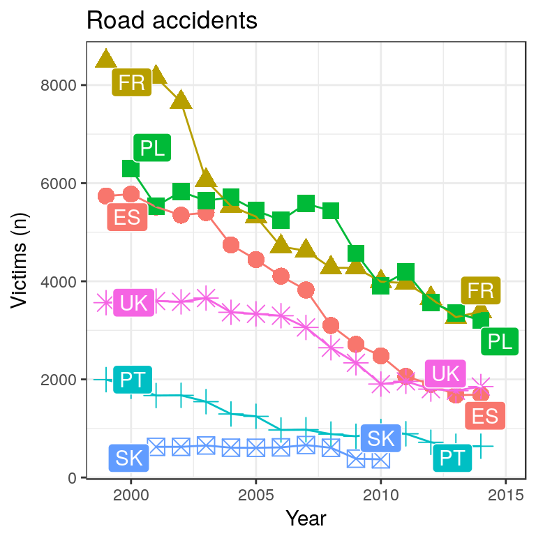
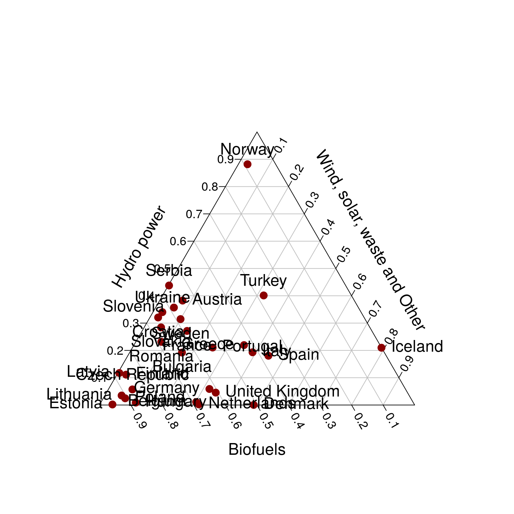
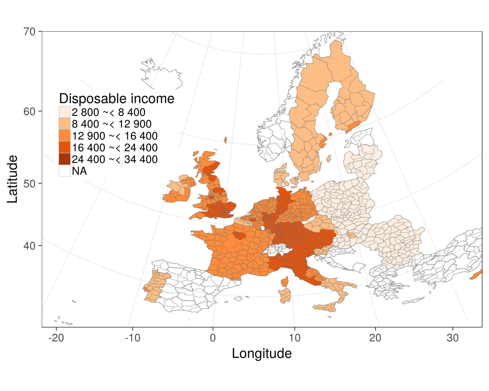

<!--
%\VignetteEngine{knitr::rmarkdown}
%\VignetteIndexEntry{eurostat Markdown Vignette}
%\usepackage[utf8]{inputenc}
-->


This document reproduces the figures and tables in [our manuscript (in
preparation)](RJwrapper.pdf) on the [eurostat R
package](https://github.com/rOpenGov/eurostat), assuming that the
required R extensions have been installed. For detailed explanation of
the examples, see the manuscript text.

To reproduce the complete manuscript PDF, clone this
[repository](https://github.com/rOpenGov/eurostat), navigate to the
[./vignettes/2015-RJournal](https://github.com/rOpenGov/eurostat/tree/master/vignettes/2015-RJournal)
subdirectory and convert the [Rmarkdown source
code](lahti-huovari-kainu-biecek.Rmd) in R by navigating to the
[vignettes/2015-RJournal](https://github.com/rOpenGov/eurostat/blob/master/vignettes/2015-RJournal/)
folder, and running in R:


```r
source("main.R")
```

Alternatively, you can proceed in steps as follows. Generate this
markdown page with manuscript figures (PNG) with:


```r
library(knitr)
knit("lahti-huovari-kainu-biecek.Rmd")
```

This will run the following workflow.


```r
# Load the required R packages
library(eurostat)
library(knitr)
library(xtable)
library(tidyr)
library(dplyr)
library(plotrix)
library(ggplot2)

# Set ggplot theme
theme_set(theme_bw(20))

# Set figure folder
knitr::opts_chunk$set(fig.path = "./")
```

## Installation

Installing the CRAN release version:


```r
install.packages("eurostat")
```

Installing the Github development version:


```r
library(devtools)
install_github("ropengov/eurostat")
```

## Search and download

To retrieve data for 'road accidents', for
instance, use:


```r
library(eurostat)
query <- search_eurostat("road accidents", type = "table")
```

Investigate the first entry of our query:


```r
query$code[[1]]
```

```
## [1] "tsdtr420"
```

```r
query$title[[1]]
```

```
## [1] "People killed in road accidents"
```


To retrieve the data set with this identifier, use:


```r
dat <- get_eurostat(id = "tsdtr420", time_format = "num")
```

This produces a table:


```r
#print(xtable(head(dat), label = "tab:getdatatable"))
kable(head(dat))
```


|unit |sex |geo | time| values|
|:----|:---|:---|----:|------:|
|NR   |T   |AT  | 1999|   1079|
|NR   |T   |BE  | 1999|   1397|
|NR   |T   |CZ  | 1999|   1455|
|NR   |T   |DE  | 1999|   7772|
|NR   |T   |DK  | 1999|    514|
|NR   |T   |EL  | 1999|   2116|


Convert to human-readable labels:


```r
# Convert into human readable labels
datl <- label_eurostat(dat)

# Print the table
#print(xtable(head(datl), label = "tab:getdatatable2"))
kable(head(datl))
```


|unit   |sex   |geo                                              | time| values|
|:------|:-----|:------------------------------------------------|----:|------:|
|Number |Total |Austria                                          | 1999|   1079|
|Number |Total |Belgium                                          | 1999|   1397|
|Number |Total |Czech Republic                                   | 1999|   1455|
|Number |Total |Germany (until 1990 former territory of the FRG) | 1999|   7772|
|Number |Total |Denmark                                          | 1999|    514|
|Number |Total |Greece                                           | 1999|   2116|


## Road accidents 

The original and more detailed treatment of this example is provided in a
[blog post](http://pbiecek.github.io/archivist/justGetIT.html).


```r
t1 <- get_eurostat("tsdtr420", 
  filters = list(geo = c("UK", "SK", "FR", "PL", "ES", "PT"))) 

ggplot(t1, aes(x = time, y = values, color=geo, group=geo, shape=geo)) +
  geom_point(size=4) + 
  geom_line() + theme_bw() + ggtitle("Road accidents")+
  xlab("Year") + ylab("Victims (n)") +
  # labels
  theme(legend.position="none") +
  ggrepel::geom_label_repel(data=t1 %>%  
                     group_by(geo) %>% 
                     na.omit() %>% 
                     filter(time %in% c(min(time),max(time))),
                   aes(fill=geo,label=geo),color="white")
```




## Body-mass index


```r
library(dplyr)
tmp1 <- get_eurostat("hlth_ehis_de1", time_format = "raw")
tmp1 %>%
  dplyr::filter( isced97 == "TOTAL" ,
          sex != "T",
          age != "TOTAL", geo == "PL") %>%
  mutate(BMI = factor(bmi, 
                      levels=c("LT18P5","18P5-25","25-30","GE30"), 
                      labels=c("<18.5", "18.5-25", "25-30",">30"))) %>%
  arrange(BMI) %>%
  ggplot(aes(y=values, x=age, fill=BMI)) +
  geom_bar(stat="identity") +
  facet_wrap(~sex) + coord_flip() +
  theme(legend.position="top") +
  ggtitle("Body mass index (BMI) by sex and age") +
  xlab("Age group") +
  ylab("Fraction of population (%)") +  
  scale_fill_brewer(type = "div")
```


## Renewable energy production


```r
dict <- c("Solid biofuels (excluding charcoal)" = "Biofuels",
          "Biogasoline" = "Biofuels",
          "Other liquid biofuels" = "Biofuels",
          "Biodiesels" = "Biofuels",
          "Biogas" = "Biofuels",
          "Hydro power" = "Hydro power",
          "Tide, Wave and Ocean" = "Hydro power",
          "Solar thermal" = "Wind, solar, waste and Other",
          "Geothermal Energy" = "Wind, solar, waste and Other",
          "Solar photovoltaic" = "Wind, solar, waste and Other",
          "Municipal waste (renewable)" = "Wind, solar, waste and Other",
          "Wind power" = "Wind, solar, waste and Other",
          "Bio jet kerosene" = "Wind, solar, waste and Other")

energy3 <- get_eurostat("ten00081") %>%
  label_eurostat(dat) %>% 
  filter(time == "2013-01-01",
         product != "Renewable energies") %>%
  mutate(nproduct = dict[as.character(product)], # just three categories
         geo = gsub(geo, pattern=" \\(.*", replacement="")) %>%
  select(nproduct, geo, values) %>% 
  group_by(nproduct, geo) %>%
  summarise(svalue = sum(values)) %>%
  group_by(geo) %>%
  mutate(tvalue = sum(svalue),
         svalue = svalue/sum(svalue)) %>%
  filter(tvalue > 1000,
         !grepl(geo, pattern="^Euro")) %>% # only large countrie
  spread(nproduct, svalue)

par(cex=1.5)
plotrix::triax.plot(as.matrix(energy3[, c(3,5,4)]),
                      show.grid = TRUE,
                      label.points = TRUE, point.labels = energy3$geo,cex.ticks=0.75,col.symbols = "red4",
                      pch = 19)
```




## Map visualization

The source code for the detailed map visualization is hidden but [available](https://github.com/rOpenGov/eurostat/blob/master/vignettes/2015-RJournal/lahti-huovari-kainu-biecek.Rmd). For a detailed treatment of this example, see our [related blog post](http://ropengov.github.io/r/2015/05/01/eurostat-package-examples/).


```r
library(eurostat)
library(dplyr)
library(ggplot2)
# Downloading and manipulating the tabular data
get_eurostat("tgs00026", time_format = "raw") %>% 
  # subsetting to year 2005 and NUTS-3 level
  dplyr::filter(time == 2005, nchar(as.character(geo)) == 4) %>% 
  # classifying the values the variable
  dplyr::mutate(`Disposable income` = cut_to_classes(values)) %>% 
  # merge Eurostat data with geodata from Cisco
  merge_eurostat_geodata(data=.,geocolumn="geo",resolution = "60", output_class ="df", all_regions=TRUE) %>% 
  # plot map
  ggplot(data=., aes(long,lat,group=group)) +
  geom_polygon(aes(fill = `Disposable income`), colour=alpha("dim grey", 1/2),size=.2) +
  scale_fill_manual(values=RColorBrewer::brewer.pal(n = 5, name = "Oranges")) + theme(legend.position=c(0.17,0.65)) +
  coord_map(project="orthographic", xlim=c(-22,34), ylim=c(35,70)) +
  xlab("Longitude") + ylab("Latitude")
```




## Country code tables


```r
# Load EFTA country listing
data(efta_countries)

# Print the table
#print(xtable(efta_countries))
kable(efta_countries)
```


|code |name          |
|:----|:-------------|
|IS   |Iceland       |
|LI   |Liechtenstein |
|NO   |Norway        |
|CH   |Switzerland   |


## Contact

For contact information, see the [README](../README.md).


## Version info

This tutorial was created with


```r
sessionInfo()
```

```
## R version 3.3.1 (2016-06-21)
## Platform: x86_64-pc-linux-gnu (64-bit)
## Running under: Ubuntu 16.04 LTS
## 
## locale:
##  [1] LC_CTYPE=en_US.UTF-8       LC_NUMERIC=C              
##  [3] LC_TIME=en_US.UTF-8        LC_COLLATE=en_US.UTF-8    
##  [5] LC_MONETARY=en_US.UTF-8    LC_MESSAGES=en_US.UTF-8   
##  [7] LC_PAPER=en_US.UTF-8       LC_NAME=C                 
##  [9] LC_ADDRESS=C               LC_TELEPHONE=C            
## [11] LC_MEASUREMENT=en_US.UTF-8 LC_IDENTIFICATION=C       
## 
## attached base packages:
## [1] stats     graphics  grDevices utils     datasets  methods   base     
## 
## other attached packages:
## [1] ggplot2_2.1.0  plotrix_3.6-2  dplyr_0.5.0    tidyr_0.5.1   
## [5] xtable_1.8-2   eurostat_2.2.1 knitr_1.13    
## 
## loaded via a namespace (and not attached):
##  [1] Rcpp_0.12.7        formatR_1.4        RColorBrewer_1.1-2
##  [4] plyr_1.8.4         highr_0.6          class_7.3-14      
##  [7] tools_3.3.1        digest_0.6.9       jsonlite_1.0      
## [10] evaluate_0.9       tibble_1.1         gtable_0.2.0      
## [13] lattice_0.20-33    DBI_0.4-1          mapproj_1.2-4     
## [16] curl_0.9.7         ggrepel_0.5        e1071_1.6-7       
## [19] httr_1.2.1         stringr_1.0.0      maps_3.1.0        
## [22] classInt_0.1-23    grid_3.3.1         R6_2.1.2          
## [25] sp_1.2-3           readr_0.2.2        magrittr_1.5      
## [28] scales_0.4.0       assertthat_0.1     colorspace_1.2-6  
## [31] labeling_0.3       stringi_1.1.1      lazyeval_0.2.0    
## [34] munsell_0.4.3
```
