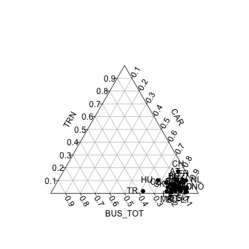

<!--
%\VignetteEngine{knitr::rmarkdown}
%\VignetteIndexEntry{eurostat Markdown Vignette}
%\usepackage[utf8]{inputenc}
-->

This document provides reproducible documentation to generate the
figures and tables for [our manuscript (in
preparation)](RJwrapper.pdf) introducing the [eurostat R
package](https://github.com/rOpenGov/eurostat).

To reproduce the figures and tables, clone the [eurostat
repository](https://github.com/rOpenGov/eurostat), go to the
[./vignettes/2015-RJournal](https://github.com/rOpenGov/eurostat/tree/master/vignettes/2015-RJournal)
subdirectory and convert the [Rmarkdown source
code](lahti-huovari-kainu-biecek.Rmd) in R with:


```r
library(knitr)
knit("lahti-huovari-kainu-biecek.Rmd")
```

To reproduce the article PDF, navigate in the
[vignettes/2015-RJournal](https://github.com/rOpenGov/eurostat/blob/master/vignettes/2015-RJournal/)
folder, and run in R:


```r
tools::texi2pdf("RJwrapper.tex")
```


Let us first load some external R packages


```r
# Load libraries
library(eurostat)
library(knitr)
library(xtable)
library(tidyr)
library(plotrix)
library(ggplot2)

# Set ggplot theme
theme_set(theme_bw(20))

# Set figure folder
knitr::opts_chunk$set(fig.path = "./")
```

## Installation

Installing the CRAN release version:


```r
install.packages("eurostat")
```

Installing the Github development version:


```r
library(devtools)
install_github("ropengov/eurostat")
```

## Search and download

To retrieve data for 'Modal split of passenger transport', for
instance, use:


```r
library(eurostat)
query <- search_eurostat("Modal split of passenger transport", type = "table")
```

Investigate the first entry of our query:


```r
query$code[[1]]
```

```
## [1] "tsdtr210"
```

```r
query$title[[1]]
```

```
## [1] "            Modal split of passenger transport"
```


To retrieve the data set with this identifier, use:


```r
dat <- get_eurostat(id = "tsdtr210", time_format = "num")
```

This produces a table:


```r
#print(xtable(head(dat), label = "tab:getdatatable"))
kable(head(dat))
```


|unit |vehicle |geo | time| values|
|:----|:-------|:---|----:|------:|
|PC   |BUS_TOT |AT  | 1990|   11.0|
|PC   |BUS_TOT |BE  | 1990|   10.6|
|PC   |BUS_TOT |BG  | 1990|     NA|
|PC   |BUS_TOT |CH  | 1990|    3.7|
|PC   |BUS_TOT |CY  | 1990|     NA|
|PC   |BUS_TOT |CZ  | 1990|     NA|

Same with human-readable labels:


```r
# Convert into human readable labels
datl <- label_eurostat(dat)

# Print the table
#print(xtable(head(datl), label = "tab:getdatatable2"))
kable(head(datl))
```


|unit       |vehicle                                |geo            | time| values|
|:----------|:--------------------------------------|:--------------|----:|------:|
|Percentage |Motor coaches, buses and trolley buses |Austria        | 1990|   11.0|
|Percentage |Motor coaches, buses and trolley buses |Belgium        | 1990|   10.6|
|Percentage |Motor coaches, buses and trolley buses |Bulgaria       | 1990|     NA|
|Percentage |Motor coaches, buses and trolley buses |Switzerland    | 1990|    3.7|
|Percentage |Motor coaches, buses and trolley buses |Cyprus         | 1990|     NA|
|Percentage |Motor coaches, buses and trolley buses |Czech Republic | 1990|     NA|


## Passenger transport


```r
id <- search_eurostat("Modal split of passenger transport", type = "table")$code[1]

dat <- get_eurostat(id, time_format = "num")
#datl <- label_eurostat(dat)

# Triangle plot on passenger transport distributions with 2012 data for
# all countries with data 
transports <- tidyr::spread(subset(dat, time == 2012,
	   select = c(geo, vehicle, values)), vehicle, values)

# Remove NAs
transports <- na.omit(transports)

# triangle plot
plotrix::triax.plot(transports[, c("BUS_TOT", "CAR", "TRN")],
           show.grid = TRUE, 
           label.points = TRUE, point.labels = transports$geo, 
           pch = 19)
```

 


## Road accidents

The original detailed treatment of this example is provided in the related
[blog post](http://pbiecek.github.io/archivist/justGetIT.html).


```r
t1 <- get_eurostat("tsdtr420") %>%
  dplyr::filter(geo %in% c("UK", "SK", "FR", "PL", "ES", "PT", "LV"))
t1$Country <- t1$geo
ggplot(t1, aes(x = time, y = values, color=Country, group=Country, shape=Country)) +
  geom_point(size=4) + 
  geom_line() + theme_bw() + ggtitle("People killed in road accidents")+
  xlab("Year") + ylab("Number of killed people") + theme(legend.position="top")
```

 


## Body-mass index


```r
library(dplyr)
tmp1 <- get_eurostat("hlth_ehis_de1", time_format = "raw")
tmp1 %>%
  dplyr::filter( isced97 == "TOTAL" ,
          sex != "T",
          age != "TOTAL", geo == "PL") %>%
  mutate(BMI = factor(bmi, 
                      levels=c("LT18P5","18P5-25","25-30","GE30"), 
                      labels=c("<18.5", "18.5-25", "25-30",">30"))) %>%
  arrange(BMI) %>%
  ggplot(aes(y=values, x=age, fill=BMI)) +
  geom_bar(stat="identity") +
  facet_wrap(~sex) + coord_flip() +
  theme(legend.position="top") + ggtitle("Body mass index (BMI) by sex and age")+xlab("% of population")+scale_fill_brewer(type = "div")
```

 


## Map visualization

The source code for the detailed map visualization is hidden but [available](https://github.com/rOpenGov/eurostat/blob/master/vignettes/2015-RJournal/lahti-huovari-kainu-biecek.Rmd). For a detailed treatment of this example, see our [related blog post](http://ropengov.github.io/r/2015/05/01/eurostat-package-examples/).

 


## Country code tables


```r
# Load EFTA country listing
data(efta_countries)

# Print the table
#print(xtable(efta_countries))
kable(efta_countries)
```


|code |name          |
|:----|:-------------|
|IS   |Iceland       |
|LI   |Liechtenstein |
|NO   |Norway        |
|CH   |Switzerland   |

