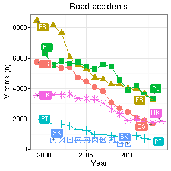
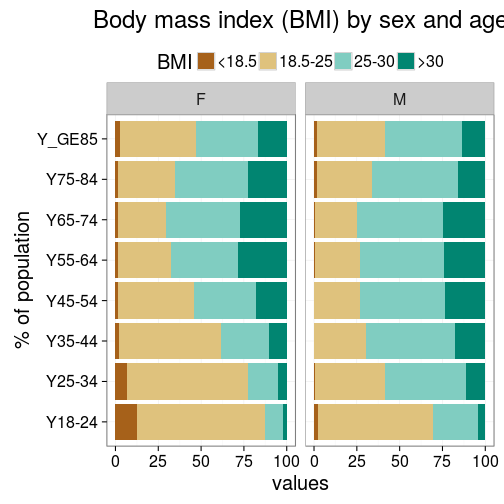
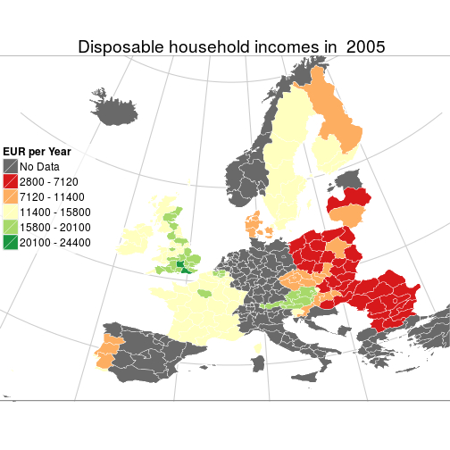

<!--
%\VignetteEngine{knitr::rmarkdown}
%\VignetteIndexEntry{eurostat Markdown Vignette}
%\usepackage[utf8]{inputenc}
-->

This document provides reproducible documentation to generate the
figures and tables for [our manuscript (in
preparation)](RJwrapper.pdf) introducing the [eurostat R
package](https://github.com/rOpenGov/eurostat). We assume below that
the required R extensions have already been installed.

To reproduce the manuscript figures and tables, clone the [eurostat
repository](https://github.com/rOpenGov/eurostat), navigate to the
[./vignettes/2015-RJournal](https://github.com/rOpenGov/eurostat/tree/master/vignettes/2015-RJournal)
subdirectory and convert the [Rmarkdown source
code](lahti-huovari-kainu-biecek.Rmd) in R with:


```r
library(knitr)
knit("lahti-huovari-kainu-biecek.Rmd")
```

This reproduces the manuscript figures as PNG images in the working
directory. To reproduce the complete manuscript PDF, navigate in the
[vignettes/2015-RJournal](https://github.com/rOpenGov/eurostat/blob/master/vignettes/2015-RJournal/)
folder, and run in R:


```r
source("main.R")
```


Let us first load some external R packages


```r
# Load libraries
library(eurostat)
library(knitr)
library(xtable)
library(tidyr)
library(plotrix)
library(ggplot2)

# Set ggplot theme
theme_set(theme_bw(20))

# Set figure folder
knitr::opts_chunk$set(fig.path = "./")
```

## Installation

Installing the CRAN release version:


```r
install.packages("eurostat")
```

Installing the Github development version:


```r
library(devtools)
install_github("ropengov/eurostat")
```

## Search and download

To retrieve data for 'road accidents', for
instance, use:


```r
library(eurostat)
query <- search_eurostat("road accidents", type = "table")
```

Investigate the first entry of our query:


```r
query$code[[1]]
```

```
## [1] "tsdtr420"
```

```r
query$title[[1]]
```

```
## [1] "            People killed in road accidents"
```


To retrieve the data set with this identifier, use:


```r
dat <- get_eurostat(id = "tsdtr420", time_format = "num")
```

This produces a table:


```r
#print(xtable(head(dat), label = "tab:getdatatable"))
kable(head(dat))
```


|sex |geo | time| values|
|:---|:---|----:|------:|
|T   |AT  | 1999|   1079|
|T   |BE  | 1999|   1397|
|T   |BG  | 1999|     NA|
|T   |CH  | 1999|     NA|
|T   |CY  | 1999|     NA|
|T   |CZ  | 1999|   1455|


Same with human-readable labels:


```r
# Convert into human readable labels
datl <- label_eurostat(dat)

# Print the table
#print(xtable(head(datl), label = "tab:getdatatable2"))
kable(head(datl))
```


|sex   |geo            | time| values|
|:-----|:--------------|----:|------:|
|Total |Austria        | 1999|   1079|
|Total |Belgium        | 1999|   1397|
|Total |Bulgaria       | 1999|     NA|
|Total |Switzerland    | 1999|     NA|
|Total |Cyprus         | 1999|     NA|
|Total |Czech Republic | 1999|   1455|


## Road accidents visualization

The original detailed treatment of this example is provided in the related
[blog post](http://pbiecek.github.io/archivist/justGetIT.html).


```r
t1 <- get_eurostat("tsdtr420") %>%
  dplyr::filter(geo %in% c("UK", "SK", "FR", "PL", "ES", "PT", "LV"))
t1$Country <- t1$geo
ggplot(t1, aes(x = time, y = values, color=Country, group=Country, shape=Country)) +
  geom_point(size=4) + 
  geom_line() + theme_bw() + ggtitle("Road accidents")+
  xlab("Year") + ylab("Victims (n)") + theme(legend.position="top")
```

 

## Production of renewable energy


```r
dict <- c("Solid biofuels (excluding charcoal)" = "Biofuels",
          "Biogasoline" = "Biofuels",
          "Other liquid biofuels" = "Biofuels",
          "Biodiesels" = "Biofuels",
          "Biogas" = "Biofuels",
          "Hydro power" = "Hydro power",
          "Tide, Wave and Ocean" = "Hydro power",
          "Solar thermal" = "Wind, solar, waste and Other",
          "Geothermal Energy" = "Wind, solar, waste and Other",
          "Solar photovoltaic" = "Wind, solar, waste and Other",
          "Municipal waste (renewable)" = "Wind, solar, waste and Other",
          "Wind power" = "Wind, solar, waste and Other",
          "Bio jet kerosene" = "Wind, solar, waste and Other")

energy3 <- get_eurostat("ten00081") %>%
  label_eurostat(dat) %>% 
  filter(time == "2013-01-01",
         product != "Renewable energies") %>%
  mutate(nproduct = dict[as.character(product)], # just three categories
         geo = gsub(geo, pattern=" \\(.*", replacement="")) %>%
  select(nproduct, geo, values) %>% 
  group_by(nproduct, geo) %>%
  summarise(svalue = sum(values)) %>%
  group_by(geo) %>%
  mutate(tvalue = sum(svalue),
         svalue = svalue/sum(svalue)) %>%
  filter(tvalue > 1000,
         !grepl(geo, pattern="^Euro")) %>% # only large countrie
  spread(nproduct, svalue)
```

```
## Error in match.arg(method): object 'product' not found
```

```r
par(cex=1.5)
plotrix::triax.plot(as.matrix(energy3[, c(3,5,4)]),
                      show.grid = TRUE,
                      label.points = TRUE, point.labels = energy3$geo,cex.ticks=0.75,col.symbols = "red4",
                      pch = 19)
```

```
## Error in as.matrix(energy3[, c(3, 5, 4)]): object 'energy3' not found
```


## Body-mass index


```r
library(dplyr)
tmp1 <- get_eurostat("hlth_ehis_de1", time_format = "raw")
tmp1 %>%
  dplyr::filter( isced97 == "TOTAL" ,
          sex != "T",
          age != "TOTAL", geo == "PL") %>%
  mutate(BMI = factor(bmi, 
                      levels=c("LT18P5","18P5-25","25-30","GE30"), 
                      labels=c("<18.5", "18.5-25", "25-30",">30"))) %>%
  arrange(BMI) %>%
  ggplot(aes(y=values, x=age, fill=BMI)) +
  geom_bar(stat="identity") +
  facet_wrap(~sex) + coord_flip() +
  theme(legend.position="top") + ggtitle("Body mass index (BMI) by sex and age")+xlab("% of population")+scale_fill_brewer(type = "div")
```

 


## Map visualization

The source code for the detailed map visualization is hidden but [available](https://github.com/rOpenGov/eurostat/blob/master/vignettes/2015-RJournal/lahti-huovari-kainu-biecek.Rmd). For a detailed treatment of this example, see our [related blog post](http://ropengov.github.io/r/2015/05/01/eurostat-package-examples/).

 


## Country code tables


```r
# Load EFTA country listing
data(efta_countries)

# Print the table
#print(xtable(efta_countries))
kable(efta_countries)
```


|code |name          |
|:----|:-------------|
|IS   |Iceland       |
|LI   |Liechtenstein |
|NO   |Norway        |
|CH   |Switzerland   |

