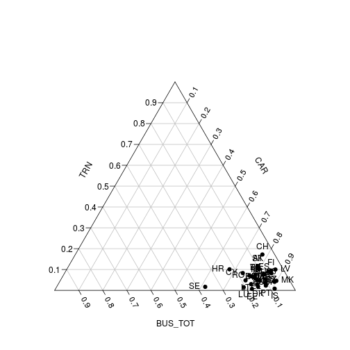

<!--
%\VignetteEngine{knitr::rmarkdown}
%\VignetteIndexEntry{eurostat Markdown Vignette}
%\usepackage[utf8]{inputenc}
-->

This document provides [reproducible source
code](lahti-huovari-kainu-biecek.Rmd) to generate the figures and
tables for [our manuscript (in
preparation)](lahti-huovari-kainu-biecek.pdf) introducing the eurostat
R package.

You can reproduce this markdown document by downloading the  [Rmarkdown source
code](lahti-huovari-kainu-biecek.Rmd) and converting it in R with:


```r
library(knitr)
knit("lahti-huovari-kainu-biecek.Rmd")
```

```
## Error in parse_block(g[-1], g[1], params.src): duplicate label '2015-manu-generate'
```

To reproduce the article PDF, clone [this
repository](https://github.com/rOpenGov/eurostat/), navigate in the
[vignettes/2015-RJournal](https://github.com/rOpenGov/eurostat/blob/master/vignettes/2015-RJournal/)
folder, and run in R:


```r
tools::texi2pdf("RJwrapper.tex")
```


## Installation

Installing the CRAN release version:


```r
install.packages("eurostat")
```

Installing the Github development version:


```r
library(devtools)
install_github("ropengov/eurostat")
```

## Search and download


```r
library(eurostat)
income <- search_eurostat("disposable income", type = "dataset")
```


```r
dat <- get_eurostat(id = "tsdtr210", time_format = "num")
```


```r
print(xtable(head(dat), label = "tab:getdatatable"))
```

```
## % latex table generated in R 3.2.2 by xtable 1.8-0 package
## % Thu Nov 26 00:07:57 2015
## \begin{table}[ht]
## \centering
## \begin{tabular}{rlllrr}
##   \hline
##  & unit & vehicle & geo & time & values \\ 
##   \hline
## 1 & PC & BUS\_TOT & AT & 1990.00 & 11.00 \\ 
##   2 & PC & BUS\_TOT & BE & 1990.00 & 10.60 \\ 
##   3 & PC & BUS\_TOT & BG & 1990.00 &  \\ 
##   4 & PC & BUS\_TOT & CH & 1990.00 & 3.70 \\ 
##   5 & PC & BUS\_TOT & CY & 1990.00 &  \\ 
##   6 & PC & BUS\_TOT & CZ & 1990.00 &  \\ 
##    \hline
## \end{tabular}
## \label{tab:getdatatable}
## \end{table}
```

## Map visualization

 


## Passenger transport


```r
id <- search_eurostat("Modal split of passenger transport", 
        	             type = "table")$code[1]

dat <- get_eurostat(id, time_format = "num")

# Triangle plot on passenger transport distributions with 2012 data for
# all countries with data 
transports <- tidyr::spread(subset(dat, time == 2012,
	   select = c(geo, vehicle, values)), vehicle, values)

# triangle plot
plotrix::triax.plot(na.omit(transports)[, -1], show.grid = TRUE, 
           label.points = TRUE, point.labels = transports$geo, 
           pch = 19)
```

 


## Country code tables


```r
library(eurostat)
data(efta_countries)
print(xtable(efta_countries))
```

```
## % latex table generated in R 3.2.2 by xtable 1.8-0 package
## % Thu Nov 26 00:08:21 2015
## \begin{table}[ht]
## \centering
## \begin{tabular}{rll}
##   \hline
##  & code & name \\ 
##   \hline
## 1 & IS & Iceland \\ 
##   2 & LI & Liechtenstein \\ 
##   3 & NO & Norway \\ 
##   4 & CH & Switzerland \\ 
##    \hline
## \end{tabular}
## \end{table}
```

## Road accidents


```r
t1 <- get_eurostat("tsdtr420") %>%
  dplyr::filter(geo %in% c("UK", "SK", "FR", "PL", "ES", "PT", "LV"))
t1$Country <- t1$geo
ggplot(t1, aes(x = time, y = values, color=Country, group=Country, shape=Country)) +
  geom_point(size=4) + 
  geom_line() + theme_bw() + ggtitle("People killed in road accidents")+
  xlab("Year") + ylab("Number of killed people") + theme(legend.position="top")
```

```
## Warning: The shape palette can deal with a maximum of 6 discrete values
## because more than 6 becomes difficult to discriminate; you have 7.
## Consider specifying shapes manually if you must have them.
```

```
## Warning: The shape palette can deal with a maximum of 6 discrete values
## because more than 6 becomes difficult to discriminate; you have 7.
## Consider specifying shapes manually if you must have them.
```

```
## Warning: Removed 25 rows containing missing values (geom_point).
```

```
## Warning: Removed 10 rows containing missing values (geom_path).
```

```
## Warning: The shape palette can deal with a maximum of 6 discrete values
## because more than 6 becomes difficult to discriminate; you have 7.
## Consider specifying shapes manually if you must have them.
```

 


## Body-mass index


```r
library(dplyr)
tmp1 <- get_eurostat("hlth_ehis_de1", time_format = "raw")
tmp1 %>%
  dplyr::filter( isced97 == "TOTAL" ,
          sex != "T",
          age != "TOTAL", geo == "PL") %>%
  mutate(BMI = factor(bmi, 
                      levels=c("LT18P5","18P5-25","25-30","GE30"), 
                      labels=c("<18.5", "18.5-25", "25-30",">30"))) %>%
  arrange(BMI) %>%
  ggplot(aes(y=values, x=age, fill=BMI)) +
  geom_bar(stat="identity") +
  facet_wrap(~sex) + coord_flip() +
  theme(legend.position="top") + ggtitle("Body mass index (BMI) by sex and age")+xlab("% of population")+scale_fill_brewer(type = "div")
```

 

