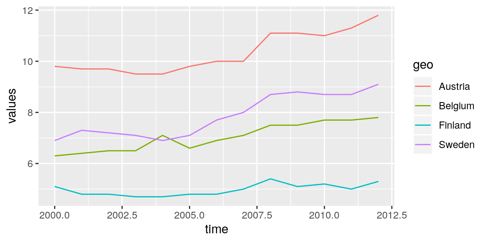
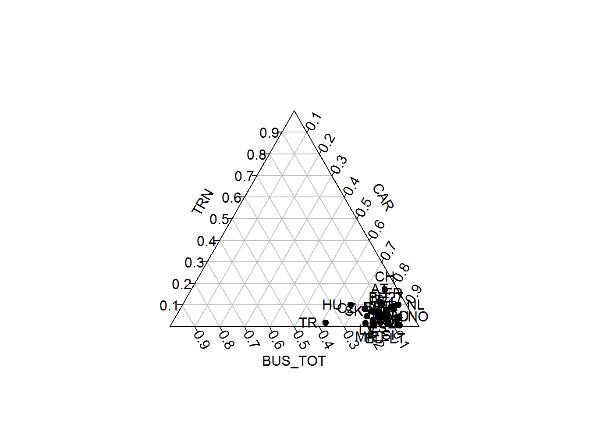
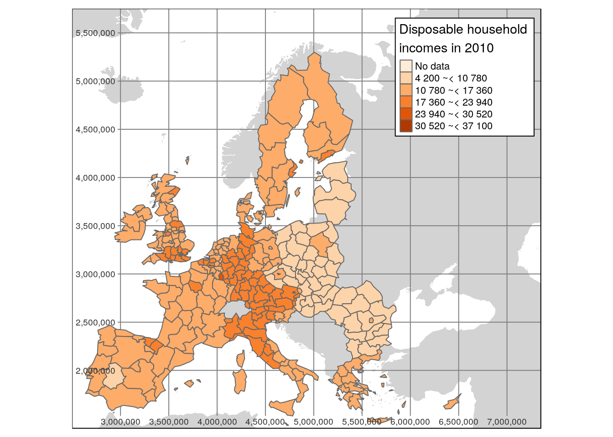
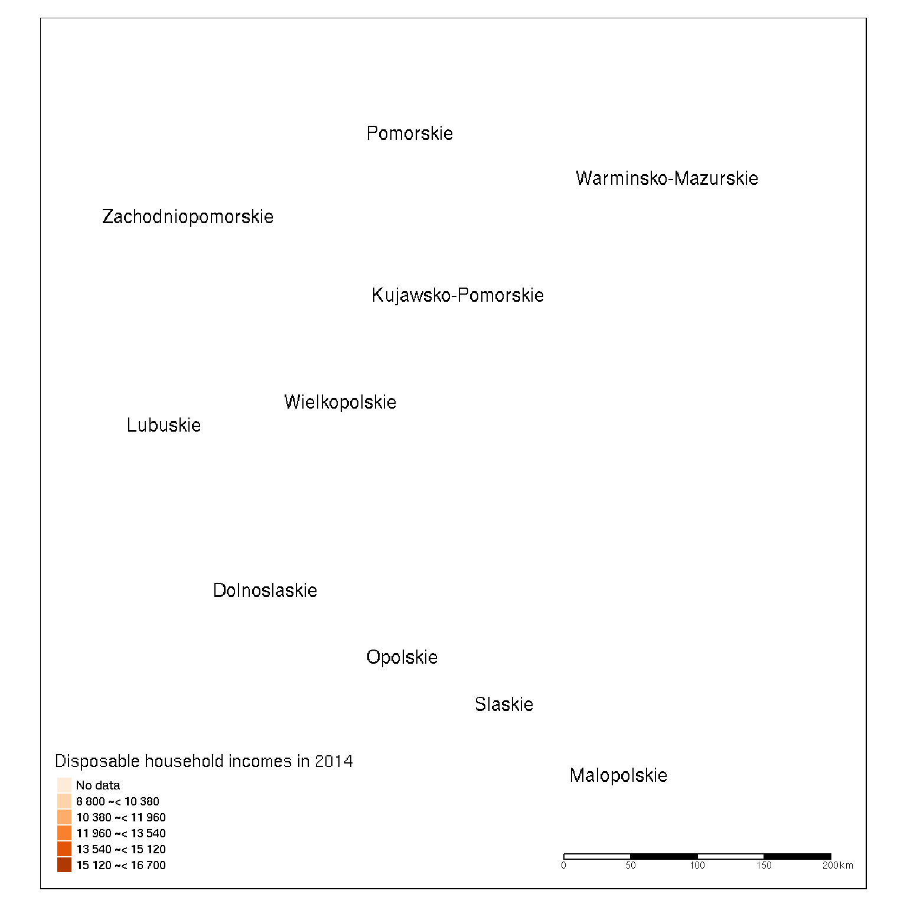
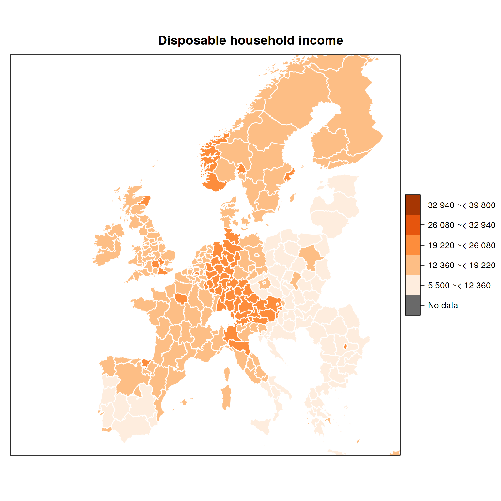
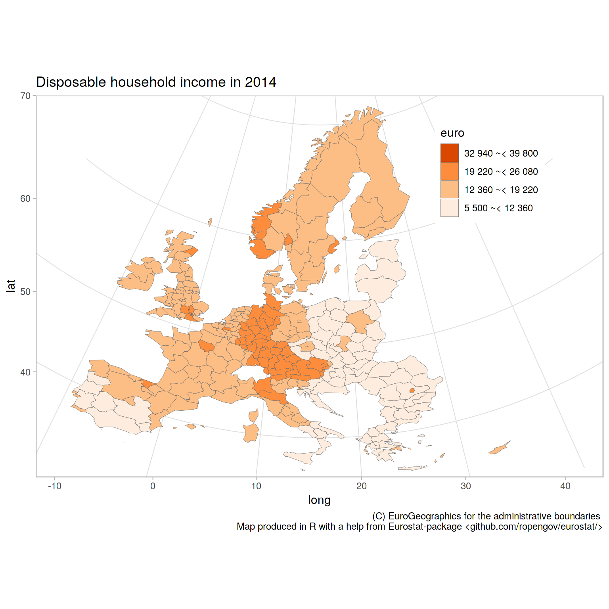

R Tools for Eurostat Open Data
==============================

This [rOpenGov](http://ropengov.github.io) R package provides tools to
access [Eurostat database](http://ec.europa.eu/eurostat/data/database),
which you can also browse on-line for the data sets and documentation.
For contact information and source code, see the [package
website](http://ropengov.github.io/eurostat/).

Installation
============

Release version
[(CRAN)](https://cran.r-project.org/web/packages/eurostat/index.html):

    install.packages("eurostat")

Development version [(Github)](https://github.com/rOpenGov/eurostat):

    library(devtools)
    install_github("ropengov/eurostat")

Overall, the eurostat package includes the following functions:

Finding data
============

Function `get_eurostat_toc()` downloads a table of contents of eurostat
datasets. The values in column 'code' should be used to download a
selected dataset.

    # Load the package
    library(eurostat)
    library(rvest)

    # Get Eurostat data listing
    toc <- get_eurostat_toc()

    # Check the first items
    library(knitr)
    kable(head(toc))

<table>
<thead>
<tr class="header">
<th align="left">title</th>
<th align="left">code</th>
<th align="left">type</th>
<th align="left">last update of data</th>
<th align="left">last table structure change</th>
<th align="left">data start</th>
<th align="left">data end</th>
<th align="left">values</th>
</tr>
</thead>
<tbody>
<tr class="odd">
<td align="left">Database by themes</td>
<td align="left">data</td>
<td align="left">folder</td>
<td align="left">NA</td>
<td align="left">NA</td>
<td align="left">NA</td>
<td align="left">NA</td>
<td align="left">NA</td>
</tr>
<tr class="even">
<td align="left">General and regional statistics</td>
<td align="left">general</td>
<td align="left">folder</td>
<td align="left">NA</td>
<td align="left">NA</td>
<td align="left">NA</td>
<td align="left">NA</td>
<td align="left">NA</td>
</tr>
<tr class="odd">
<td align="left">European and national indicators for short-term analysis</td>
<td align="left">euroind</td>
<td align="left">folder</td>
<td align="left">NA</td>
<td align="left">NA</td>
<td align="left">NA</td>
<td align="left">NA</td>
<td align="left">NA</td>
</tr>
<tr class="even">
<td align="left">Business and consumer surveys (source: DG ECFIN)</td>
<td align="left">ei_bcs</td>
<td align="left">folder</td>
<td align="left">NA</td>
<td align="left">NA</td>
<td align="left">NA</td>
<td align="left">NA</td>
<td align="left">NA</td>
</tr>
<tr class="odd">
<td align="left">Consumer surveys (source: DG ECFIN)</td>
<td align="left">ei_bcs_cs</td>
<td align="left">folder</td>
<td align="left">NA</td>
<td align="left">NA</td>
<td align="left">NA</td>
<td align="left">NA</td>
<td align="left">NA</td>
</tr>
<tr class="even">
<td align="left">Consumers - monthly data</td>
<td align="left">ei_bsco_m</td>
<td align="left">dataset</td>
<td align="left">28.06.2018</td>
<td align="left">28.06.2018</td>
<td align="left">1980M01</td>
<td align="left">2018M06</td>
<td align="left">NA</td>
</tr>
</tbody>
</table>

With `search_eurostat()` you can search the table of contents for
particular patterns, e.g. all datasets related to *passenger transport*.
The kable function to produces nice markdown output. Note that with the
`type` argument of this function you could restrict the search to for
instance datasets or tables.

    # info about passengers
    kable(head(search_eurostat("passenger transport")))

<table>
<thead>
<tr class="header">
<th align="left">title</th>
<th align="left">code</th>
<th align="left">type</th>
<th align="left">last update of data</th>
<th align="left">last table structure change</th>
<th align="left">data start</th>
<th align="left">data end</th>
<th align="left">values</th>
</tr>
</thead>
<tbody>
<tr class="odd">
<td align="left">Volume of passenger transport relative to GDP</td>
<td align="left">tran_hv_pstra</td>
<td align="left">dataset</td>
<td align="left">16.08.2017</td>
<td align="left">14.08.2017</td>
<td align="left">2000</td>
<td align="left">2015</td>
<td align="left">NA</td>
</tr>
<tr class="even">
<td align="left">Modal split of passenger transport</td>
<td align="left">tran_hv_psmod</td>
<td align="left">dataset</td>
<td align="left">17.08.2017</td>
<td align="left">17.08.2017</td>
<td align="left">1990</td>
<td align="left">2015</td>
<td align="left">NA</td>
</tr>
<tr class="odd">
<td align="left">Railway transport - total annual passenger transport (1 000 pass., million pkm)</td>
<td align="left">rail_pa_total</td>
<td align="left">dataset</td>
<td align="left">27.02.2018</td>
<td align="left">08.11.2016</td>
<td align="left">2004</td>
<td align="left">2015</td>
<td align="left">NA</td>
</tr>
<tr class="even">
<td align="left">Railway transport - passenger transport by type of transport (detailed reporting only) (1 000 pass.)</td>
<td align="left">rail_pa_typepas</td>
<td align="left">dataset</td>
<td align="left">17.07.2018</td>
<td align="left">31.08.2017</td>
<td align="left">2004</td>
<td align="left">2016</td>
<td align="left">NA</td>
</tr>
<tr class="odd">
<td align="left">Railway transport - passenger transport by type of transport (detailed reporting only) (million pkm)</td>
<td align="left">rail_pa_typepkm</td>
<td align="left">dataset</td>
<td align="left">17.07.2018</td>
<td align="left">31.08.2017</td>
<td align="left">2004</td>
<td align="left">2016</td>
<td align="left">NA</td>
</tr>
<tr class="even">
<td align="left">International railway passenger transport from the reporting country to the country of disembarkation (1 000 passengers)</td>
<td align="left">rail_pa_intgong</td>
<td align="left">dataset</td>
<td align="left">17.07.2018</td>
<td align="left">17.07.2018</td>
<td align="left">2004</td>
<td align="left">2017</td>
<td align="left">NA</td>
</tr>
</tbody>
</table>

Codes for the dataset can be searched also from the [Eurostat
database](http://ec.europa.eu/eurostat/data/database). The Eurostat
database gives codes in the Data Navigation Tree after every dataset in
parenthesis.

Downloading data
================

The package supports two of the Eurostats download methods: the bulk
download facility and the Web Services' JSON API. The bulk download
facility is the fastest method to download whole datasets. It is also
often the only way as the JSON API has limitation of maximum 50
sub-indicators at a time and whole datasets usually exceeds that. To
download only a small section of the dataset the JSON API is faster, as
it allows to make a data selection before downloading.

A user does not usually have to bother with methods, as both are used
via main function `get_eurostat()`. If only the table id is given, the
whole table is downloaded from the bulk download facility. If also
filters are defined the JSON API is used.

Here an example of indicator 'Modal split of passenger transport'. This
is the percentage share of each mode of transport in total inland
transport, expressed in passenger-kilometres (pkm) based on transport by
passenger cars, buses and coaches, and trains. All data should be based
on movements on national territory, regardless of the nationality of the
vehicle. However, the data collection is not harmonized at the EU level.

Pick and print the id of the data set to download:

    # For the original data, see
    # http://ec.europa.eu/eurostat/tgm/table.do?tab=table&init=1&plugin=1&language=en&pcode=tsdtr210
    id <- search_eurostat("Modal split of passenger transport", 
                             type = "table")$code[1]
    print(id)

\[1\] "t2020\_rk310"

Get the whole corresponding table. As the table is annual data, it is
more convient to use a numeric time variable than use the default date
format:

    dat <- get_eurostat(id, time_format = "num")

Investigate the structure of the downloaded data set:

    str(dat)

    ## Classes 'tbl_df', 'tbl' and 'data.frame':    2431 obs. of  5 variables:
    ##  $ unit   : Factor w/ 1 level "PC": 1 1 1 1 1 1 1 1 1 1 ...
    ##  $ vehicle: Factor w/ 3 levels "BUS_TOT","CAR",..: 1 1 1 1 1 1 1 1 1 1 ...
    ##  $ geo    : Factor w/ 35 levels "AT","BE","CH",..: 1 2 3 4 5 6 7 8 9 10 ...
    ##  $ time   : num  1990 1990 1990 1990 1990 1990 1990 1990 1990 1990 ...
    ##  $ values : num  11 10.6 3.7 9.1 11.3 32.4 14.9 13.5 6 24.8 ...

    kable(head(dat))

<table>
<thead>
<tr class="header">
<th align="left">unit</th>
<th align="left">vehicle</th>
<th align="left">geo</th>
<th align="right">time</th>
<th align="right">values</th>
</tr>
</thead>
<tbody>
<tr class="odd">
<td align="left">PC</td>
<td align="left">BUS_TOT</td>
<td align="left">AT</td>
<td align="right">1990</td>
<td align="right">11.0</td>
</tr>
<tr class="even">
<td align="left">PC</td>
<td align="left">BUS_TOT</td>
<td align="left">BE</td>
<td align="right">1990</td>
<td align="right">10.6</td>
</tr>
<tr class="odd">
<td align="left">PC</td>
<td align="left">BUS_TOT</td>
<td align="left">CH</td>
<td align="right">1990</td>
<td align="right">3.7</td>
</tr>
<tr class="even">
<td align="left">PC</td>
<td align="left">BUS_TOT</td>
<td align="left">DE</td>
<td align="right">1990</td>
<td align="right">9.1</td>
</tr>
<tr class="odd">
<td align="left">PC</td>
<td align="left">BUS_TOT</td>
<td align="left">DK</td>
<td align="right">1990</td>
<td align="right">11.3</td>
</tr>
<tr class="even">
<td align="left">PC</td>
<td align="left">BUS_TOT</td>
<td align="left">EL</td>
<td align="right">1990</td>
<td align="right">32.4</td>
</tr>
</tbody>
</table>

Or you can get only a part of the dataset by defining `filters`
argument. It should be named list, where names corresponds to variable
names (lower case) and values are vectors of codes corresponding
desidered series (upper case). For time variable, in addition to a
`time`, also a `sinceTimePeriod` and a `lastTimePeriod` can be used.

    dat2 <- get_eurostat(id, filters = list(geo = c("EU28", "FI"), lastTimePeriod=1), time_format = "num")
    kable(dat2)

Replacing codes with labels
---------------------------

By default variables are returned as Eurostat codes, but to get
human-readable labels instead, use a `type = "label"` argument.

    datl2 <- get_eurostat(id, filters = list(geo = c("EU28", "FI"), 
                                             lastTimePeriod = 1), 
                          type = "label", time_format = "num")
    kable(head(datl2))

Eurostat codes in the downloaded data set can be replaced with
human-readable labels from the Eurostat dictionaries with the
`label_eurostat()` function.

    datl <- label_eurostat(dat)
    kable(head(datl))

<table>
<thead>
<tr class="header">
<th align="left">unit</th>
<th align="left">vehicle</th>
<th align="left">geo</th>
<th align="right">time</th>
<th align="right">values</th>
</tr>
</thead>
<tbody>
<tr class="odd">
<td align="left">Percentage</td>
<td align="left">Motor coaches, buses and trolley buses</td>
<td align="left">Austria</td>
<td align="right">1990</td>
<td align="right">11.0</td>
</tr>
<tr class="even">
<td align="left">Percentage</td>
<td align="left">Motor coaches, buses and trolley buses</td>
<td align="left">Belgium</td>
<td align="right">1990</td>
<td align="right">10.6</td>
</tr>
<tr class="odd">
<td align="left">Percentage</td>
<td align="left">Motor coaches, buses and trolley buses</td>
<td align="left">Switzerland</td>
<td align="right">1990</td>
<td align="right">3.7</td>
</tr>
<tr class="even">
<td align="left">Percentage</td>
<td align="left">Motor coaches, buses and trolley buses</td>
<td align="left">Germany (until 1990 former territory of the FRG)</td>
<td align="right">1990</td>
<td align="right">9.1</td>
</tr>
<tr class="odd">
<td align="left">Percentage</td>
<td align="left">Motor coaches, buses and trolley buses</td>
<td align="left">Denmark</td>
<td align="right">1990</td>
<td align="right">11.3</td>
</tr>
<tr class="even">
<td align="left">Percentage</td>
<td align="left">Motor coaches, buses and trolley buses</td>
<td align="left">Greece</td>
<td align="right">1990</td>
<td align="right">32.4</td>
</tr>
</tbody>
</table>

The `label_eurostat()` allows conversion of individual variable vectors
or variable names as well.

    label_eurostat_vars(names(datl))

Vehicle information has 3 levels. You can check them now with:

    levels(datl$vehicle)

Selecting and modifying data
============================

EFTA, Eurozone, EU and EU candidate countries
---------------------------------------------

To facilitate smooth visualization of standard European geographic
areas, the package provides ready-made lists of the country codes used
in the eurostat database for EFTA (efta\_countries), Euro area
(ea\_countries), EU (eu\_countries) and EU candidate countries
(eu\_candidate\_countries). These can be used to select specific groups
of countries for closer investigation. For conversions with other
standard country coding systems, see the [countrycode](...) R package.
To retrieve the country code list for EFTA, for instance, use:

    data(efta_countries)
    kable(efta_countries)

<table>
<thead>
<tr class="header">
<th align="left">code</th>
<th align="left">name</th>
</tr>
</thead>
<tbody>
<tr class="odd">
<td align="left">IS</td>
<td align="left">Iceland</td>
</tr>
<tr class="even">
<td align="left">LI</td>
<td align="left">Liechtenstein</td>
</tr>
<tr class="odd">
<td align="left">NO</td>
<td align="left">Norway</td>
</tr>
<tr class="even">
<td align="left">CH</td>
<td align="left">Switzerland</td>
</tr>
</tbody>
</table>

EU data from 2012 in all vehicles:
----------------------------------

    dat_eu12 <- subset(datl, geo == "European Union (current composition)" & time == 2012)
    kable(dat_eu12, row.names = FALSE)

<table>
<thead>
<tr class="header">
<th align="left">unit</th>
<th align="left">vehicle</th>
<th align="left">geo</th>
<th align="right">time</th>
<th align="right">values</th>
</tr>
</thead>
<tbody>
<tr class="odd">
<td align="left">Percentage</td>
<td align="left">Motor coaches, buses and trolley buses</td>
<td align="left">European Union (current composition)</td>
<td align="right">2012</td>
<td align="right">9.5</td>
</tr>
<tr class="even">
<td align="left">Percentage</td>
<td align="left">Passenger cars</td>
<td align="left">European Union (current composition)</td>
<td align="right">2012</td>
<td align="right">82.8</td>
</tr>
<tr class="odd">
<td align="left">Percentage</td>
<td align="left">Trains</td>
<td align="left">European Union (current composition)</td>
<td align="right">2012</td>
<td align="right">7.7</td>
</tr>
</tbody>
</table>

EU data from 2000 - 2012 with vehicle types as variables:
---------------------------------------------------------

Reshaping the data is best done with `spread()` in `tidyr`.

    library("tidyr")
    dat_eu_0012 <- subset(dat, geo == "EU28" & time %in% 2000:2012)
    dat_eu_0012_wide <- spread(dat_eu_0012, vehicle, values)
    kable(subset(dat_eu_0012_wide, select = -geo), row.names = FALSE)

<table>
<thead>
<tr class="header">
<th align="left">unit</th>
<th align="right">time</th>
<th align="right">BUS_TOT</th>
<th align="right">CAR</th>
<th align="right">TRN</th>
</tr>
</thead>
<tbody>
<tr class="odd">
<td align="left">PC</td>
<td align="right">2000</td>
<td align="right">10.4</td>
<td align="right">82.4</td>
<td align="right">7.2</td>
</tr>
<tr class="even">
<td align="left">PC</td>
<td align="right">2001</td>
<td align="right">10.2</td>
<td align="right">82.7</td>
<td align="right">7.1</td>
</tr>
<tr class="odd">
<td align="left">PC</td>
<td align="right">2002</td>
<td align="right">9.9</td>
<td align="right">83.3</td>
<td align="right">6.8</td>
</tr>
<tr class="even">
<td align="left">PC</td>
<td align="right">2003</td>
<td align="right">9.9</td>
<td align="right">83.5</td>
<td align="right">6.7</td>
</tr>
<tr class="odd">
<td align="left">PC</td>
<td align="right">2004</td>
<td align="right">9.8</td>
<td align="right">83.4</td>
<td align="right">6.8</td>
</tr>
<tr class="even">
<td align="left">PC</td>
<td align="right">2005</td>
<td align="right">9.8</td>
<td align="right">83.3</td>
<td align="right">6.9</td>
</tr>
<tr class="odd">
<td align="left">PC</td>
<td align="right">2006</td>
<td align="right">9.7</td>
<td align="right">83.2</td>
<td align="right">7.1</td>
</tr>
<tr class="even">
<td align="left">PC</td>
<td align="right">2007</td>
<td align="right">9.8</td>
<td align="right">83.1</td>
<td align="right">7.1</td>
</tr>
<tr class="odd">
<td align="left">PC</td>
<td align="right">2008</td>
<td align="right">9.9</td>
<td align="right">82.8</td>
<td align="right">7.4</td>
</tr>
<tr class="even">
<td align="left">PC</td>
<td align="right">2009</td>
<td align="right">9.3</td>
<td align="right">83.6</td>
<td align="right">7.1</td>
</tr>
<tr class="odd">
<td align="left">PC</td>
<td align="right">2010</td>
<td align="right">9.4</td>
<td align="right">83.5</td>
<td align="right">7.2</td>
</tr>
<tr class="even">
<td align="left">PC</td>
<td align="right">2011</td>
<td align="right">9.4</td>
<td align="right">83.2</td>
<td align="right">7.3</td>
</tr>
<tr class="odd">
<td align="left">PC</td>
<td align="right">2012</td>
<td align="right">9.5</td>
<td align="right">82.8</td>
<td align="right">7.7</td>
</tr>
</tbody>
</table>

Train passengers for selected EU countries in 2000 - 2012
---------------------------------------------------------

    dat_trains <- subset(datl, geo %in% c("Austria", "Belgium", "Finland", "Sweden")
                         & time %in% 2000:2012 
                         & vehicle == "Trains")

    dat_trains_wide <- spread(dat_trains, geo, values) 
    kable(subset(dat_trains_wide, select = -vehicle), row.names = FALSE)

<table>
<thead>
<tr class="header">
<th align="left">unit</th>
<th align="right">time</th>
<th align="right">Austria</th>
<th align="right">Belgium</th>
<th align="right">Finland</th>
<th align="right">Sweden</th>
</tr>
</thead>
<tbody>
<tr class="odd">
<td align="left">Percentage</td>
<td align="right">2000</td>
<td align="right">9.7</td>
<td align="right">6.3</td>
<td align="right">5.1</td>
<td align="right">6.8</td>
</tr>
<tr class="even">
<td align="left">Percentage</td>
<td align="right">2001</td>
<td align="right">9.7</td>
<td align="right">6.4</td>
<td align="right">4.8</td>
<td align="right">7.1</td>
</tr>
<tr class="odd">
<td align="left">Percentage</td>
<td align="right">2002</td>
<td align="right">9.7</td>
<td align="right">6.5</td>
<td align="right">4.8</td>
<td align="right">7.1</td>
</tr>
<tr class="even">
<td align="left">Percentage</td>
<td align="right">2003</td>
<td align="right">9.5</td>
<td align="right">6.5</td>
<td align="right">4.7</td>
<td align="right">7.0</td>
</tr>
<tr class="odd">
<td align="left">Percentage</td>
<td align="right">2004</td>
<td align="right">9.4</td>
<td align="right">7.1</td>
<td align="right">4.7</td>
<td align="right">6.8</td>
</tr>
<tr class="even">
<td align="left">Percentage</td>
<td align="right">2005</td>
<td align="right">9.8</td>
<td align="right">6.6</td>
<td align="right">4.8</td>
<td align="right">7.1</td>
</tr>
<tr class="odd">
<td align="left">Percentage</td>
<td align="right">2006</td>
<td align="right">10.0</td>
<td align="right">6.9</td>
<td align="right">4.8</td>
<td align="right">7.6</td>
</tr>
<tr class="even">
<td align="left">Percentage</td>
<td align="right">2007</td>
<td align="right">10.0</td>
<td align="right">7.1</td>
<td align="right">5.0</td>
<td align="right">7.9</td>
</tr>
<tr class="odd">
<td align="left">Percentage</td>
<td align="right">2008</td>
<td align="right">11.1</td>
<td align="right">7.5</td>
<td align="right">5.4</td>
<td align="right">8.6</td>
</tr>
<tr class="even">
<td align="left">Percentage</td>
<td align="right">2009</td>
<td align="right">11.1</td>
<td align="right">7.5</td>
<td align="right">5.1</td>
<td align="right">8.7</td>
</tr>
<tr class="odd">
<td align="left">Percentage</td>
<td align="right">2010</td>
<td align="right">11.0</td>
<td align="right">7.7</td>
<td align="right">5.2</td>
<td align="right">8.7</td>
</tr>
<tr class="even">
<td align="left">Percentage</td>
<td align="right">2011</td>
<td align="right">11.3</td>
<td align="right">7.7</td>
<td align="right">5.0</td>
<td align="right">8.7</td>
</tr>
<tr class="odd">
<td align="left">Percentage</td>
<td align="right">2012</td>
<td align="right">11.8</td>
<td align="right">7.8</td>
<td align="right">5.3</td>
<td align="right">9.1</td>
</tr>
</tbody>
</table>

Visualization
=============

Visualizing train passenger data with `ggplot2`:

    library(ggplot2)
    p <- ggplot(dat_trains, aes(x = time, y = values, colour = geo)) 
    p <- p + geom_line()
    print(p)

**Triangle plot**

Triangle plot is handy for visualizing data sets with three variables.

    library(tidyr)
    library(plotrix)
    library(eurostat)
    library(dplyr)
    library(tidyr)

    # All sources of renewable energy are to be grouped into three sets
     dict <- c("Solid biofuels (excluding charcoal)" = "Biofuels",
     "Biogasoline" = "Biofuels",
     "Other liquid biofuels" = "Biofuels",
     "Biodiesels" = "Biofuels",
     "Biogas" = "Biofuels",
     "Hydro power" = "Hydro power",
     "Tide, Wave and Ocean" = "Hydro power",
     "Solar thermal" = "Wind, solar, waste and Other",
     "Geothermal Energy" = "Wind, solar, waste and Other",
     "Solar photovoltaic" = "Wind, solar, waste and Other",
     "Municipal waste (renewable)" = "Wind, solar, waste and Other",
     "Wind power" = "Wind, solar, waste and Other",
     "Bio jet kerosene" = "Wind, solar, waste and Other")
    # Some cleaning of the data is required
     energy3 <- get_eurostat("ten00081") %>%
     label_eurostat(dat) %>%
     filter(time == "2013-01-01",
     product != "Renewable energies") %>%
     mutate(nproduct = dict[as.character(product)], # just three categories
     geo = gsub(geo, pattern=" \\(.*", replacement="")) %>%
     select(nproduct, geo, values) %>%
     group_by(nproduct, geo) %>%
     summarise(svalue = sum(values)) %>%
     group_by(geo) %>%
     mutate(tvalue = sum(svalue),
     svalue = svalue/sum(svalue)) %>%
     filter(tvalue > 1000) %>% # only large countries
     spread(nproduct, svalue)
     
    # Triangle plot
     par(cex=0.75, mar=c(0,0,0,0))
     positions <- plotrix::triax.plot(as.matrix(energy3[, c(3,5,4)]),
                         show.grid = TRUE,
                         label.points= FALSE, point.labels = energy3$geo,
                         col.axis="gray50", col.grid="gray90",
                         pch = 19, cex.axis=0.8, cex.ticks=0.7, col="grey50")

     # Larger labels
     ind <- which(energy3$geo %in%  c("Norway", "Iceland","Denmark","Estonia", "Turkey", "Italy", "Finland"))
     df <- data.frame(positions$xypos, geo = energy3$geo)
     points(df$x[ind], df$y[ind], cex=2, col="red", pch=19)
     text(df$x[ind], df$y[ind], df$geo[ind], adj = c(0.5,-1), cex=1.5)

Maps
----

### Disposable income of private households by NUTS 2 regions at 1:60mln resolution using tmap

The mapping examples below use
[`tmap`](https://github.com/mtennekes/tmap) package.

    library(dplyr)
    library(eurostat)
    library(sf)

    ## Linking to GEOS 3.6.2, GDAL 2.2.3, proj.4 4.9.3

    library(tmap)

    # Download attribute data from Eurostat
    sp_data <- eurostat::get_eurostat("tgs00026", time_format = "raw", stringsAsFactors = FALSE) %>% 
      # subset to have only a single row per geo
      dplyr::filter(time == 2010, nchar(geo) == 4) %>% 
      # categorise
      dplyr::mutate(income = cut_to_classes(values, n = 5))

    ## Table tgs00026 cached at /tmp/RtmpTCqdr2/eurostat/tgs00026_raw_code_FF.rds

    # Download geospatial data from GISCO
    geodata <- get_eurostat_geospatial(output_class = "sf", resolution = "60", nuts_level = 2)

    ## 
    ## COPYRIGHT NOTICE
    ## 
    ## When data downloaded from this page 
    ## <http://ec.europa.eu/eurostat/web/gisco/geodata/reference-data/administrative-units-statistical-units>
    ## is used in any printed or electronic publication, 
    ## in addition to any other provisions 
    ## applicable to the whole Eurostat website, 
    ## data source will have to be acknowledged 
    ## in the legend of the map and 
    ## in the introductory page of the publication 
    ## with the following copyright notice:
    ## 
    ## - EN: (C) EuroGeographics for the administrative boundaries
    ## - FR: (C) EuroGeographics pour les limites administratives
    ## - DE: (C) EuroGeographics bezuglich der Verwaltungsgrenzen
    ## 
    ## For publications in languages other than 
    ## English, French or German, 
    ## the translation of the copyright notice 
    ## in the language of the publication shall be used.
    ## 
    ## If you intend to use the data commercially, 
    ## please contact EuroGeographics for 
    ## information regarding their licence agreements.
    ## 

    ## sf at resolution 1:60 read from local file

    ## 
    ## # --------------------------
    ## HEADS UP!!
    ## 
    ## Function now returns the data in 'sf'-class (simple features) 
    ## by default which is different 
    ## from previous behaviour's 'SpatialPolygonDataFrame'. 
    ## 
    ## If you prefer either 'SpatialPolygonDataFrame' or 
    ## fortified 'data_frame' (for ggplot2::geom_polygon), 
    ## please specify it explicitly to 'output_class'-argument!
    ## 
    ## # --------------------------          
    ## 

    # merge with attribute data with geodata
    map_data <- inner_join(geodata, sp_data)

    ## Joining, by = "geo"

Construct the map

    map1 <- tmap::tm_shape(geodata) +
      tmap::tm_fill("lightgrey") +
      tmap::tm_shape(map_data) +
      tmap::tm_grid() +
      tmap::tm_polygons("income", title = "Disposable household\nincomes in 2010",  
                        palette = "Oranges") +
      tmap::tm_format_Europe(legend.outside = TRUE, attr.outside = TRUE)

    ## Warning in tmap::tm_format_Europe(legend.outside = TRUE, attr.outside =
    ## TRUE): tm_format_Europe not used anymore as of tmap version 2.0, since the
    ## data object Europe is no longer contained

    print(map1)  

    ## Warning in grid.Call.graphics(C_path, x$x, x$y, index, switch(x$rule,
    ## winding = 1L, : Path drawing not available for this device

    ## Warning in grid.Call.graphics(C_path, x$x, x$y, index, switch(x$rule,
    ## winding = 1L, : Path drawing not available for this device

    ## Warning in grid.Call.graphics(C_path, x$x, x$y, index, switch(x$rule,
    ## winding = 1L, : Path drawing not available for this device

    ## Warning in grid.Call.graphics(C_path, x$x, x$y, index, switch(x$rule,
    ## winding = 1L, : Path drawing not available for this device

    ## Warning in grid.Call.graphics(C_path, x$x, x$y, index, switch(x$rule,
    ## winding = 1L, : Path drawing not available for this device

    ## Warning in grid.Call.graphics(C_path, x$x, x$y, index, switch(x$rule,
    ## winding = 1L, : Path drawing not available for this device

    ## Warning in grid.Call.graphics(C_path, x$x, x$y, index, switch(x$rule,
    ## winding = 1L, : Path drawing not available for this device

    ## Warning in grid.Call.graphics(C_path, x$x, x$y, index, switch(x$rule,
    ## winding = 1L, : Path drawing not available for this device

    ## Warning in grid.Call.graphics(C_path, x$x, x$y, index, switch(x$rule,
    ## winding = 1L, : Path drawing not available for this device

    ## Warning in grid.Call.graphics(C_path, x$x, x$y, index, switch(x$rule,
    ## winding = 1L, : Path drawing not available for this device

    ## Warning in grid.Call.graphics(C_path, x$x, x$y, index, switch(x$rule,
    ## winding = 1L, : Path drawing not available for this device

    ## Warning in grid.Call.graphics(C_path, x$x, x$y, index, switch(x$rule,
    ## winding = 1L, : Path drawing not available for this device

    ## Warning in grid.Call.graphics(C_path, x$x, x$y, index, switch(x$rule,
    ## winding = 1L, : Path drawing not available for this device

    ## Warning in grid.Call.graphics(C_path, x$x, x$y, index, switch(x$rule,
    ## winding = 1L, : Path drawing not available for this device

    ## Warning in grid.Call.graphics(C_path, x$x, x$y, index, switch(x$rule,
    ## winding = 1L, : Path drawing not available for this device

    ## Warning in grid.Call.graphics(C_path, x$x, x$y, index, switch(x$rule,
    ## winding = 1L, : Path drawing not available for this device

    ## Warning in grid.Call.graphics(C_path, x$x, x$y, index, switch(x$rule,
    ## winding = 1L, : Path drawing not available for this device

    ## Warning in grid.Call.graphics(C_path, x$x, x$y, index, switch(x$rule,
    ## winding = 1L, : Path drawing not available for this device

    ## Warning in grid.Call.graphics(C_path, x$x, x$y, index, switch(x$rule,
    ## winding = 1L, : Path drawing not available for this device

    ## Warning in grid.Call.graphics(C_path, x$x, x$y, index, switch(x$rule,
    ## winding = 1L, : Path drawing not available for this device

    ## Warning in grid.Call.graphics(C_path, x$x, x$y, index, switch(x$rule,
    ## winding = 1L, : Path drawing not available for this device

    ## Warning in grid.Call.graphics(C_path, x$x, x$y, index, switch(x$rule,
    ## winding = 1L, : Path drawing not available for this device

    ## Warning in grid.Call.graphics(C_path, x$x, x$y, index, switch(x$rule,
    ## winding = 1L, : Path drawing not available for this device

    ## Warning in grid.Call.graphics(C_path, x$x, x$y, index, switch(x$rule,
    ## winding = 1L, : Path drawing not available for this device

    ## Warning in grid.Call.graphics(C_path, x$x, x$y, index, switch(x$rule,
    ## winding = 1L, : Path drawing not available for this device

    ## Warning in grid.Call.graphics(C_path, x$x, x$y, index, switch(x$rule,
    ## winding = 1L, : Path drawing not available for this device

    ## Warning in grid.Call.graphics(C_path, x$x, x$y, index, switch(x$rule,
    ## winding = 1L, : Path drawing not available for this device

    ## Warning in grid.Call.graphics(C_path, x$x, x$y, index, switch(x$rule,
    ## winding = 1L, : Path drawing not available for this device

    ## Warning in grid.Call.graphics(C_path, x$x, x$y, index, switch(x$rule,
    ## winding = 1L, : Path drawing not available for this device

    ## Warning in grid.Call.graphics(C_path, x$x, x$y, index, switch(x$rule,
    ## winding = 1L, : Path drawing not available for this device

    ## Warning in grid.Call.graphics(C_path, x$x, x$y, index, switch(x$rule,
    ## winding = 1L, : Path drawing not available for this device

    ## Warning in grid.Call.graphics(C_path, x$x, x$y, index, switch(x$rule,
    ## winding = 1L, : Path drawing not available for this device

    ## Warning in grid.Call.graphics(C_path, x$x, x$y, index, switch(x$rule,
    ## winding = 1L, : Path drawing not available for this device

    ## Warning in grid.Call.graphics(C_path, x$x, x$y, index, switch(x$rule,
    ## winding = 1L, : Path drawing not available for this device

    ## Warning in grid.Call.graphics(C_path, x$x, x$y, index, switch(x$rule,
    ## winding = 1L, : Path drawing not available for this device

    ## Warning in grid.Call.graphics(C_path, x$x, x$y, index, switch(x$rule,
    ## winding = 1L, : Path drawing not available for this device

    ## Warning in grid.Call.graphics(C_path, x$x, x$y, index, switch(x$rule,
    ## winding = 1L, : Path drawing not available for this device

    ## Warning in grid.Call.graphics(C_path, x$x, x$y, index, switch(x$rule,
    ## winding = 1L, : Path drawing not available for this device

    ## Warning in grid.Call.graphics(C_path, x$x, x$y, index, switch(x$rule,
    ## winding = 1L, : Path drawing not available for this device

    ## Warning in grid.Call.graphics(C_path, x$x, x$y, index, switch(x$rule,
    ## winding = 1L, : Path drawing not available for this device

    ## Warning in grid.Call.graphics(C_path, x$x, x$y, index, switch(x$rule,
    ## winding = 1L, : Path drawing not available for this device

    ## Warning in grid.Call.graphics(C_path, x$x, x$y, index, switch(x$rule,
    ## winding = 1L, : Path drawing not available for this device

    ## Warning in grid.Call.graphics(C_path, x$x, x$y, index, switch(x$rule,
    ## winding = 1L, : Path drawing not available for this device

    ## Warning in grid.Call.graphics(C_path, x$x, x$y, index, switch(x$rule,
    ## winding = 1L, : Path drawing not available for this device

    ## Warning in grid.Call.graphics(C_path, x$x, x$y, index, switch(x$rule,
    ## winding = 1L, : Path drawing not available for this device

    ## Warning in grid.Call.graphics(C_path, x$x, x$y, index, switch(x$rule,
    ## winding = 1L, : Path drawing not available for this device

    ## Warning in grid.Call.graphics(C_path, x$x, x$y, index, switch(x$rule,
    ## winding = 1L, : Path drawing not available for this device

    ## Warning in grid.Call.graphics(C_path, x$x, x$y, index, switch(x$rule,
    ## winding = 1L, : Path drawing not available for this device

    ## Warning in grid.Call.graphics(C_path, x$x, x$y, index, switch(x$rule,
    ## winding = 1L, : Path drawing not available for this device

    ## Warning in grid.Call.graphics(C_path, x$x, x$y, index, switch(x$rule,
    ## winding = 1L, : Path drawing not available for this device

    ## Warning in grid.Call.graphics(C_path, x$x, x$y, index, switch(x$rule,
    ## winding = 1L, : Path drawing not available for this device

    ## Warning in grid.Call.graphics(C_path, x$x, x$y, index, switch(x$rule,
    ## winding = 1L, : Path drawing not available for this device

    ## Warning in grid.Call.graphics(C_path, x$x, x$y, index, switch(x$rule,
    ## winding = 1L, : Path drawing not available for this device

    ## Warning in grid.Call.graphics(C_path, x$x, x$y, index, switch(x$rule,
    ## winding = 1L, : Path drawing not available for this device

    ## Warning in grid.Call.graphics(C_path, x$x, x$y, index, switch(x$rule,
    ## winding = 1L, : Path drawing not available for this device

    ## Warning in grid.Call.graphics(C_path, x$x, x$y, index, switch(x$rule,
    ## winding = 1L, : Path drawing not available for this device

    ## Warning in grid.Call.graphics(C_path, x$x, x$y, index, switch(x$rule,
    ## winding = 1L, : Path drawing not available for this device

    ## Warning in grid.Call.graphics(C_path, x$x, x$y, index, switch(x$rule,
    ## winding = 1L, : Path drawing not available for this device

    ## Warning in grid.Call.graphics(C_path, x$x, x$y, index, switch(x$rule,
    ## winding = 1L, : Path drawing not available for this device

    ## Warning in grid.Call.graphics(C_path, x$x, x$y, index, switch(x$rule,
    ## winding = 1L, : Path drawing not available for this device

    ## Warning in grid.Call.graphics(C_path, x$x, x$y, index, switch(x$rule,
    ## winding = 1L, : Path drawing not available for this device

    ## Warning in grid.Call.graphics(C_path, x$x, x$y, index, switch(x$rule,
    ## winding = 1L, : Path drawing not available for this device

    ## Warning in grid.Call.graphics(C_path, x$x, x$y, index, switch(x$rule,
    ## winding = 1L, : Path drawing not available for this device

    ## Warning in grid.Call.graphics(C_path, x$x, x$y, index, switch(x$rule,
    ## winding = 1L, : Path drawing not available for this device

    ## Warning in grid.Call.graphics(C_path, x$x, x$y, index, switch(x$rule,
    ## winding = 1L, : Path drawing not available for this device

    ## Warning in grid.Call.graphics(C_path, x$x, x$y, index, switch(x$rule,
    ## winding = 1L, : Path drawing not available for this device

    ## Warning in grid.Call.graphics(C_path, x$x, x$y, index, switch(x$rule,
    ## winding = 1L, : Path drawing not available for this device

    ## Warning in grid.Call.graphics(C_path, x$x, x$y, index, switch(x$rule,
    ## winding = 1L, : Path drawing not available for this device

    ## Warning in grid.Call.graphics(C_path, x$x, x$y, index, switch(x$rule,
    ## winding = 1L, : Path drawing not available for this device

    ## Warning in grid.Call.graphics(C_path, x$x, x$y, index, switch(x$rule,
    ## winding = 1L, : Path drawing not available for this device

    ## Warning in grid.Call.graphics(C_path, x$x, x$y, index, switch(x$rule,
    ## winding = 1L, : Path drawing not available for this device

    ## Warning in grid.Call.graphics(C_path, x$x, x$y, index, switch(x$rule,
    ## winding = 1L, : Path drawing not available for this device

    ## Warning in grid.Call.graphics(C_path, x$x, x$y, index, switch(x$rule,
    ## winding = 1L, : Path drawing not available for this device

    ## Warning in grid.Call.graphics(C_path, x$x, x$y, index, switch(x$rule,
    ## winding = 1L, : Path drawing not available for this device

    ## Warning in grid.Call.graphics(C_path, x$x, x$y, index, switch(x$rule,
    ## winding = 1L, : Path drawing not available for this device

    ## Warning in grid.Call.graphics(C_path, x$x, x$y, index, switch(x$rule,
    ## winding = 1L, : Path drawing not available for this device

    ## Warning in grid.Call.graphics(C_path, x$x, x$y, index, switch(x$rule,
    ## winding = 1L, : Path drawing not available for this device

    ## Warning in grid.Call.graphics(C_path, x$x, x$y, index, switch(x$rule,
    ## winding = 1L, : Path drawing not available for this device

    ## Warning in grid.Call.graphics(C_path, x$x, x$y, index, switch(x$rule,
    ## winding = 1L, : Path drawing not available for this device

    ## Warning in grid.Call.graphics(C_path, x$x, x$y, index, switch(x$rule,
    ## winding = 1L, : Path drawing not available for this device

    ## Warning in grid.Call.graphics(C_path, x$x, x$y, index, switch(x$rule,
    ## winding = 1L, : Path drawing not available for this device

    ## Warning in grid.Call.graphics(C_path, x$x, x$y, index, switch(x$rule,
    ## winding = 1L, : Path drawing not available for this device

    ## Warning in grid.Call.graphics(C_path, x$x, x$y, index, switch(x$rule,
    ## winding = 1L, : Path drawing not available for this device

    ## Warning in grid.Call.graphics(C_path, x$x, x$y, index, switch(x$rule,
    ## winding = 1L, : Path drawing not available for this device

    ## Warning in grid.Call.graphics(C_path, x$x, x$y, index, switch(x$rule,
    ## winding = 1L, : Path drawing not available for this device

    ## Warning in grid.Call.graphics(C_path, x$x, x$y, index, switch(x$rule,
    ## winding = 1L, : Path drawing not available for this device

    ## Warning in grid.Call.graphics(C_path, x$x, x$y, index, switch(x$rule,
    ## winding = 1L, : Path drawing not available for this device

    ## Warning in grid.Call.graphics(C_path, x$x, x$y, index, switch(x$rule,
    ## winding = 1L, : Path drawing not available for this device

    ## Warning in grid.Call.graphics(C_path, x$x, x$y, index, switch(x$rule,
    ## winding = 1L, : Path drawing not available for this device

    ## Warning in grid.Call.graphics(C_path, x$x, x$y, index, switch(x$rule,
    ## winding = 1L, : Path drawing not available for this device

    ## Warning in grid.Call.graphics(C_path, x$x, x$y, index, switch(x$rule,
    ## winding = 1L, : Path drawing not available for this device

    ## Warning in grid.Call.graphics(C_path, x$x, x$y, index, switch(x$rule,
    ## winding = 1L, : Path drawing not available for this device

    ## Warning in grid.Call.graphics(C_path, x$x, x$y, index, switch(x$rule,
    ## winding = 1L, : Path drawing not available for this device

    ## Warning in grid.Call.graphics(C_path, x$x, x$y, index, switch(x$rule,
    ## winding = 1L, : Path drawing not available for this device

    ## Warning in grid.Call.graphics(C_path, x$x, x$y, index, switch(x$rule,
    ## winding = 1L, : Path drawing not available for this device

    ## Warning in grid.Call.graphics(C_path, x$x, x$y, index, switch(x$rule,
    ## winding = 1L, : Path drawing not available for this device

    ## Warning in grid.Call.graphics(C_path, x$x, x$y, index, switch(x$rule,
    ## winding = 1L, : Path drawing not available for this device

    ## Warning in grid.Call.graphics(C_path, x$x, x$y, index, switch(x$rule,
    ## winding = 1L, : Path drawing not available for this device

    ## Warning in grid.Call.graphics(C_path, x$x, x$y, index, switch(x$rule,
    ## winding = 1L, : Path drawing not available for this device

    ## Warning in grid.Call.graphics(C_path, x$x, x$y, index, switch(x$rule,
    ## winding = 1L, : Path drawing not available for this device

    ## Warning in grid.Call.graphics(C_path, x$x, x$y, index, switch(x$rule,
    ## winding = 1L, : Path drawing not available for this device

    ## Warning in grid.Call.graphics(C_path, x$x, x$y, index, switch(x$rule,
    ## winding = 1L, : Path drawing not available for this device

    ## Warning in grid.Call.graphics(C_path, x$x, x$y, index, switch(x$rule,
    ## winding = 1L, : Path drawing not available for this device

    ## Warning in grid.Call.graphics(C_path, x$x, x$y, index, switch(x$rule,
    ## winding = 1L, : Path drawing not available for this device

    ## Warning in grid.Call.graphics(C_path, x$x, x$y, index, switch(x$rule,
    ## winding = 1L, : Path drawing not available for this device

    ## Warning in grid.Call.graphics(C_path, x$x, x$y, index, switch(x$rule,
    ## winding = 1L, : Path drawing not available for this device

    ## Warning in grid.Call.graphics(C_path, x$x, x$y, index, switch(x$rule,
    ## winding = 1L, : Path drawing not available for this device

    ## Warning in grid.Call.graphics(C_path, x$x, x$y, index, switch(x$rule,
    ## winding = 1L, : Path drawing not available for this device

    ## Warning in grid.Call.graphics(C_path, x$x, x$y, index, switch(x$rule,
    ## winding = 1L, : Path drawing not available for this device

    ## Warning in grid.Call.graphics(C_path, x$x, x$y, index, switch(x$rule,
    ## winding = 1L, : Path drawing not available for this device

    ## Warning in grid.Call.graphics(C_path, x$x, x$y, index, switch(x$rule,
    ## winding = 1L, : Path drawing not available for this device

    ## Warning in grid.Call.graphics(C_path, x$x, x$y, index, switch(x$rule,
    ## winding = 1L, : Path drawing not available for this device

    ## Warning in grid.Call.graphics(C_path, x$x, x$y, index, switch(x$rule,
    ## winding = 1L, : Path drawing not available for this device

    ## Warning in grid.Call.graphics(C_path, x$x, x$y, index, switch(x$rule,
    ## winding = 1L, : Path drawing not available for this device

    ## Warning in grid.Call.graphics(C_path, x$x, x$y, index, switch(x$rule,
    ## winding = 1L, : Path drawing not available for this device

    ## Warning in grid.Call.graphics(C_path, x$x, x$y, index, switch(x$rule,
    ## winding = 1L, : Path drawing not available for this device

    ## Warning in grid.Call.graphics(C_path, x$x, x$y, index, switch(x$rule,
    ## winding = 1L, : Path drawing not available for this device

    ## Warning in grid.Call.graphics(C_path, x$x, x$y, index, switch(x$rule,
    ## winding = 1L, : Path drawing not available for this device

    ## Warning in grid.Call.graphics(C_path, x$x, x$y, index, switch(x$rule,
    ## winding = 1L, : Path drawing not available for this device

    ## Warning in grid.Call.graphics(C_path, x$x, x$y, index, switch(x$rule,
    ## winding = 1L, : Path drawing not available for this device

    ## Warning in grid.Call.graphics(C_path, x$x, x$y, index, switch(x$rule,
    ## winding = 1L, : Path drawing not available for this device

    ## Warning in grid.Call.graphics(C_path, x$x, x$y, index, switch(x$rule,
    ## winding = 1L, : Path drawing not available for this device

    ## Warning in grid.Call.graphics(C_path, x$x, x$y, index, switch(x$rule,
    ## winding = 1L, : Path drawing not available for this device

    ## Warning in grid.Call.graphics(C_path, x$x, x$y, index, switch(x$rule,
    ## winding = 1L, : Path drawing not available for this device

    ## Warning in grid.Call.graphics(C_path, x$x, x$y, index, switch(x$rule,
    ## winding = 1L, : Path drawing not available for this device

    ## Warning in grid.Call.graphics(C_path, x$x, x$y, index, switch(x$rule,
    ## winding = 1L, : Path drawing not available for this device

    ## Warning in grid.Call.graphics(C_path, x$x, x$y, index, switch(x$rule,
    ## winding = 1L, : Path drawing not available for this device

    ## Warning in grid.Call.graphics(C_path, x$x, x$y, index, switch(x$rule,
    ## winding = 1L, : Path drawing not available for this device

    ## Warning in grid.Call.graphics(C_path, x$x, x$y, index, switch(x$rule,
    ## winding = 1L, : Path drawing not available for this device

    ## Warning in grid.Call.graphics(C_path, x$x, x$y, index, switch(x$rule,
    ## winding = 1L, : Path drawing not available for this device

    ## Warning in grid.Call.graphics(C_path, x$x, x$y, index, switch(x$rule,
    ## winding = 1L, : Path drawing not available for this device

    ## Warning in grid.Call.graphics(C_path, x$x, x$y, index, switch(x$rule,
    ## winding = 1L, : Path drawing not available for this device

    ## Warning in grid.Call.graphics(C_path, x$x, x$y, index, switch(x$rule,
    ## winding = 1L, : Path drawing not available for this device

    ## Warning in grid.Call.graphics(C_path, x$x, x$y, index, switch(x$rule,
    ## winding = 1L, : Path drawing not available for this device

    ## Warning in grid.Call.graphics(C_path, x$x, x$y, index, switch(x$rule,
    ## winding = 1L, : Path drawing not available for this device

    ## Warning in grid.Call.graphics(C_path, x$x, x$y, index, switch(x$rule,
    ## winding = 1L, : Path drawing not available for this device

    ## Warning in grid.Call.graphics(C_path, x$x, x$y, index, switch(x$rule,
    ## winding = 1L, : Path drawing not available for this device

    ## Warning in grid.Call.graphics(C_path, x$x, x$y, index, switch(x$rule,
    ## winding = 1L, : Path drawing not available for this device

    ## Warning in grid.Call.graphics(C_path, x$x, x$y, index, switch(x$rule,
    ## winding = 1L, : Path drawing not available for this device

    ## Warning in grid.Call.graphics(C_path, x$x, x$y, index, switch(x$rule,
    ## winding = 1L, : Path drawing not available for this device

    ## Warning in grid.Call.graphics(C_path, x$x, x$y, index, switch(x$rule,
    ## winding = 1L, : Path drawing not available for this device

    ## Warning in grid.Call.graphics(C_path, x$x, x$y, index, switch(x$rule,
    ## winding = 1L, : Path drawing not available for this device

    ## Warning in grid.Call.graphics(C_path, x$x, x$y, index, switch(x$rule,
    ## winding = 1L, : Path drawing not available for this device

    ## Warning in grid.Call.graphics(C_path, x$x, x$y, index, switch(x$rule,
    ## winding = 1L, : Path drawing not available for this device

    ## Warning in grid.Call.graphics(C_path, x$x, x$y, index, switch(x$rule,
    ## winding = 1L, : Path drawing not available for this device

    ## Warning in grid.Call.graphics(C_path, x$x, x$y, index, switch(x$rule,
    ## winding = 1L, : Path drawing not available for this device

    ## Warning in grid.Call.graphics(C_path, x$x, x$y, index, switch(x$rule,
    ## winding = 1L, : Path drawing not available for this device

    ## Warning in grid.Call.graphics(C_path, x$x, x$y, index, switch(x$rule,
    ## winding = 1L, : Path drawing not available for this device

    ## Warning in grid.Call.graphics(C_path, x$x, x$y, index, switch(x$rule,
    ## winding = 1L, : Path drawing not available for this device

    ## Warning in grid.Call.graphics(C_path, x$x, x$y, index, switch(x$rule,
    ## winding = 1L, : Path drawing not available for this device

    ## Warning in grid.Call.graphics(C_path, x$x, x$y, index, switch(x$rule,
    ## winding = 1L, : Path drawing not available for this device

    ## Warning in grid.Call.graphics(C_path, x$x, x$y, index, switch(x$rule,
    ## winding = 1L, : Path drawing not available for this device

    ## Warning in grid.Call.graphics(C_path, x$x, x$y, index, switch(x$rule,
    ## winding = 1L, : Path drawing not available for this device

    ## Warning in grid.Call.graphics(C_path, x$x, x$y, index, switch(x$rule,
    ## winding = 1L, : Path drawing not available for this device

    ## Warning in grid.Call.graphics(C_path, x$x, x$y, index, switch(x$rule,
    ## winding = 1L, : Path drawing not available for this device

    ## Warning in grid.Call.graphics(C_path, x$x, x$y, index, switch(x$rule,
    ## winding = 1L, : Path drawing not available for this device

    ## Warning in grid.Call.graphics(C_path, x$x, x$y, index, switch(x$rule,
    ## winding = 1L, : Path drawing not available for this device

    ## Warning in grid.Call.graphics(C_path, x$x, x$y, index, switch(x$rule,
    ## winding = 1L, : Path drawing not available for this device

    ## Warning in grid.Call.graphics(C_path, x$x, x$y, index, switch(x$rule,
    ## winding = 1L, : Path drawing not available for this device

    ## Warning in grid.Call.graphics(C_path, x$x, x$y, index, switch(x$rule,
    ## winding = 1L, : Path drawing not available for this device

    ## Warning in grid.Call.graphics(C_path, x$x, x$y, index, switch(x$rule,
    ## winding = 1L, : Path drawing not available for this device

    ## Warning in grid.Call.graphics(C_path, x$x, x$y, index, switch(x$rule,
    ## winding = 1L, : Path drawing not available for this device

    ## Warning in grid.Call.graphics(C_path, x$x, x$y, index, switch(x$rule,
    ## winding = 1L, : Path drawing not available for this device

    ## Warning in grid.Call.graphics(C_path, x$x, x$y, index, switch(x$rule,
    ## winding = 1L, : Path drawing not available for this device

    ## Warning in grid.Call.graphics(C_path, x$x, x$y, index, switch(x$rule,
    ## winding = 1L, : Path drawing not available for this device

    ## Warning in grid.Call.graphics(C_path, x$x, x$y, index, switch(x$rule,
    ## winding = 1L, : Path drawing not available for this device

    ## Warning in grid.Call.graphics(C_path, x$x, x$y, index, switch(x$rule,
    ## winding = 1L, : Path drawing not available for this device

    ## Warning in grid.Call.graphics(C_path, x$x, x$y, index, switch(x$rule,
    ## winding = 1L, : Path drawing not available for this device

    ## Warning in grid.Call.graphics(C_path, x$x, x$y, index, switch(x$rule,
    ## winding = 1L, : Path drawing not available for this device

    ## Warning in grid.Call.graphics(C_path, x$x, x$y, index, switch(x$rule,
    ## winding = 1L, : Path drawing not available for this device

    ## Warning in grid.Call.graphics(C_path, x$x, x$y, index, switch(x$rule,
    ## winding = 1L, : Path drawing not available for this device

    ## Warning in grid.Call.graphics(C_path, x$x, x$y, index, switch(x$rule,
    ## winding = 1L, : Path drawing not available for this device

    ## Warning in grid.Call.graphics(C_path, x$x, x$y, index, switch(x$rule,
    ## winding = 1L, : Path drawing not available for this device

    ## Warning in grid.Call.graphics(C_path, x$x, x$y, index, switch(x$rule,
    ## winding = 1L, : Path drawing not available for this device

    ## Warning in grid.Call.graphics(C_path, x$x, x$y, index, switch(x$rule,
    ## winding = 1L, : Path drawing not available for this device

    ## Warning in grid.Call.graphics(C_path, x$x, x$y, index, switch(x$rule,
    ## winding = 1L, : Path drawing not available for this device

    ## Warning in grid.Call.graphics(C_path, x$x, x$y, index, switch(x$rule,
    ## winding = 1L, : Path drawing not available for this device

    ## Warning in grid.Call.graphics(C_path, x$x, x$y, index, switch(x$rule,
    ## winding = 1L, : Path drawing not available for this device

    ## Warning in grid.Call.graphics(C_path, x$x, x$y, index, switch(x$rule,
    ## winding = 1L, : Path drawing not available for this device

    ## Warning in grid.Call.graphics(C_path, x$x, x$y, index, switch(x$rule,
    ## winding = 1L, : Path drawing not available for this device

    ## Warning in grid.Call.graphics(C_path, x$x, x$y, index, switch(x$rule,
    ## winding = 1L, : Path drawing not available for this device

    ## Warning in grid.Call.graphics(C_path, x$x, x$y, index, switch(x$rule,
    ## winding = 1L, : Path drawing not available for this device

    ## Warning in grid.Call.graphics(C_path, x$x, x$y, index, switch(x$rule,
    ## winding = 1L, : Path drawing not available for this device

    ## Warning in grid.Call.graphics(C_path, x$x, x$y, index, switch(x$rule,
    ## winding = 1L, : Path drawing not available for this device

    ## Warning in grid.Call.graphics(C_path, x$x, x$y, index, switch(x$rule,
    ## winding = 1L, : Path drawing not available for this device

    ## Warning in grid.Call.graphics(C_path, x$x, x$y, index, switch(x$rule,
    ## winding = 1L, : Path drawing not available for this device

    ## Warning in grid.Call.graphics(C_path, x$x, x$y, index, switch(x$rule,
    ## winding = 1L, : Path drawing not available for this device

    ## Warning in grid.Call.graphics(C_path, x$x, x$y, index, switch(x$rule,
    ## winding = 1L, : Path drawing not available for this device

    ## Warning in grid.Call.graphics(C_path, x$x, x$y, index, switch(x$rule,
    ## winding = 1L, : Path drawing not available for this device

    ## Warning in grid.Call.graphics(C_path, x$x, x$y, index, switch(x$rule,
    ## winding = 1L, : Path drawing not available for this device

    ## Warning in grid.Call.graphics(C_path, x$x, x$y, index, switch(x$rule,
    ## winding = 1L, : Path drawing not available for this device

    ## Warning in grid.Call.graphics(C_path, x$x, x$y, index, switch(x$rule,
    ## winding = 1L, : Path drawing not available for this device

    ## Warning in grid.Call.graphics(C_path, x$x, x$y, index, switch(x$rule,
    ## winding = 1L, : Path drawing not available for this device

    ## Warning in grid.Call.graphics(C_path, x$x, x$y, index, switch(x$rule,
    ## winding = 1L, : Path drawing not available for this device

    ## Warning in grid.Call.graphics(C_path, x$x, x$y, index, switch(x$rule,
    ## winding = 1L, : Path drawing not available for this device

    ## Warning in grid.Call.graphics(C_path, x$x, x$y, index, switch(x$rule,
    ## winding = 1L, : Path drawing not available for this device

    ## Warning in grid.Call.graphics(C_path, x$x, x$y, index, switch(x$rule,
    ## winding = 1L, : Path drawing not available for this device

    ## Warning in grid.Call.graphics(C_path, x$x, x$y, index, switch(x$rule,
    ## winding = 1L, : Path drawing not available for this device

    ## Warning in grid.Call.graphics(C_path, x$x, x$y, index, switch(x$rule,
    ## winding = 1L, : Path drawing not available for this device

    ## Warning in grid.Call.graphics(C_path, x$x, x$y, index, switch(x$rule,
    ## winding = 1L, : Path drawing not available for this device

    ## Warning in grid.Call.graphics(C_path, x$x, x$y, index, switch(x$rule,
    ## winding = 1L, : Path drawing not available for this device

    ## Warning in grid.Call.graphics(C_path, x$x, x$y, index, switch(x$rule,
    ## winding = 1L, : Path drawing not available for this device

    ## Warning in grid.Call.graphics(C_path, x$x, x$y, index, switch(x$rule,
    ## winding = 1L, : Path drawing not available for this device

    ## Warning in grid.Call.graphics(C_path, x$x, x$y, index, switch(x$rule,
    ## winding = 1L, : Path drawing not available for this device

    ## Warning in grid.Call.graphics(C_path, x$x, x$y, index, switch(x$rule,
    ## winding = 1L, : Path drawing not available for this device

    ## Warning in grid.Call.graphics(C_path, x$x, x$y, index, switch(x$rule,
    ## winding = 1L, : Path drawing not available for this device

    ## Warning in grid.Call.graphics(C_path, x$x, x$y, index, switch(x$rule,
    ## winding = 1L, : Path drawing not available for this device

    ## Warning in grid.Call.graphics(C_path, x$x, x$y, index, switch(x$rule,
    ## winding = 1L, : Path drawing not available for this device

    ## Warning in grid.Call.graphics(C_path, x$x, x$y, index, switch(x$rule,
    ## winding = 1L, : Path drawing not available for this device

    ## Warning in grid.Call.graphics(C_path, x$x, x$y, index, switch(x$rule,
    ## winding = 1L, : Path drawing not available for this device

    ## Warning in grid.Call.graphics(C_path, x$x, x$y, index, switch(x$rule,
    ## winding = 1L, : Path drawing not available for this device

    ## Warning in grid.Call.graphics(C_path, x$x, x$y, index, switch(x$rule,
    ## winding = 1L, : Path drawing not available for this device

    ## Warning in grid.Call.graphics(C_path, x$x, x$y, index, switch(x$rule,
    ## winding = 1L, : Path drawing not available for this device

    ## Warning in grid.Call.graphics(C_path, x$x, x$y, index, switch(x$rule,
    ## winding = 1L, : Path drawing not available for this device

    ## Warning in grid.Call.graphics(C_path, x$x, x$y, index, switch(x$rule,
    ## winding = 1L, : Path drawing not available for this device

    ## Warning in grid.Call.graphics(C_path, x$x, x$y, index, switch(x$rule,
    ## winding = 1L, : Path drawing not available for this device

    ## Warning in grid.Call.graphics(C_path, x$x, x$y, index, switch(x$rule,
    ## winding = 1L, : Path drawing not available for this device

    ## Warning in grid.Call.graphics(C_path, x$x, x$y, index, switch(x$rule,
    ## winding = 1L, : Path drawing not available for this device

    ## Warning in grid.Call.graphics(C_path, x$x, x$y, index, switch(x$rule,
    ## winding = 1L, : Path drawing not available for this device

    ## Warning in grid.Call.graphics(C_path, x$x, x$y, index, switch(x$rule,
    ## winding = 1L, : Path drawing not available for this device

    ## Warning in grid.Call.graphics(C_path, x$x, x$y, index, switch(x$rule,
    ## winding = 1L, : Path drawing not available for this device

    ## Warning in grid.Call.graphics(C_path, x$x, x$y, index, switch(x$rule,
    ## winding = 1L, : Path drawing not available for this device

    ## Warning in grid.Call.graphics(C_path, x$x, x$y, index, switch(x$rule,
    ## winding = 1L, : Path drawing not available for this device

    ## Warning in grid.Call.graphics(C_path, x$x, x$y, index, switch(x$rule,
    ## winding = 1L, : Path drawing not available for this device

    ## Warning in grid.Call.graphics(C_path, x$x, x$y, index, switch(x$rule,
    ## winding = 1L, : Path drawing not available for this device

    ## Warning in grid.Call.graphics(C_path, x$x, x$y, index, switch(x$rule,
    ## winding = 1L, : Path drawing not available for this device

    ## Warning in grid.Call.graphics(C_path, x$x, x$y, index, switch(x$rule,
    ## winding = 1L, : Path drawing not available for this device

    ## Warning in grid.Call.graphics(C_path, x$x, x$y, index, switch(x$rule,
    ## winding = 1L, : Path drawing not available for this device

    ## Warning in grid.Call.graphics(C_path, x$x, x$y, index, switch(x$rule,
    ## winding = 1L, : Path drawing not available for this device

    ## Warning in grid.Call.graphics(C_path, x$x, x$y, index, switch(x$rule,
    ## winding = 1L, : Path drawing not available for this device

    ## Warning in grid.Call.graphics(C_path, x$x, x$y, index, switch(x$rule,
    ## winding = 1L, : Path drawing not available for this device

    ## Warning in grid.Call.graphics(C_path, x$x, x$y, index, switch(x$rule,
    ## winding = 1L, : Path drawing not available for this device

    ## Warning in grid.Call.graphics(C_path, x$x, x$y, index, switch(x$rule,
    ## winding = 1L, : Path drawing not available for this device

    ## Warning in grid.Call.graphics(C_path, x$x, x$y, index, switch(x$rule,
    ## winding = 1L, : Path drawing not available for this device

    ## Warning in grid.Call.graphics(C_path, x$x, x$y, index, switch(x$rule,
    ## winding = 1L, : Path drawing not available for this device

    ## Warning in grid.Call.graphics(C_path, x$x, x$y, index, switch(x$rule,
    ## winding = 1L, : Path drawing not available for this device

    ## Warning in grid.Call.graphics(C_path, x$x, x$y, index, switch(x$rule,
    ## winding = 1L, : Path drawing not available for this device

    ## Warning in grid.Call.graphics(C_path, x$x, x$y, index, switch(x$rule,
    ## winding = 1L, : Path drawing not available for this device

    ## Warning in grid.Call.graphics(C_path, x$x, x$y, index, switch(x$rule,
    ## winding = 1L, : Path drawing not available for this device

    ## Warning in grid.Call.graphics(C_path, x$x, x$y, index, switch(x$rule,
    ## winding = 1L, : Path drawing not available for this device

    ## Warning in grid.Call.graphics(C_path, x$x, x$y, index, switch(x$rule,
    ## winding = 1L, : Path drawing not available for this device

    ## Warning in grid.Call.graphics(C_path, x$x, x$y, index, switch(x$rule,
    ## winding = 1L, : Path drawing not available for this device

    ## Warning in grid.Call.graphics(C_path, x$x, x$y, index, switch(x$rule,
    ## winding = 1L, : Path drawing not available for this device

    ## Warning in grid.Call.graphics(C_path, x$x, x$y, index, switch(x$rule,
    ## winding = 1L, : Path drawing not available for this device

    ## Warning in grid.Call.graphics(C_path, x$x, x$y, index, switch(x$rule,
    ## winding = 1L, : Path drawing not available for this device

    ## Warning in grid.Call.graphics(C_path, x$x, x$y, index, switch(x$rule,
    ## winding = 1L, : Path drawing not available for this device

    ## Warning in grid.Call.graphics(C_path, x$x, x$y, index, switch(x$rule,
    ## winding = 1L, : Path drawing not available for this device

    ## Warning in grid.Call.graphics(C_path, x$x, x$y, index, switch(x$rule,
    ## winding = 1L, : Path drawing not available for this device

    ## Warning in grid.Call.graphics(C_path, x$x, x$y, index, switch(x$rule,
    ## winding = 1L, : Path drawing not available for this device

    ## Warning in grid.Call.graphics(C_path, x$x, x$y, index, switch(x$rule,
    ## winding = 1L, : Path drawing not available for this device

    ## Warning in grid.Call.graphics(C_path, x$x, x$y, index, switch(x$rule,
    ## winding = 1L, : Path drawing not available for this device

    ## Warning in grid.Call.graphics(C_path, x$x, x$y, index, switch(x$rule,
    ## winding = 1L, : Path drawing not available for this device

    ## Warning in grid.Call.graphics(C_path, x$x, x$y, index, switch(x$rule,
    ## winding = 1L, : Path drawing not available for this device

    ## Warning in grid.Call.graphics(C_path, x$x, x$y, index, switch(x$rule,
    ## winding = 1L, : Path drawing not available for this device

    ## Warning in grid.Call.graphics(C_path, x$x, x$y, index, switch(x$rule,
    ## winding = 1L, : Path drawing not available for this device

    ## Warning in grid.Call.graphics(C_path, x$x, x$y, index, switch(x$rule,
    ## winding = 1L, : Path drawing not available for this device

    ## Warning in grid.Call.graphics(C_path, x$x, x$y, index, switch(x$rule,
    ## winding = 1L, : Path drawing not available for this device

    ## Warning in grid.Call.graphics(C_path, x$x, x$y, index, switch(x$rule,
    ## winding = 1L, : Path drawing not available for this device

    ## Warning in grid.Call.graphics(C_path, x$x, x$y, index, switch(x$rule,
    ## winding = 1L, : Path drawing not available for this device

    ## Warning in grid.Call.graphics(C_path, x$x, x$y, index, switch(x$rule,
    ## winding = 1L, : Path drawing not available for this device

    ## Warning in grid.Call.graphics(C_path, x$x, x$y, index, switch(x$rule,
    ## winding = 1L, : Path drawing not available for this device

    ## Warning in grid.Call.graphics(C_path, x$x, x$y, index, switch(x$rule,
    ## winding = 1L, : Path drawing not available for this device

    ## Warning in grid.Call.graphics(C_path, x$x, x$y, index, switch(x$rule,
    ## winding = 1L, : Path drawing not available for this device

    ## Warning in grid.Call.graphics(C_path, x$x, x$y, index, switch(x$rule,
    ## winding = 1L, : Path drawing not available for this device

    ## Warning in grid.Call.graphics(C_path, x$x, x$y, index, switch(x$rule,
    ## winding = 1L, : Path drawing not available for this device

    ## Warning in grid.Call.graphics(C_path, x$x, x$y, index, switch(x$rule,
    ## winding = 1L, : Path drawing not available for this device

    ## Warning in grid.Call.graphics(C_path, x$x, x$y, index, switch(x$rule,
    ## winding = 1L, : Path drawing not available for this device

    ## Warning in grid.Call.graphics(C_path, x$x, x$y, index, switch(x$rule,
    ## winding = 1L, : Path drawing not available for this device

    ## Warning in grid.Call.graphics(C_path, x$x, x$y, index, switch(x$rule,
    ## winding = 1L, : Path drawing not available for this device

    ## Warning in grid.Call.graphics(C_path, x$x, x$y, index, switch(x$rule,
    ## winding = 1L, : Path drawing not available for this device

    ## Warning in grid.Call.graphics(C_path, x$x, x$y, index, switch(x$rule,
    ## winding = 1L, : Path drawing not available for this device

    ## Warning in grid.Call.graphics(C_path, x$x, x$y, index, switch(x$rule,
    ## winding = 1L, : Path drawing not available for this device

    ## Warning in grid.Call.graphics(C_path, x$x, x$y, index, switch(x$rule,
    ## winding = 1L, : Path drawing not available for this device

    ## Warning in grid.Call.graphics(C_path, x$x, x$y, index, switch(x$rule,
    ## winding = 1L, : Path drawing not available for this device

    ## Warning in grid.Call.graphics(C_path, x$x, x$y, index, switch(x$rule,
    ## winding = 1L, : Path drawing not available for this device

    ## Warning in grid.Call.graphics(C_path, x$x, x$y, index, switch(x$rule,
    ## winding = 1L, : Path drawing not available for this device

    ## Warning in grid.Call.graphics(C_path, x$x, x$y, index, switch(x$rule,
    ## winding = 1L, : Path drawing not available for this device

    ## Warning in grid.Call.graphics(C_path, x$x, x$y, index, switch(x$rule,
    ## winding = 1L, : Path drawing not available for this device

    ## Warning in grid.Call.graphics(C_path, x$x, x$y, index, switch(x$rule,
    ## winding = 1L, : Path drawing not available for this device

    ## Warning in grid.Call.graphics(C_path, x$x, x$y, index, switch(x$rule,
    ## winding = 1L, : Path drawing not available for this device

    ## Warning in grid.Call.graphics(C_path, x$x, x$y, index, switch(x$rule,
    ## winding = 1L, : Path drawing not available for this device

    ## Warning in grid.Call.graphics(C_path, x$x, x$y, index, switch(x$rule,
    ## winding = 1L, : Path drawing not available for this device

    ## Warning in grid.Call.graphics(C_path, x$x, x$y, index, switch(x$rule,
    ## winding = 1L, : Path drawing not available for this device

    ## Warning in grid.Call.graphics(C_path, x$x, x$y, index, switch(x$rule,
    ## winding = 1L, : Path drawing not available for this device

    ## Warning in grid.Call.graphics(C_path, x$x, x$y, index, switch(x$rule,
    ## winding = 1L, : Path drawing not available for this device

    ## Warning in grid.Call.graphics(C_path, x$x, x$y, index, switch(x$rule,
    ## winding = 1L, : Path drawing not available for this device

    ## Warning in grid.Call.graphics(C_path, x$x, x$y, index, switch(x$rule,
    ## winding = 1L, : Path drawing not available for this device

    ## Warning in grid.Call.graphics(C_path, x$x, x$y, index, switch(x$rule,
    ## winding = 1L, : Path drawing not available for this device

    ## Warning in grid.Call.graphics(C_path, x$x, x$y, index, switch(x$rule,
    ## winding = 1L, : Path drawing not available for this device

    ## Warning in grid.Call.graphics(C_path, x$x, x$y, index, switch(x$rule,
    ## winding = 1L, : Path drawing not available for this device

    ## Warning in grid.Call.graphics(C_path, x$x, x$y, index, switch(x$rule,
    ## winding = 1L, : Path drawing not available for this device

    ## Warning in grid.Call.graphics(C_path, x$x, x$y, index, switch(x$rule,
    ## winding = 1L, : Path drawing not available for this device

    ## Warning in grid.Call.graphics(C_path, x$x, x$y, index, switch(x$rule,
    ## winding = 1L, : Path drawing not available for this device

    ## Warning in grid.Call.graphics(C_path, x$x, x$y, index, switch(x$rule,
    ## winding = 1L, : Path drawing not available for this device

    ## Warning in grid.Call.graphics(C_path, x$x, x$y, index, switch(x$rule,
    ## winding = 1L, : Path drawing not available for this device

    ## Warning in grid.Call.graphics(C_path, x$x, x$y, index, switch(x$rule,
    ## winding = 1L, : Path drawing not available for this device

    ## Warning in grid.Call.graphics(C_path, x$x, x$y, index, switch(x$rule,
    ## winding = 1L, : Path drawing not available for this device

    ## Warning in grid.Call.graphics(C_path, x$x, x$y, index, switch(x$rule,
    ## winding = 1L, : Path drawing not available for this device

    ## Warning in grid.Call.graphics(C_path, x$x, x$y, index, switch(x$rule,
    ## winding = 1L, : Path drawing not available for this device

    ## Warning in grid.Call.graphics(C_path, x$x, x$y, index, switch(x$rule,
    ## winding = 1L, : Path drawing not available for this device

    ## Warning in grid.Call.graphics(C_path, x$x, x$y, index, switch(x$rule,
    ## winding = 1L, : Path drawing not available for this device

    ## Warning in grid.Call.graphics(C_path, x$x, x$y, index, switch(x$rule,
    ## winding = 1L, : Path drawing not available for this device

    ## Warning in grid.Call.graphics(C_path, x$x, x$y, index, switch(x$rule,
    ## winding = 1L, : Path drawing not available for this device

    ## Warning in grid.Call.graphics(C_path, x$x, x$y, index, switch(x$rule,
    ## winding = 1L, : Path drawing not available for this device

    ## Warning in grid.Call.graphics(C_path, x$x, x$y, index, switch(x$rule,
    ## winding = 1L, : Path drawing not available for this device

    ## Warning in grid.Call.graphics(C_path, x$x, x$y, index, switch(x$rule,
    ## winding = 1L, : Path drawing not available for this device

    ## Warning in grid.Call.graphics(C_path, x$x, x$y, index, switch(x$rule,
    ## winding = 1L, : Path drawing not available for this device

    ## Warning in grid.Call.graphics(C_path, x$x, x$y, index, switch(x$rule,
    ## winding = 1L, : Path drawing not available for this device

    ## Warning in grid.Call.graphics(C_path, x$x, x$y, index, switch(x$rule,
    ## winding = 1L, : Path drawing not available for this device

    ## Warning in grid.Call.graphics(C_path, x$x, x$y, index, switch(x$rule,
    ## winding = 1L, : Path drawing not available for this device

    ## Warning in grid.Call.graphics(C_path, x$x, x$y, index, switch(x$rule,
    ## winding = 1L, : Path drawing not available for this device

    ## Warning in grid.Call.graphics(C_path, x$x, x$y, index, switch(x$rule,
    ## winding = 1L, : Path drawing not available for this device

    ## Warning in grid.Call.graphics(C_path, x$x, x$y, index, switch(x$rule,
    ## winding = 1L, : Path drawing not available for this device

    ## Warning in grid.Call.graphics(C_path, x$x, x$y, index, switch(x$rule,
    ## winding = 1L, : Path drawing not available for this device

    ## Warning in grid.Call.graphics(C_path, x$x, x$y, index, switch(x$rule,
    ## winding = 1L, : Path drawing not available for this device

    ## Warning in grid.Call.graphics(C_path, x$x, x$y, index, switch(x$rule,
    ## winding = 1L, : Path drawing not available for this device

    ## Warning in grid.Call.graphics(C_path, x$x, x$y, index, switch(x$rule,
    ## winding = 1L, : Path drawing not available for this device

    ## Warning in grid.Call.graphics(C_path, x$x, x$y, index, switch(x$rule,
    ## winding = 1L, : Path drawing not available for this device

    ## Warning in grid.Call.graphics(C_path, x$x, x$y, index, switch(x$rule,
    ## winding = 1L, : Path drawing not available for this device

    ## Warning in grid.Call.graphics(C_path, x$x, x$y, index, switch(x$rule,
    ## winding = 1L, : Path drawing not available for this device

    ## Warning in grid.Call.graphics(C_path, x$x, x$y, index, switch(x$rule,
    ## winding = 1L, : Path drawing not available for this device

    ## Warning in grid.Call.graphics(C_path, x$x, x$y, index, switch(x$rule,
    ## winding = 1L, : Path drawing not available for this device

    ## Warning in grid.Call.graphics(C_path, x$x, x$y, index, switch(x$rule,
    ## winding = 1L, : Path drawing not available for this device

    ## Warning in grid.Call.graphics(C_path, x$x, x$y, index, switch(x$rule,
    ## winding = 1L, : Path drawing not available for this device

    ## Warning in grid.Call.graphics(C_path, x$x, x$y, index, switch(x$rule,
    ## winding = 1L, : Path drawing not available for this device

    ## Warning in grid.Call.graphics(C_path, x$x, x$y, index, switch(x$rule,
    ## winding = 1L, : Path drawing not available for this device

    ## Warning in grid.Call.graphics(C_path, x$x, x$y, index, switch(x$rule,
    ## winding = 1L, : Path drawing not available for this device

    ## Warning in grid.Call.graphics(C_path, x$x, x$y, index, switch(x$rule,
    ## winding = 1L, : Path drawing not available for this device

    ## Warning in grid.Call.graphics(C_path, x$x, x$y, index, switch(x$rule,
    ## winding = 1L, : Path drawing not available for this device

    ## Warning in grid.Call.graphics(C_path, x$x, x$y, index, switch(x$rule,
    ## winding = 1L, : Path drawing not available for this device

    ## Warning in grid.Call.graphics(C_path, x$x, x$y, index, switch(x$rule,
    ## winding = 1L, : Path drawing not available for this device

    ## Warning in grid.Call.graphics(C_path, x$x, x$y, index, switch(x$rule,
    ## winding = 1L, : Path drawing not available for this device

    ## Warning in grid.Call.graphics(C_path, x$x, x$y, index, switch(x$rule,
    ## winding = 1L, : Path drawing not available for this device

    ## Warning in grid.Call.graphics(C_path, x$x, x$y, index, switch(x$rule,
    ## winding = 1L, : Path drawing not available for this device

    ## Warning in grid.Call.graphics(C_path, x$x, x$y, index, switch(x$rule,
    ## winding = 1L, : Path drawing not available for this device

    ## Warning in grid.Call.graphics(C_path, x$x, x$y, index, switch(x$rule,
    ## winding = 1L, : Path drawing not available for this device

    ## Warning in grid.Call.graphics(C_path, x$x, x$y, index, switch(x$rule,
    ## winding = 1L, : Path drawing not available for this device

    ## Warning in grid.Call.graphics(C_path, x$x, x$y, index, switch(x$rule,
    ## winding = 1L, : Path drawing not available for this device

    ## Warning in grid.Call.graphics(C_path, x$x, x$y, index, switch(x$rule,
    ## winding = 1L, : Path drawing not available for this device

    ## Warning in grid.Call.graphics(C_path, x$x, x$y, index, switch(x$rule,
    ## winding = 1L, : Path drawing not available for this device

    ## Warning in grid.Call.graphics(C_path, x$x, x$y, index, switch(x$rule,
    ## winding = 1L, : Path drawing not available for this device

    ## Warning in grid.Call.graphics(C_path, x$x, x$y, index, switch(x$rule,
    ## winding = 1L, : Path drawing not available for this device

    ## Warning in grid.Call.graphics(C_path, x$x, x$y, index, switch(x$rule,
    ## winding = 1L, : Path drawing not available for this device

    ## Warning in grid.Call.graphics(C_path, x$x, x$y, index, switch(x$rule,
    ## winding = 1L, : Path drawing not available for this device

    ## Warning in grid.Call.graphics(C_path, x$x, x$y, index, switch(x$rule,
    ## winding = 1L, : Path drawing not available for this device

    ## Warning in grid.Call.graphics(C_path, x$x, x$y, index, switch(x$rule,
    ## winding = 1L, : Path drawing not available for this device

    ## Warning in grid.Call.graphics(C_path, x$x, x$y, index, switch(x$rule,
    ## winding = 1L, : Path drawing not available for this device

    ## Warning in grid.Call.graphics(C_path, x$x, x$y, index, switch(x$rule,
    ## winding = 1L, : Path drawing not available for this device

    ## Warning in grid.Call.graphics(C_path, x$x, x$y, index, switch(x$rule,
    ## winding = 1L, : Path drawing not available for this device

    ## Warning in grid.Call.graphics(C_path, x$x, x$y, index, switch(x$rule,
    ## winding = 1L, : Path drawing not available for this device

    ## Warning in grid.Call.graphics(C_path, x$x, x$y, index, switch(x$rule,
    ## winding = 1L, : Path drawing not available for this device

    ## Warning in grid.Call.graphics(C_path, x$x, x$y, index, switch(x$rule,
    ## winding = 1L, : Path drawing not available for this device

    ## Warning in grid.Call.graphics(C_path, x$x, x$y, index, switch(x$rule,
    ## winding = 1L, : Path drawing not available for this device

    ## Warning in grid.Call.graphics(C_path, x$x, x$y, index, switch(x$rule,
    ## winding = 1L, : Path drawing not available for this device

    ## Warning in grid.Call.graphics(C_path, x$x, x$y, index, switch(x$rule,
    ## winding = 1L, : Path drawing not available for this device

    ## Warning in grid.Call.graphics(C_path, x$x, x$y, index, switch(x$rule,
    ## winding = 1L, : Path drawing not available for this device

    ## Warning in grid.Call.graphics(C_path, x$x, x$y, index, switch(x$rule,
    ## winding = 1L, : Path drawing not available for this device

    ## Warning in grid.Call.graphics(C_path, x$x, x$y, index, switch(x$rule,
    ## winding = 1L, : Path drawing not available for this device

    ## Warning in grid.Call.graphics(C_path, x$x, x$y, index, switch(x$rule,
    ## winding = 1L, : Path drawing not available for this device

    ## Warning in grid.Call.graphics(C_path, x$x, x$y, index, switch(x$rule,
    ## winding = 1L, : Path drawing not available for this device

    ## Warning in grid.Call.graphics(C_path, x$x, x$y, index, switch(x$rule,
    ## winding = 1L, : Path drawing not available for this device

    ## Warning in grid.Call.graphics(C_path, x$x, x$y, index, switch(x$rule,
    ## winding = 1L, : Path drawing not available for this device

    ## Warning in grid.Call.graphics(C_path, x$x, x$y, index, switch(x$rule,
    ## winding = 1L, : Path drawing not available for this device

    ## Warning in grid.Call.graphics(C_path, x$x, x$y, index, switch(x$rule,
    ## winding = 1L, : Path drawing not available for this device

    ## Warning in grid.Call.graphics(C_path, x$x, x$y, index, switch(x$rule,
    ## winding = 1L, : Path drawing not available for this device

    ## Warning in grid.Call.graphics(C_path, x$x, x$y, index, switch(x$rule,
    ## winding = 1L, : Path drawing not available for this device

    ## Warning in grid.Call.graphics(C_path, x$x, x$y, index, switch(x$rule,
    ## winding = 1L, : Path drawing not available for this device

    ## Warning in grid.Call.graphics(C_path, x$x, x$y, index, switch(x$rule,
    ## winding = 1L, : Path drawing not available for this device

    ## Warning in grid.Call.graphics(C_path, x$x, x$y, index, switch(x$rule,
    ## winding = 1L, : Path drawing not available for this device

    ## Warning in grid.Call.graphics(C_path, x$x, x$y, index, switch(x$rule,
    ## winding = 1L, : Path drawing not available for this device

    ## Warning in grid.Call.graphics(C_path, x$x, x$y, index, switch(x$rule,
    ## winding = 1L, : Path drawing not available for this device

    ## Warning in grid.Call.graphics(C_path, x$x, x$y, index, switch(x$rule,
    ## winding = 1L, : Path drawing not available for this device

    ## Warning in grid.Call.graphics(C_path, x$x, x$y, index, switch(x$rule,
    ## winding = 1L, : Path drawing not available for this device

    ## Warning in grid.Call.graphics(C_path, x$x, x$y, index, switch(x$rule,
    ## winding = 1L, : Path drawing not available for this device

    ## Warning in grid.Call.graphics(C_path, x$x, x$y, index, switch(x$rule,
    ## winding = 1L, : Path drawing not available for this device

    ## Warning in grid.Call.graphics(C_path, x$x, x$y, index, switch(x$rule,
    ## winding = 1L, : Path drawing not available for this device

    ## Warning in grid.Call.graphics(C_path, x$x, x$y, index, switch(x$rule,
    ## winding = 1L, : Path drawing not available for this device

    ## Warning in grid.Call.graphics(C_path, x$x, x$y, index, switch(x$rule,
    ## winding = 1L, : Path drawing not available for this device

    ## Warning in grid.Call.graphics(C_path, x$x, x$y, index, switch(x$rule,
    ## winding = 1L, : Path drawing not available for this device

    ## Warning in grid.Call.graphics(C_path, x$x, x$y, index, switch(x$rule,
    ## winding = 1L, : Path drawing not available for this device

    ## Warning in grid.Call.graphics(C_path, x$x, x$y, index, switch(x$rule,
    ## winding = 1L, : Path drawing not available for this device

    ## Warning in grid.Call.graphics(C_path, x$x, x$y, index, switch(x$rule,
    ## winding = 1L, : Path drawing not available for this device

    ## Warning in grid.Call.graphics(C_path, x$x, x$y, index, switch(x$rule,
    ## winding = 1L, : Path drawing not available for this device

    ## Warning in grid.Call.graphics(C_path, x$x, x$y, index, switch(x$rule,
    ## winding = 1L, : Path drawing not available for this device

    ## Warning in grid.Call.graphics(C_path, x$x, x$y, index, switch(x$rule,
    ## winding = 1L, : Path drawing not available for this device

    ## Warning in grid.Call.graphics(C_path, x$x, x$y, index, switch(x$rule,
    ## winding = 1L, : Path drawing not available for this device

    ## Warning in grid.Call.graphics(C_path, x$x, x$y, index, switch(x$rule,
    ## winding = 1L, : Path drawing not available for this device

    ## Warning in grid.Call.graphics(C_path, x$x, x$y, index, switch(x$rule,
    ## winding = 1L, : Path drawing not available for this device

    ## Warning in grid.Call.graphics(C_path, x$x, x$y, index, switch(x$rule,
    ## winding = 1L, : Path drawing not available for this device

    ## Warning in grid.Call.graphics(C_path, x$x, x$y, index, switch(x$rule,
    ## winding = 1L, : Path drawing not available for this device

    ## Warning in grid.Call.graphics(C_path, x$x, x$y, index, switch(x$rule,
    ## winding = 1L, : Path drawing not available for this device

    ## Warning in grid.Call.graphics(C_path, x$x, x$y, index, switch(x$rule,
    ## winding = 1L, : Path drawing not available for this device

    ## Warning in grid.Call.graphics(C_path, x$x, x$y, index, switch(x$rule,
    ## winding = 1L, : Path drawing not available for this device

    ## Warning in grid.Call.graphics(C_path, x$x, x$y, index, switch(x$rule,
    ## winding = 1L, : Path drawing not available for this device

    ## Warning in grid.Call.graphics(C_path, x$x, x$y, index, switch(x$rule,
    ## winding = 1L, : Path drawing not available for this device

    ## Warning in grid.Call.graphics(C_path, x$x, x$y, index, switch(x$rule,
    ## winding = 1L, : Path drawing not available for this device

    ## Warning in grid.Call.graphics(C_path, x$x, x$y, index, switch(x$rule,
    ## winding = 1L, : Path drawing not available for this device

    ## Warning in grid.Call.graphics(C_path, x$x, x$y, index, switch(x$rule,
    ## winding = 1L, : Path drawing not available for this device

    ## Warning in grid.Call.graphics(C_path, x$x, x$y, index, switch(x$rule,
    ## winding = 1L, : Path drawing not available for this device

    ## Warning in grid.Call.graphics(C_path, x$x, x$y, index, switch(x$rule,
    ## winding = 1L, : Path drawing not available for this device

    ## Warning in grid.Call.graphics(C_path, x$x, x$y, index, switch(x$rule,
    ## winding = 1L, : Path drawing not available for this device

    ## Warning in grid.Call.graphics(C_path, x$x, x$y, index, switch(x$rule,
    ## winding = 1L, : Path drawing not available for this device

    ## Warning in grid.Call.graphics(C_path, x$x, x$y, index, switch(x$rule,
    ## winding = 1L, : Path drawing not available for this device

    ## Warning in grid.Call.graphics(C_path, x$x, x$y, index, switch(x$rule,
    ## winding = 1L, : Path drawing not available for this device

    ## Warning in grid.Call.graphics(C_path, x$x, x$y, index, switch(x$rule,
    ## winding = 1L, : Path drawing not available for this device

    ## Warning in grid.Call.graphics(C_path, x$x, x$y, index, switch(x$rule,
    ## winding = 1L, : Path drawing not available for this device

    ## Warning in grid.Call.graphics(C_path, x$x, x$y, index, switch(x$rule,
    ## winding = 1L, : Path drawing not available for this device

    ## Warning in grid.Call.graphics(C_path, x$x, x$y, index, switch(x$rule,
    ## winding = 1L, : Path drawing not available for this device

    ## Warning in grid.Call.graphics(C_path, x$x, x$y, index, switch(x$rule,
    ## winding = 1L, : Path drawing not available for this device

    ## Warning in grid.Call.graphics(C_path, x$x, x$y, index, switch(x$rule,
    ## winding = 1L, : Path drawing not available for this device

    ## Warning in grid.Call.graphics(C_path, x$x, x$y, index, switch(x$rule,
    ## winding = 1L, : Path drawing not available for this device

    ## Warning in grid.Call.graphics(C_path, x$x, x$y, index, switch(x$rule,
    ## winding = 1L, : Path drawing not available for this device

    ## Warning in grid.Call.graphics(C_path, x$x, x$y, index, switch(x$rule,
    ## winding = 1L, : Path drawing not available for this device

    ## Warning in grid.Call.graphics(C_path, x$x, x$y, index, switch(x$rule,
    ## winding = 1L, : Path drawing not available for this device

    ## Warning in grid.Call.graphics(C_path, x$x, x$y, index, switch(x$rule,
    ## winding = 1L, : Path drawing not available for this device

    ## Warning in grid.Call.graphics(C_path, x$x, x$y, index, switch(x$rule,
    ## winding = 1L, : Path drawing not available for this device

    ## Warning in grid.Call.graphics(C_path, x$x, x$y, index, switch(x$rule,
    ## winding = 1L, : Path drawing not available for this device

    ## Warning in grid.Call.graphics(C_path, x$x, x$y, index, switch(x$rule,
    ## winding = 1L, : Path drawing not available for this device

    ## Warning in grid.Call.graphics(C_path, x$x, x$y, index, switch(x$rule,
    ## winding = 1L, : Path drawing not available for this device

    ## Warning in grid.Call.graphics(C_path, x$x, x$y, index, switch(x$rule,
    ## winding = 1L, : Path drawing not available for this device

    ## Warning in grid.Call.graphics(C_path, x$x, x$y, index, switch(x$rule,
    ## winding = 1L, : Path drawing not available for this device

    ## Warning in grid.Call.graphics(C_path, x$x, x$y, index, switch(x$rule,
    ## winding = 1L, : Path drawing not available for this device

    ## Warning in grid.Call.graphics(C_path, x$x, x$y, index, switch(x$rule,
    ## winding = 1L, : Path drawing not available for this device

    ## Warning in grid.Call.graphics(C_path, x$x, x$y, index, switch(x$rule,
    ## winding = 1L, : Path drawing not available for this device

    ## Warning in grid.Call.graphics(C_path, x$x, x$y, index, switch(x$rule,
    ## winding = 1L, : Path drawing not available for this device

    ## Warning in grid.Call.graphics(C_path, x$x, x$y, index, switch(x$rule,
    ## winding = 1L, : Path drawing not available for this device

    ## Warning in grid.Call.graphics(C_path, x$x, x$y, index, switch(x$rule,
    ## winding = 1L, : Path drawing not available for this device

    ## Warning in grid.Call.graphics(C_path, x$x, x$y, index, switch(x$rule,
    ## winding = 1L, : Path drawing not available for this device

    ## Warning in grid.Call.graphics(C_path, x$x, x$y, index, switch(x$rule,
    ## winding = 1L, : Path drawing not available for this device

    ## Warning in grid.Call.graphics(C_path, x$x, x$y, index, switch(x$rule,
    ## winding = 1L, : Path drawing not available for this device

    ## Warning in grid.Call.graphics(C_path, x$x, x$y, index, switch(x$rule,
    ## winding = 1L, : Path drawing not available for this device

    ## Warning in grid.Call.graphics(C_path, x$x, x$y, index, switch(x$rule,
    ## winding = 1L, : Path drawing not available for this device

    ## Warning in grid.Call.graphics(C_path, x$x, x$y, index, switch(x$rule,
    ## winding = 1L, : Path drawing not available for this device

    ## Warning in grid.Call.graphics(C_path, x$x, x$y, index, switch(x$rule,
    ## winding = 1L, : Path drawing not available for this device

    ## Warning in grid.Call.graphics(C_path, x$x, x$y, index, switch(x$rule,
    ## winding = 1L, : Path drawing not available for this device

    ## Warning in grid.Call.graphics(C_path, x$x, x$y, index, switch(x$rule,
    ## winding = 1L, : Path drawing not available for this device

    ## Warning in grid.Call.graphics(C_path, x$x, x$y, index, switch(x$rule,
    ## winding = 1L, : Path drawing not available for this device

    ## Warning in grid.Call.graphics(C_path, x$x, x$y, index, switch(x$rule,
    ## winding = 1L, : Path drawing not available for this device

    ## Warning in grid.Call.graphics(C_path, x$x, x$y, index, switch(x$rule,
    ## winding = 1L, : Path drawing not available for this device

    ## Warning in grid.Call.graphics(C_path, x$x, x$y, index, switch(x$rule,
    ## winding = 1L, : Path drawing not available for this device

    ## Warning in grid.Call.graphics(C_path, x$x, x$y, index, switch(x$rule,
    ## winding = 1L, : Path drawing not available for this device

    ## Warning in grid.Call.graphics(C_path, x$x, x$y, index, switch(x$rule,
    ## winding = 1L, : Path drawing not available for this device

    ## Warning in grid.Call.graphics(C_path, x$x, x$y, index, switch(x$rule,
    ## winding = 1L, : Path drawing not available for this device

    ## Warning in grid.Call.graphics(C_path, x$x, x$y, index, switch(x$rule,
    ## winding = 1L, : Path drawing not available for this device

    ## Warning in grid.Call.graphics(C_path, x$x, x$y, index, switch(x$rule,
    ## winding = 1L, : Path drawing not available for this device

    ## Warning in grid.Call.graphics(C_path, x$x, x$y, index, switch(x$rule,
    ## winding = 1L, : Path drawing not available for this device

    ## Warning in grid.Call.graphics(C_path, x$x, x$y, index, switch(x$rule,
    ## winding = 1L, : Path drawing not available for this device

    ## Warning in grid.Call.graphics(C_path, x$x, x$y, index, switch(x$rule,
    ## winding = 1L, : Path drawing not available for this device

    ## Warning in grid.Call.graphics(C_path, x$x, x$y, index, switch(x$rule,
    ## winding = 1L, : Path drawing not available for this device

    ## Warning in grid.Call.graphics(C_path, x$x, x$y, index, switch(x$rule,
    ## winding = 1L, : Path drawing not available for this device

    ## Warning in grid.Call.graphics(C_path, x$x, x$y, index, switch(x$rule,
    ## winding = 1L, : Path drawing not available for this device

    ## Warning in grid.Call.graphics(C_path, x$x, x$y, index, switch(x$rule,
    ## winding = 1L, : Path drawing not available for this device

    ## Warning in grid.Call.graphics(C_path, x$x, x$y, index, switch(x$rule,
    ## winding = 1L, : Path drawing not available for this device

    ## Warning in grid.Call.graphics(C_path, x$x, x$y, index, switch(x$rule,
    ## winding = 1L, : Path drawing not available for this device

    ## Warning in grid.Call.graphics(C_path, x$x, x$y, index, switch(x$rule,
    ## winding = 1L, : Path drawing not available for this device

    ## Warning in grid.Call.graphics(C_path, x$x, x$y, index, switch(x$rule,
    ## winding = 1L, : Path drawing not available for this device

    ## Warning in grid.Call.graphics(C_path, x$x, x$y, index, switch(x$rule,
    ## winding = 1L, : Path drawing not available for this device

    ## Warning in grid.Call.graphics(C_path, x$x, x$y, index, switch(x$rule,
    ## winding = 1L, : Path drawing not available for this device

    ## Warning in grid.Call.graphics(C_path, x$x, x$y, index, switch(x$rule,
    ## winding = 1L, : Path drawing not available for this device

    ## Warning in grid.Call.graphics(C_path, x$x, x$y, index, switch(x$rule,
    ## winding = 1L, : Path drawing not available for this device

    ## Warning in grid.Call.graphics(C_path, x$x, x$y, index, switch(x$rule,
    ## winding = 1L, : Path drawing not available for this device

    ## Warning in grid.Call.graphics(C_path, x$x, x$y, index, switch(x$rule,
    ## winding = 1L, : Path drawing not available for this device

    ## Warning in grid.Call.graphics(C_path, x$x, x$y, index, switch(x$rule,
    ## winding = 1L, : Path drawing not available for this device

    ## Warning in grid.Call.graphics(C_path, x$x, x$y, index, switch(x$rule,
    ## winding = 1L, : Path drawing not available for this device

    ## Warning in grid.Call.graphics(C_path, x$x, x$y, index, switch(x$rule,
    ## winding = 1L, : Path drawing not available for this device

    ## Warning in grid.Call.graphics(C_path, x$x, x$y, index, switch(x$rule,
    ## winding = 1L, : Path drawing not available for this device

    ## Warning in grid.Call.graphics(C_path, x$x, x$y, index, switch(x$rule,
    ## winding = 1L, : Path drawing not available for this device

    ## Warning in grid.Call.graphics(C_path, x$x, x$y, index, switch(x$rule,
    ## winding = 1L, : Path drawing not available for this device

    ## Warning in grid.Call.graphics(C_path, x$x, x$y, index, switch(x$rule,
    ## winding = 1L, : Path drawing not available for this device

    ## Warning in grid.Call.graphics(C_path, x$x, x$y, index, switch(x$rule,
    ## winding = 1L, : Path drawing not available for this device

    ## Warning in grid.Call.graphics(C_path, x$x, x$y, index, switch(x$rule,
    ## winding = 1L, : Path drawing not available for this device

    ## Warning in grid.Call.graphics(C_path, x$x, x$y, index, switch(x$rule,
    ## winding = 1L, : Path drawing not available for this device

    ## Warning in grid.Call.graphics(C_path, x$x, x$y, index, switch(x$rule,
    ## winding = 1L, : Path drawing not available for this device

    ## Warning in grid.Call.graphics(C_path, x$x, x$y, index, switch(x$rule,
    ## winding = 1L, : Path drawing not available for this device

    ## Warning in grid.Call.graphics(C_path, x$x, x$y, index, switch(x$rule,
    ## winding = 1L, : Path drawing not available for this device

    ## Warning in grid.Call.graphics(C_path, x$x, x$y, index, switch(x$rule,
    ## winding = 1L, : Path drawing not available for this device

    ## Warning in grid.Call.graphics(C_path, x$x, x$y, index, switch(x$rule,
    ## winding = 1L, : Path drawing not available for this device

    ## Warning in grid.Call.graphics(C_path, x$x, x$y, index, switch(x$rule,
    ## winding = 1L, : Path drawing not available for this device

    ## Warning in grid.Call.graphics(C_path, x$x, x$y, index, switch(x$rule,
    ## winding = 1L, : Path drawing not available for this device

    ## Warning in grid.Call.graphics(C_path, x$x, x$y, index, switch(x$rule,
    ## winding = 1L, : Path drawing not available for this device

    ## Warning in grid.Call.graphics(C_path, x$x, x$y, index, switch(x$rule,
    ## winding = 1L, : Path drawing not available for this device

    ## Warning in grid.Call.graphics(C_path, x$x, x$y, index, switch(x$rule,
    ## winding = 1L, : Path drawing not available for this device

    ## Warning in grid.Call.graphics(C_path, x$x, x$y, index, switch(x$rule,
    ## winding = 1L, : Path drawing not available for this device

    ## Warning in grid.Call.graphics(C_path, x$x, x$y, index, switch(x$rule,
    ## winding = 1L, : Path drawing not available for this device

    ## Warning in grid.Call.graphics(C_path, x$x, x$y, index, switch(x$rule,
    ## winding = 1L, : Path drawing not available for this device

    ## Warning in grid.Call.graphics(C_path, x$x, x$y, index, switch(x$rule,
    ## winding = 1L, : Path drawing not available for this device

    ## Warning in grid.Call.graphics(C_path, x$x, x$y, index, switch(x$rule,
    ## winding = 1L, : Path drawing not available for this device

    ## Warning in grid.Call.graphics(C_path, x$x, x$y, index, switch(x$rule,
    ## winding = 1L, : Path drawing not available for this device

    ## Warning in grid.Call.graphics(C_path, x$x, x$y, index, switch(x$rule,
    ## winding = 1L, : Path drawing not available for this device

    ## Warning in grid.Call.graphics(C_path, x$x, x$y, index, switch(x$rule,
    ## winding = 1L, : Path drawing not available for this device

    ## Warning in grid.Call.graphics(C_path, x$x, x$y, index, switch(x$rule,
    ## winding = 1L, : Path drawing not available for this device

    ## Warning in grid.Call.graphics(C_path, x$x, x$y, index, switch(x$rule,
    ## winding = 1L, : Path drawing not available for this device

    ## Warning in grid.Call.graphics(C_path, x$x, x$y, index, switch(x$rule,
    ## winding = 1L, : Path drawing not available for this device

    ## Warning in grid.Call.graphics(C_path, x$x, x$y, index, switch(x$rule,
    ## winding = 1L, : Path drawing not available for this device

    ## Warning in grid.Call.graphics(C_path, x$x, x$y, index, switch(x$rule,
    ## winding = 1L, : Path drawing not available for this device

    ## Warning in grid.Call.graphics(C_path, x$x, x$y, index, switch(x$rule,
    ## winding = 1L, : Path drawing not available for this device

    ## Warning in grid.Call.graphics(C_path, x$x, x$y, index, switch(x$rule,
    ## winding = 1L, : Path drawing not available for this device

    ## Warning in grid.Call.graphics(C_path, x$x, x$y, index, switch(x$rule,
    ## winding = 1L, : Path drawing not available for this device

    ## Warning in grid.Call.graphics(C_path, x$x, x$y, index, switch(x$rule,
    ## winding = 1L, : Path drawing not available for this device

    ## Warning in grid.Call.graphics(C_path, x$x, x$y, index, switch(x$rule,
    ## winding = 1L, : Path drawing not available for this device

    ## Warning in grid.Call.graphics(C_path, x$x, x$y, index, switch(x$rule,
    ## winding = 1L, : Path drawing not available for this device

    ## Warning in grid.Call.graphics(C_path, x$x, x$y, index, switch(x$rule,
    ## winding = 1L, : Path drawing not available for this device

    ## Warning in grid.Call.graphics(C_path, x$x, x$y, index, switch(x$rule,
    ## winding = 1L, : Path drawing not available for this device

    ## Warning in grid.Call.graphics(C_path, x$x, x$y, index, switch(x$rule,
    ## winding = 1L, : Path drawing not available for this device

    ## Warning in grid.Call.graphics(C_path, x$x, x$y, index, switch(x$rule,
    ## winding = 1L, : Path drawing not available for this device

    ## Warning in grid.Call.graphics(C_path, x$x, x$y, index, switch(x$rule,
    ## winding = 1L, : Path drawing not available for this device

    ## Warning in grid.Call.graphics(C_path, x$x, x$y, index, switch(x$rule,
    ## winding = 1L, : Path drawing not available for this device

    ## Warning in grid.Call.graphics(C_path, x$x, x$y, index, switch(x$rule,
    ## winding = 1L, : Path drawing not available for this device

    ## Warning in grid.Call.graphics(C_path, x$x, x$y, index, switch(x$rule,
    ## winding = 1L, : Path drawing not available for this device

    ## Warning in grid.Call.graphics(C_path, x$x, x$y, index, switch(x$rule,
    ## winding = 1L, : Path drawing not available for this device

    ## Warning in grid.Call.graphics(C_path, x$x, x$y, index, switch(x$rule,
    ## winding = 1L, : Path drawing not available for this device

    ## Warning in grid.Call.graphics(C_path, x$x, x$y, index, switch(x$rule,
    ## winding = 1L, : Path drawing not available for this device

    ## Warning in grid.Call.graphics(C_path, x$x, x$y, index, switch(x$rule,
    ## winding = 1L, : Path drawing not available for this device

    ## Warning in grid.Call.graphics(C_path, x$x, x$y, index, switch(x$rule,
    ## winding = 1L, : Path drawing not available for this device

    ## Warning in grid.Call.graphics(C_path, x$x, x$y, index, switch(x$rule,
    ## winding = 1L, : Path drawing not available for this device

    ## Warning in grid.Call.graphics(C_path, x$x, x$y, index, switch(x$rule,
    ## winding = 1L, : Path drawing not available for this device

    ## Warning in grid.Call.graphics(C_path, x$x, x$y, index, switch(x$rule,
    ## winding = 1L, : Path drawing not available for this device

    ## Warning in grid.Call.graphics(C_path, x$x, x$y, index, switch(x$rule,
    ## winding = 1L, : Path drawing not available for this device

    ## Warning in grid.Call.graphics(C_path, x$x, x$y, index, switch(x$rule,
    ## winding = 1L, : Path drawing not available for this device

    ## Warning in grid.Call.graphics(C_path, x$x, x$y, index, switch(x$rule,
    ## winding = 1L, : Path drawing not available for this device

    ## Warning in grid.Call.graphics(C_path, x$x, x$y, index, switch(x$rule,
    ## winding = 1L, : Path drawing not available for this device

    ## Warning in grid.Call.graphics(C_path, x$x, x$y, index, switch(x$rule,
    ## winding = 1L, : Path drawing not available for this device

    ## Warning in grid.Call.graphics(C_path, x$x, x$y, index, switch(x$rule,
    ## winding = 1L, : Path drawing not available for this device

    ## Warning in grid.Call.graphics(C_path, x$x, x$y, index, switch(x$rule,
    ## winding = 1L, : Path drawing not available for this device

    ## Warning in grid.Call.graphics(C_path, x$x, x$y, index, switch(x$rule,
    ## winding = 1L, : Path drawing not available for this device

    ## Warning in grid.Call.graphics(C_path, x$x, x$y, index, switch(x$rule,
    ## winding = 1L, : Path drawing not available for this device

    ## Warning in grid.Call.graphics(C_path, x$x, x$y, index, switch(x$rule,
    ## winding = 1L, : Path drawing not available for this device

    ## Warning in grid.Call.graphics(C_path, x$x, x$y, index, switch(x$rule,
    ## winding = 1L, : Path drawing not available for this device

    ## Warning in grid.Call.graphics(C_path, x$x, x$y, index, switch(x$rule,
    ## winding = 1L, : Path drawing not available for this device

    ## Warning in grid.Call.graphics(C_path, x$x, x$y, index, switch(x$rule,
    ## winding = 1L, : Path drawing not available for this device

    ## Warning in grid.Call.graphics(C_path, x$x, x$y, index, switch(x$rule,
    ## winding = 1L, : Path drawing not available for this device

    ## Warning in grid.Call.graphics(C_path, x$x, x$y, index, switch(x$rule,
    ## winding = 1L, : Path drawing not available for this device

    ## Warning in grid.Call.graphics(C_path, x$x, x$y, index, switch(x$rule,
    ## winding = 1L, : Path drawing not available for this device

    ## Warning in grid.Call.graphics(C_path, x$x, x$y, index, switch(x$rule,
    ## winding = 1L, : Path drawing not available for this device

    ## Warning in grid.Call.graphics(C_path, x$x, x$y, index, switch(x$rule,
    ## winding = 1L, : Path drawing not available for this device

    ## Warning in grid.Call.graphics(C_path, x$x, x$y, index, switch(x$rule,
    ## winding = 1L, : Path drawing not available for this device

    ## Warning in grid.Call.graphics(C_path, x$x, x$y, index, switch(x$rule,
    ## winding = 1L, : Path drawing not available for this device

    ## Warning in grid.Call.graphics(C_path, x$x, x$y, index, switch(x$rule,
    ## winding = 1L, : Path drawing not available for this device

    ## Warning in grid.Call.graphics(C_path, x$x, x$y, index, switch(x$rule,
    ## winding = 1L, : Path drawing not available for this device

    ## Warning in grid.Call.graphics(C_path, x$x, x$y, index, switch(x$rule,
    ## winding = 1L, : Path drawing not available for this device

    ## Warning in grid.Call.graphics(C_path, x$x, x$y, index, switch(x$rule,
    ## winding = 1L, : Path drawing not available for this device

    ## Warning in grid.Call.graphics(C_path, x$x, x$y, index, switch(x$rule,
    ## winding = 1L, : Path drawing not available for this device

    ## Warning in grid.Call.graphics(C_path, x$x, x$y, index, switch(x$rule,
    ## winding = 1L, : Path drawing not available for this device

    ## Warning in grid.Call.graphics(C_path, x$x, x$y, index, switch(x$rule,
    ## winding = 1L, : Path drawing not available for this device

    ## Warning in grid.Call.graphics(C_path, x$x, x$y, index, switch(x$rule,
    ## winding = 1L, : Path drawing not available for this device

    ## Warning in grid.Call.graphics(C_path, x$x, x$y, index, switch(x$rule,
    ## winding = 1L, : Path drawing not available for this device

    ## Warning in grid.Call.graphics(C_path, x$x, x$y, index, switch(x$rule,
    ## winding = 1L, : Path drawing not available for this device

    ## Warning in grid.Call.graphics(C_path, x$x, x$y, index, switch(x$rule,
    ## winding = 1L, : Path drawing not available for this device

    ## Warning in grid.Call.graphics(C_path, x$x, x$y, index, switch(x$rule,
    ## winding = 1L, : Path drawing not available for this device

    ## Warning in grid.Call.graphics(C_path, x$x, x$y, index, switch(x$rule,
    ## winding = 1L, : Path drawing not available for this device

    ## Warning in grid.Call.graphics(C_path, x$x, x$y, index, switch(x$rule,
    ## winding = 1L, : Path drawing not available for this device

    ## Warning in grid.Call.graphics(C_path, x$x, x$y, index, switch(x$rule,
    ## winding = 1L, : Path drawing not available for this device

    ## Warning in grid.Call.graphics(C_path, x$x, x$y, index, switch(x$rule,
    ## winding = 1L, : Path drawing not available for this device

    ## Warning in grid.Call.graphics(C_path, x$x, x$y, index, switch(x$rule,
    ## winding = 1L, : Path drawing not available for this device

    ## Warning in grid.Call.graphics(C_path, x$x, x$y, index, switch(x$rule,
    ## winding = 1L, : Path drawing not available for this device

    ## Warning in grid.Call.graphics(C_path, x$x, x$y, index, switch(x$rule,
    ## winding = 1L, : Path drawing not available for this device

    ## Warning in grid.Call.graphics(C_path, x$x, x$y, index, switch(x$rule,
    ## winding = 1L, : Path drawing not available for this device

    ## Warning in grid.Call.graphics(C_path, x$x, x$y, index, switch(x$rule,
    ## winding = 1L, : Path drawing not available for this device

    ## Warning in grid.Call.graphics(C_path, x$x, x$y, index, switch(x$rule,
    ## winding = 1L, : Path drawing not available for this device

    ## Warning in grid.Call.graphics(C_path, x$x, x$y, index, switch(x$rule,
    ## winding = 1L, : Path drawing not available for this device

    ## Warning in grid.Call.graphics(C_path, x$x, x$y, index, switch(x$rule,
    ## winding = 1L, : Path drawing not available for this device

    ## Warning in grid.Call.graphics(C_path, x$x, x$y, index, switch(x$rule,
    ## winding = 1L, : Path drawing not available for this device

    ## Warning in grid.Call.graphics(C_path, x$x, x$y, index, switch(x$rule,
    ## winding = 1L, : Path drawing not available for this device

    ## Warning in grid.Call.graphics(C_path, x$x, x$y, index, switch(x$rule,
    ## winding = 1L, : Path drawing not available for this device

    ## Warning in grid.Call.graphics(C_path, x$x, x$y, index, switch(x$rule,
    ## winding = 1L, : Path drawing not available for this device

    ## Warning in grid.Call.graphics(C_path, x$x, x$y, index, switch(x$rule,
    ## winding = 1L, : Path drawing not available for this device

    ## Warning in grid.Call.graphics(C_path, x$x, x$y, index, switch(x$rule,
    ## winding = 1L, : Path drawing not available for this device

    ## Warning in grid.Call.graphics(C_path, x$x, x$y, index, switch(x$rule,
    ## winding = 1L, : Path drawing not available for this device

    ## Warning in grid.Call.graphics(C_path, x$x, x$y, index, switch(x$rule,
    ## winding = 1L, : Path drawing not available for this device

    ## Warning in grid.Call.graphics(C_path, x$x, x$y, index, switch(x$rule,
    ## winding = 1L, : Path drawing not available for this device

    ## Warning in grid.Call.graphics(C_path, x$x, x$y, index, switch(x$rule,
    ## winding = 1L, : Path drawing not available for this device

    ## Warning in grid.Call.graphics(C_path, x$x, x$y, index, switch(x$rule,
    ## winding = 1L, : Path drawing not available for this device

    ## Warning in grid.Call.graphics(C_path, x$x, x$y, index, switch(x$rule,
    ## winding = 1L, : Path drawing not available for this device

    ## Warning in grid.Call.graphics(C_path, x$x, x$y, index, switch(x$rule,
    ## winding = 1L, : Path drawing not available for this device

    ## Warning in grid.Call.graphics(C_path, x$x, x$y, index, switch(x$rule,
    ## winding = 1L, : Path drawing not available for this device

    ## Warning in grid.Call.graphics(C_path, x$x, x$y, index, switch(x$rule,
    ## winding = 1L, : Path drawing not available for this device

    ## Warning in grid.Call.graphics(C_path, x$x, x$y, index, switch(x$rule,
    ## winding = 1L, : Path drawing not available for this device

    ## Warning in grid.Call.graphics(C_path, x$x, x$y, index, switch(x$rule,
    ## winding = 1L, : Path drawing not available for this device

    ## Warning in grid.Call.graphics(C_path, x$x, x$y, index, switch(x$rule,
    ## winding = 1L, : Path drawing not available for this device

    ## Warning in grid.Call.graphics(C_path, x$x, x$y, index, switch(x$rule,
    ## winding = 1L, : Path drawing not available for this device

    ## Warning in grid.Call.graphics(C_path, x$x, x$y, index, switch(x$rule,
    ## winding = 1L, : Path drawing not available for this device

    ## Warning in grid.Call.graphics(C_path, x$x, x$y, index, switch(x$rule,
    ## winding = 1L, : Path drawing not available for this device

    ## Warning in grid.Call.graphics(C_path, x$x, x$y, index, switch(x$rule,
    ## winding = 1L, : Path drawing not available for this device

    ## Warning in grid.Call.graphics(C_path, x$x, x$y, index, switch(x$rule,
    ## winding = 1L, : Path drawing not available for this device

    ## Warning in grid.Call.graphics(C_path, x$x, x$y, index, switch(x$rule,
    ## winding = 1L, : Path drawing not available for this device

    ## Warning in grid.Call.graphics(C_path, x$x, x$y, index, switch(x$rule,
    ## winding = 1L, : Path drawing not available for this device

    ## Warning in grid.Call.graphics(C_path, x$x, x$y, index, switch(x$rule,
    ## winding = 1L, : Path drawing not available for this device

    ## Warning in grid.Call.graphics(C_path, x$x, x$y, index, switch(x$rule,
    ## winding = 1L, : Path drawing not available for this device

    ## Warning in grid.Call.graphics(C_path, x$x, x$y, index, switch(x$rule,
    ## winding = 1L, : Path drawing not available for this device

    ## Warning in grid.Call.graphics(C_path, x$x, x$y, index, switch(x$rule,
    ## winding = 1L, : Path drawing not available for this device

    ## Warning in grid.Call.graphics(C_path, x$x, x$y, index, switch(x$rule,
    ## winding = 1L, : Path drawing not available for this device

    ## Warning in grid.Call.graphics(C_path, x$x, x$y, index, switch(x$rule,
    ## winding = 1L, : Path drawing not available for this device

    ## Warning in grid.Call.graphics(C_path, x$x, x$y, index, switch(x$rule,
    ## winding = 1L, : Path drawing not available for this device

    ## Warning in grid.Call.graphics(C_path, x$x, x$y, index, switch(x$rule,
    ## winding = 1L, : Path drawing not available for this device

Interactive maps can be generated as well

    # Interactive
    tmap_mode("view")
    map1

    # Set the mode back to normal plotting
    tmap_mode("plot")
    print(map1)

### Disposable income of private households by NUTS 2 regions in Poland with labels at 1:1mln resolution using tmap

    library(eurostat)
    library(dplyr)
    library(sf)
    library(RColorBrewer)

    # Downloading and manipulating the tabular data
    print("Let us focus on year 2014 and NUTS-3 level")

    ## [1] "Let us focus on year 2014 and NUTS-3 level"

    euro_sf2 <- get_eurostat("tgs00026", time_format = "raw",
                             stringsAsFactors = FALSE,
                 filter = list(time = "2014")) %>% 
     
      # Subset to NUTS-3 level
      dplyr::filter(grepl("PL",geo)) %>% 
      # label the single geo column
      mutate(label = paste0(label_eurostat(.)[["geo"]], "\n", values, "€"),
             income = cut_to_classes(values))

    print("Download geospatial data from GISCO")

    ## [1] "Download geospatial data from GISCO"

    geodata <- get_eurostat_geospatial(output_class = "sf", resolution = "60", nuts_level = 2)

    ## 
    ## COPYRIGHT NOTICE
    ## 
    ## When data downloaded from this page 
    ## <http://ec.europa.eu/eurostat/web/gisco/geodata/reference-data/administrative-units-statistical-units>
    ## is used in any printed or electronic publication, 
    ## in addition to any other provisions 
    ## applicable to the whole Eurostat website, 
    ## data source will have to be acknowledged 
    ## in the legend of the map and 
    ## in the introductory page of the publication 
    ## with the following copyright notice:
    ## 
    ## - EN: (C) EuroGeographics for the administrative boundaries
    ## - FR: (C) EuroGeographics pour les limites administratives
    ## - DE: (C) EuroGeographics bezuglich der Verwaltungsgrenzen
    ## 
    ## For publications in languages other than 
    ## English, French or German, 
    ## the translation of the copyright notice 
    ## in the language of the publication shall be used.
    ## 
    ## If you intend to use the data commercially, 
    ## please contact EuroGeographics for 
    ## information regarding their licence agreements.
    ## 

    ## sf at resolution 1:60 read from local file

    ## 
    ## # --------------------------
    ## HEADS UP!!
    ## 
    ## Function now returns the data in 'sf'-class (simple features) 
    ## by default which is different 
    ## from previous behaviour's 'SpatialPolygonDataFrame'. 
    ## 
    ## If you prefer either 'SpatialPolygonDataFrame' or 
    ## fortified 'data_frame' (for ggplot2::geom_polygon), 
    ## please specify it explicitly to 'output_class'-argument!
    ## 
    ## # --------------------------          
    ## 

    # Merge with attribute data with geodata
    map_data <- inner_join(geodata, euro_sf2)

    ## Joining, by = "geo"

    # plot map
    map2 <- tm_shape(geodata) +
      tm_fill("lightgrey") +
      tm_shape(map_data, is.master = TRUE) +
      tm_polygons("income", title = "Disposable household incomes in 2014",
                  palette = "Oranges", border.col = "white") + 
      tm_text("NUTS_NAME", just = "center") + 
      tm_scale_bar() +
      tm_format_Europe(legend.outside = TRUE, attr.outside = TRUE)
    map2

### Disposable income of private households by NUTS 2 regions at 1:10mln resolution using spplot

    library(sp)
    library(eurostat)
    library(dplyr)
    library(RColorBrewer)
    dat <- get_eurostat("tgs00026", time_format = "raw", stringsAsFactors = FALSE) %>% 
      # subsetting to year 2014 and NUTS-2 level
      dplyr::filter(time == 2014, nchar(geo) == 4) %>% 
      # classifying the values the variable
      dplyr::mutate(cat = cut_to_classes(values))

    ## Reading cache file /tmp/RtmpTCqdr2/eurostat/tgs00026_raw_code_FF.rds

    ## Table  tgs00026  read from cache file:  /tmp/RtmpTCqdr2/eurostat/tgs00026_raw_code_FF.rds

    # Download geospatial data from GISCO
    geodata <- get_eurostat_geospatial(output_class = "spdf", resolution = "10", nuts_level = 2)

    ## 
    ## COPYRIGHT NOTICE
    ## 
    ## When data downloaded from this page 
    ## <http://ec.europa.eu/eurostat/web/gisco/geodata/reference-data/administrative-units-statistical-units>
    ## is used in any printed or electronic publication, 
    ## in addition to any other provisions 
    ## applicable to the whole Eurostat website, 
    ## data source will have to be acknowledged 
    ## in the legend of the map and 
    ## in the introductory page of the publication 
    ## with the following copyright notice:
    ## 
    ## - EN: (C) EuroGeographics for the administrative boundaries
    ## - FR: (C) EuroGeographics pour les limites administratives
    ## - DE: (C) EuroGeographics bezuglich der Verwaltungsgrenzen
    ## 
    ## For publications in languages other than 
    ## English, French or German, 
    ## the translation of the copyright notice 
    ## in the language of the publication shall be used.
    ## 
    ## If you intend to use the data commercially, 
    ## please contact EuroGeographics for 
    ## information regarding their licence agreements.
    ## 

    ## No encoding supplied: defaulting to UTF-8.

    ## 
    ## # --------------------------
    ## HEADS UP!!
    ## 
    ## Function now returns the data in 'sf'-class (simple features) 
    ## by default which is different 
    ## from previous behaviour's 'SpatialPolygonDataFrame'. 
    ## 
    ## If you prefer either 'SpatialPolygonDataFrame' or 
    ## fortified 'data_frame' (for ggplot2::geom_polygon), 
    ## please specify it explicitly to 'output_class'-argument!
    ## 
    ## # --------------------------          
    ## 

    # merge with attribute data with geodata
    geodata@data <- left_join(geodata@data, dat)

    ## Joining, by = "geo"

    # plot map
    sp::spplot(obj = geodata, "cat", main = "Disposable household income",
           xlim = c(-22,34), ylim = c(35,70), 
               col.regions = c("dim grey", brewer.pal(n = 5, name = "Oranges")),
           col = "white", usePolypath = FALSE)

### Disposable income of private households by NUTS 2 regions at 1:60mln resolution using ggplot2

Meanwhile the CRAN version of `ggplot2` is lacking support for simple
features, you can plot maps with `ggplot2` by downloading geospatial
data as `data.frame` with `output_class` argument set as `df`.

    library(eurostat)
    library(dplyr)
    library(ggplot2)
    dat <- get_eurostat("tgs00026", time_format = "raw", stringsAsFactors = FALSE) %>% 
      # subsetting to year 2014 and NUTS-2 level
      dplyr::filter(time == 2014, nchar(geo) == 4) %>% 
      # classifying the values the variable
      dplyr::mutate(cat = cut_to_classes(values))

    ## Reading cache file /tmp/RtmpTCqdr2/eurostat/tgs00026_raw_code_FF.rds

    ## Table  tgs00026  read from cache file:  /tmp/RtmpTCqdr2/eurostat/tgs00026_raw_code_FF.rds

    # Download geospatial data from GISCO
    geodata <- get_eurostat_geospatial(resolution = "60", nuts_level = "2")

    ## 
    ## COPYRIGHT NOTICE
    ## 
    ## When data downloaded from this page 
    ## <http://ec.europa.eu/eurostat/web/gisco/geodata/reference-data/administrative-units-statistical-units>
    ## is used in any printed or electronic publication, 
    ## in addition to any other provisions 
    ## applicable to the whole Eurostat website, 
    ## data source will have to be acknowledged 
    ## in the legend of the map and 
    ## in the introductory page of the publication 
    ## with the following copyright notice:
    ## 
    ## - EN: (C) EuroGeographics for the administrative boundaries
    ## - FR: (C) EuroGeographics pour les limites administratives
    ## - DE: (C) EuroGeographics bezuglich der Verwaltungsgrenzen
    ## 
    ## For publications in languages other than 
    ## English, French or German, 
    ## the translation of the copyright notice 
    ## in the language of the publication shall be used.
    ## 
    ## If you intend to use the data commercially, 
    ## please contact EuroGeographics for 
    ## information regarding their licence agreements.
    ## 

    ## sf at resolution 1:60 read from local file

    ## 
    ## # --------------------------
    ## HEADS UP!!
    ## 
    ## Function now returns the data in 'sf'-class (simple features) 
    ## by default which is different 
    ## from previous behaviour's 'SpatialPolygonDataFrame'. 
    ## 
    ## If you prefer either 'SpatialPolygonDataFrame' or 
    ## fortified 'data_frame' (for ggplot2::geom_polygon), 
    ## please specify it explicitly to 'output_class'-argument!
    ## 
    ## # --------------------------          
    ## 

    # merge with attribute data with geodata
    map_data <- inner_join(geodata, dat)

    ## Joining, by = "geo"

    ggplot(data=map_data) + geom_sf(aes(fill=cat),color="dim grey", size=.1) + 
        scale_fill_brewer(palette = "Oranges") +
      guides(fill = guide_legend(reverse=T, title = "euro")) +
      labs(title="Disposable household income in 2014",
           caption="(C) EuroGeographics for the administrative boundaries 
                    Map produced in R with a help from Eurostat-package <github.com/ropengov/eurostat/>") +
      theme_light() + theme(legend.position=c(.8,.8)) +
      coord_sf(xlim=c(-12,44), ylim=c(35,70))

SDMX
----

Eurostat data is available also in the SDMX format. The eurostat R
package does not provide custom tools for this but the generic rsdmx R
package can be used to access data in that format when necessary:

    library(rsdmx)

    # Data set URL
    url <- "http://ec.europa.eu/eurostat/SDMX/diss-web/rest/data/cdh_e_fos/..PC.FOS1.BE/?startperiod=2005&endPeriod=2011"

    # Read the data from eurostat
    d <- readSDMX(url)

    # Convert to data frame and show the first entries
    df <- as.data.frame(d)

    kable(head(df))

<table>
<thead>
<tr class="header">
<th align="left">UNIT</th>
<th align="left">Y_GRAD</th>
<th align="left">FOS07</th>
<th align="left">GEO</th>
<th align="left">FREQ</th>
<th align="left">obsTime</th>
<th align="right">obsValue</th>
<th align="left">OBS_STATUS</th>
</tr>
</thead>
<tbody>
<tr class="odd">
<td align="left">PC</td>
<td align="left">TOTAL</td>
<td align="left">FOS1</td>
<td align="left">BE</td>
<td align="left">A</td>
<td align="left">2009</td>
<td align="right">NA</td>
<td align="left">na</td>
</tr>
<tr class="even">
<td align="left">PC</td>
<td align="left">TOTAL</td>
<td align="left">FOS1</td>
<td align="left">BE</td>
<td align="left">A</td>
<td align="left">2006</td>
<td align="right">NA</td>
<td align="left">na</td>
</tr>
<tr class="odd">
<td align="left">PC</td>
<td align="left">Y_GE1990</td>
<td align="left">FOS1</td>
<td align="left">BE</td>
<td align="left">A</td>
<td align="left">2009</td>
<td align="right">43.75</td>
<td align="left">NA</td>
</tr>
<tr class="even">
<td align="left">PC</td>
<td align="left">Y_GE1990</td>
<td align="left">FOS1</td>
<td align="left">BE</td>
<td align="left">A</td>
<td align="left">2006</td>
<td align="right">NA</td>
<td align="left">na</td>
</tr>
</tbody>
</table>

Further examples
================

For further examples, see the [package
homepage](http://ropengov.github.io/eurostat/articles/index.html).

Citations and related work
==========================

### Citing the data sources

Eurostat data: cite [Eurostat](http://ec.europa.eu/eurostat/).

Administrative boundaries: cite EuroGeographics

### Citing the eurostat R package

For main developers and contributors, see the [package
homepage](http://ropengov.github.io/eurostat).

This work can be freely used, modified and distributed under the
BSD-2-clause (modified FreeBSD) license:

    citation("eurostat")

    ## 
    ## Kindly cite the eurostat R package as follows:
    ## 
    ##   (C) Leo Lahti, Janne Huovari, Markus Kainu, Przemyslaw Biecek.
    ##   Retrieval and analysis of Eurostat open data with the eurostat
    ##   package. R Journal 9(1):385-392, 2017. Version 3.2.2 Package
    ##   URL: http://ropengov.github.io/eurostat Manuscript URL:
    ##   https://journal.r-project.org/archive/2017/RJ-2017-019/index.html
    ## 
    ## A BibTeX entry for LaTeX users is
    ## 
    ##   @Misc{,
    ##     title = {eurostat R package},
    ##     author = {Leo Lahti and Janne Huovari and Markus Kainu and Przemyslaw Biecek},
    ##     journal = {R Journal},
    ##     volume = {9},
    ##     number = {1},
    ##     pages = {385-392},
    ##     year = {2017},
    ##     url = {https://journal.r-project.org/archive/2017/RJ-2017-019/index.html},
    ##     note = {Version 3.2.2},
    ##   }

### Related work

This [rOpenGov](http://ropengov.github.io) R package is based on the
earlier CRAN packages
[statfi](https://cran.r-project.org/package=statfi) and
[smarterpoland](https://cran.r-project.org/package=SmarterPoland).

The independent [reurostat](https://github.com/Tungurahua/reurostat)
package develops related Eurostat tools but seems to be in an
experimental stage at the time of writing this tutorial.

The more generic [quandl](https://cran.r-project.org/package=quandl),
[datamart](https://cran.r-project.org/package=datamart),
[rsdmx](https://cran.r-project.org/package=rsdmx), and
[pdfetch](https://cran.r-project.org/package=pdfetch) packages may
provide access to some versions of eurostat data but these packages are
more generic and hence, in contrast to the eurostat R package, lack
tools that are specifically customized to facilitate eurostat analysis.

### Contact

For contact information, see the [package
homepage](http://ropengov.github.io/eurostat).

Version info
============

This tutorial was created with

    sessionInfo()

    ## R version 3.5.1 (2018-07-02)
    ## Platform: x86_64-pc-linux-gnu (64-bit)
    ## Running under: Ubuntu 18.04 LTS
    ## 
    ## Matrix products: default
    ## BLAS: /home/lei/bin/R-3.5.1/lib/libRblas.so
    ## LAPACK: /home/lei/bin/R-3.5.1/lib/libRlapack.so
    ## 
    ## locale:
    ##  [1] LC_CTYPE=en_US.UTF-8       LC_NUMERIC=C              
    ##  [3] LC_TIME=en_US.UTF-8        LC_COLLATE=en_US.UTF-8    
    ##  [5] LC_MONETARY=en_US.UTF-8    LC_MESSAGES=en_US.UTF-8   
    ##  [7] LC_PAPER=en_US.UTF-8       LC_NAME=C                 
    ##  [9] LC_ADDRESS=C               LC_TELEPHONE=C            
    ## [11] LC_MEASUREMENT=en_US.UTF-8 LC_IDENTIFICATION=C       
    ## 
    ## attached base packages:
    ## [1] stats     graphics  grDevices utils     datasets  methods   base     
    ## 
    ## other attached packages:
    ##  [1] rsdmx_0.5-12       sp_1.3-1           RColorBrewer_1.1-2
    ##  [4] tmap_2.0           sf_0.6-3           dplyr_0.7.6       
    ##  [7] plotrix_3.7-2      ggplot2_3.0.0      tidyr_0.8.1       
    ## [10] bindrcpp_0.2.2     rvest_0.3.2        xml2_1.2.0        
    ## [13] rmarkdown_1.10     pkgdown_1.1.0.9000 knitr_1.20        
    ## [16] eurostat_3.2.2     devtools_1.13.6   
    ## 
    ## loaded via a namespace (and not attached):
    ##  [1] colorspace_1.3-2   class_7.3-14       gdalUtils_2.0.1.14
    ##  [4] leaflet_2.0.1      rgdal_1.3-3        rprojroot_1.3-2   
    ##  [7] satellite_1.0.1    base64enc_0.1-3    fs_1.2.3          
    ## [10] dichromat_2.0-0    roxygen2_6.0.1     lubridate_1.7.4   
    ## [13] codetools_0.2-15   R.methodsS3_1.7.1  mnormt_1.5-5      
    ## [16] jsonlite_1.5       tmaptools_2.0      Cairo_1.5-9       
    ## [19] broom_0.4.5        png_0.1-7          R.oo_1.22.0       
    ## [22] rgeos_0.3-28       shiny_1.1.0        readr_1.1.1       
    ## [25] compiler_3.5.1     httr_1.3.1         backports_1.1.2   
    ## [28] mapview_2.4.0      assertthat_0.2.0   lazyeval_0.2.1    
    ## [31] cli_1.0.0          later_0.7.3        htmltools_0.3.6   
    ## [34] tools_3.5.1        gtable_0.2.0       glue_1.2.0        
    ## [37] reshape2_1.4.3     Rcpp_0.12.17       raster_2.6-7      
    ## [40] nlme_3.1-137       iterators_1.0.9    crosstalk_1.0.0   
    ## [43] psych_1.8.4        lwgeom_0.1-4       stringr_1.3.1     
    ## [46] testthat_2.0.0     mime_0.5           XML_3.98-1.11     
    ## [49] MASS_7.3-50        scales_0.5.0       hms_0.4.2         
    ## [52] promises_1.0.1     parallel_3.5.1     yaml_2.1.19       
    ## [55] curl_3.2           memoise_1.1.0      stringi_1.2.3     
    ## [58] highr_0.7          desc_1.2.0         foreach_1.4.4     
    ## [61] e1071_1.6-8        spData_0.2.9.0     rlang_0.2.1       
    ## [64] pkgconfig_2.0.1    commonmark_1.5     bitops_1.0-6      
    ## [67] evaluate_0.10.1    lattice_0.20-35    purrr_0.2.5       
    ## [70] bindr_0.1.1        htmlwidgets_1.2    labeling_0.3      
    ## [73] processx_3.1.0     tidyselect_0.2.4   plyr_1.8.4        
    ## [76] magrittr_1.5       R6_2.2.2           DBI_1.0.0         
    ## [79] pillar_1.2.3       foreign_0.8-70     withr_2.1.2       
    ## [82] units_0.6-0        RCurl_1.95-4.10    tibble_1.4.2      
    ## [85] crayon_1.3.4       KernSmooth_2.23-15 grid_3.5.1        
    ## [88] callr_2.0.4        digest_0.6.15      classInt_0.2-3    
    ## [91] webshot_0.5.0.9000 xtable_1.8-2       httpuv_1.4.4.9001 
    ## [94] R.utils_2.6.0      stats4_3.5.1       munsell_0.5.0     
    ## [97] viridisLite_0.3.0
