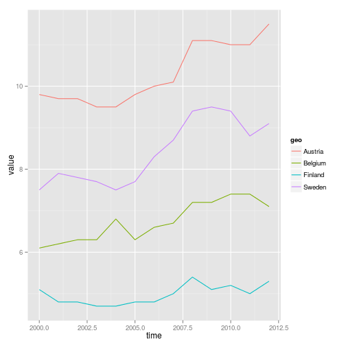
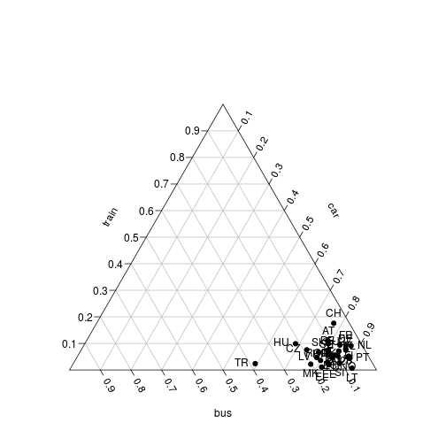

<!--
%\VignetteEngine{knitr::rmarkdown}
%\VignetteIndexEntry{eurostat Markdown Vignette}
%\usepackage[utf8]{inputenc}
-->


Eurostat R tools
===========

This R package provides tools to access 
[Eurostat database](http://ec.europa.eu/eurostat/) 
as part of the [rOpenGov](http://ropengov.github.io) project.

For contact information and source code, see the [github page](https://github.com/rOpenGov/eurostat)

## Available tools

 * [Installation](#installation)  
 * [Finding data](#search)  
 * [Downloading data](#download)  
 * [Replacing codes with labels](#labeling)  
 * [Selecting and modifying data](#select)  
 * [Visualization](#visualization)  
   * [Triangle plot](#triangle)  
 * [Citing the package](#citing)  
 * [Acknowledgements](#acknowledgements)  
 * [Session info](#session)  


## <a name="installation"></a>Installation

Release version:


```r
install.packages("eurostat")
```

Development version:


```r
library(devtools)
install_github("ropengov/eurostat")
```

## <a name="search"></a>Finding data

Function `get_eurostat_toc()` downloads a table of contents of eurostat datasets. The values in column 'code' should be used to download a selected dataset.


```r
# Load the package
library(eurostat)

# Get Eurostat data listing
toc <- get_eurostat_toc()

# Check the first items
library(knitr)
kable(head(toc))
```


|title                                                            |code      |type    |last.update.of.data |last.table.structure.change |data.start |data.end | values|
|:----------------------------------------------------------------|:---------|:-------|:-------------------|:---------------------------|:----------|:--------|------:|
|Database by themes                                               |data      |folder  |                    |                            |           |         |     NA|
|    General and regional statistics                              |general   |folder  |                    |                            |           |         |     NA|
|        European and national indicators for short-term analysis |euroind   |folder  |                    |                            |           |         |     NA|
|            Business and consumer surveys (source: DG ECFIN)     |ei_bcs    |folder  |                    |                            |           |         |     NA|
|                Consumer surveys (source: DG ECFIN)              |ei_bcs_cs |folder  |                    |                            |           |         |     NA|
|                    Consumers - monthly data                     |ei_bsco_m |dataset |25.02.2015          |25.02.2015                  |1985M01    |2015M02  |     NA|

With `search_eurostat()` you can search the table of contents for particular patterns, e.g. all datasets related to *passenger transport*. The kable function to produces nice markdown output. Note that with the `type` argument of this function you could restrict the search to for instance datasets or tables.


```r
# info about passengers
kable(head(search_eurostat("passenger transport")))
```


|     |title                                                                                                                                    |code            |type    |last.update.of.data |last.table.structure.change |data.start |data.end | values|
|:----|:----------------------------------------------------------------------------------------------------------------------------------------|:---------------|:-------|:-------------------|:---------------------------|:----------|:--------|------:|
|5192 |                Volume of passenger transport relative to GDP                                                                            |tran_hv_pstra   |dataset |25.06.2014          |25.06.2014                  |1995       |2012     |     NA|
|5193 |                Modal split of passenger transport                                                                                       |tran_hv_psmod   |dataset |25.06.2014          |25.06.2014                  |1990       |2012     |     NA|
|5232 |                Railway transport - Total annual passenger transport (1 000 pass., million pkm)                                          |rail_pa_total   |dataset |10.03.2015          |10.07.2014                  |2004       |2013     |     NA|
|5236 |                International railway passenger transport from the reporting country to the country of disembarkation (1 000 passengers) |rail_pa_intgong |dataset |03.03.2015          |26.02.2015                  |2002       |2013     |     NA|
|5237 |                International railway passenger transport from the country of embarkation to the reporting country (1 000 passengers)    |rail_pa_intcmng |dataset |03.03.2015          |26.02.2015                  |2002       |2013     |     NA|
|5588 |                    Air passenger transport by reporting country                                                                         |avia_paoc       |dataset |10.02.2015          |10.02.2015                  |1993       |2014Q4   |     NA|

## <a name="download"></a>Downloading data 

Here an example of indicator [Modal split of passenger transport](http://ec.europa.eu/eurostat/tgm/table.do?tab=table&init=1&plugin=1&language=en&pcode=tsdtr210). This is the percentage share of each mode of transport in total inland transport, expressed in passenger-kilometres (pkm) based on transport by passenger cars, buses and coaches, and trains. All data should be based on movements on national territory, regardless of the nationality of the vehicle. However, the data collection is not harmonized at the EU level. 

Pick and print the id of the data set to download: 

```r
id <- search_eurostat("Modal split of passenger transport", 
        	             type = "table")$code[1]
print(id)
```

[1] "tsdtr210"

Get the corersponding table. As the table is annual data, it is more
convient to use a numeric time variable than use the default date format:


```r
dat <- get_eurostat(id, time_format = "num")
```

Investigate the structure of the downloaded data set:

```r
str(dat)
```

'data.frame':	2415 obs. of  4 variables:
 $ vehicle: Factor w/ 3 levels "BUS_TOT","CAR",..: 1 1 1 1 1 1 1 1 1 1 ...
 $ geo    : Factor w/ 35 levels "AT","BE","BG",..: 1 2 3 4 5 6 7 8 9 10 ...
 $ time   : num  1990 1990 1990 1990 1990 1990 1990 1990 1990 1990 ...
 $ values : num  NA NA NA NA NA NA NA NA NA NA ...

```r
kable(head(dat))
```


|vehicle |geo | time| values|
|:-------|:---|----:|------:|
|BUS_TOT |AT  | 1990|     NA|
|BUS_TOT |BE  | 1990|     NA|
|BUS_TOT |BG  | 1990|     NA|
|BUS_TOT |CH  | 1990|     NA|
|BUS_TOT |CY  | 1990|     NA|
|BUS_TOT |CZ  | 1990|     NA|

### <a name="labeling"></a>Replacing codes with labels

Eurostat variable IDs can be replaced with human-readable labels.
Function `label_eurostat()` replaces the eurostat IDs based on
definitions from Eurostat dictionaries.


```r
datl <- label_eurostat(dat)
kable(head(datl))
```


|vehicle                                |geo            | time| values|
|:--------------------------------------|:--------------|----:|------:|
|Motor coaches, buses and trolley buses |Austria        | 1990|     NA|
|Motor coaches, buses and trolley buses |Belgium        | 1990|     NA|
|Motor coaches, buses and trolley buses |Bulgaria       | 1990|     NA|
|Motor coaches, buses and trolley buses |Switzerland    | 1990|     NA|
|Motor coaches, buses and trolley buses |Cyprus         | 1990|     NA|
|Motor coaches, buses and trolley buses |Czech Republic | 1990|     NA|

Vehicle information has 3 levels. They are:

```r
levels(datl$vehicle)
```

```
## [1] "Motor coaches, buses and trolley buses"
## [2] "Passenger cars"                        
## [3] "Trains"
```

You can get also labels for variable names

```r
label_eurostat_vars(names(datl))
```

```
## [1] "Vehicles"                                                                            
## [2] "Geopolitical entity (reporting)"                                                     
## [3] "Period of time (a=annual, q=quarterly, m=monthly, d=daily, c=cumulated from January)"
## [4] "VALUES"
```


## <a name="select"></a>Selecting and modifying data

### EU data from 2012 in all vehicles:


```r
dat_eu12 <- subset(datl, geo == "European Union (28 countries)" & time == 2012)
kable(dat_eu12, row.names = FALSE)
```


|vehicle                                |geo                           | time| values|
|:--------------------------------------|:-----------------------------|----:|------:|
|Motor coaches, buses and trolley buses |European Union (28 countries) | 2012|    9.2|
|Passenger cars                         |European Union (28 countries) | 2012|   83.3|
|Trains                                 |European Union (28 countries) | 2012|    7.4|

### EU data from 2000 - 2012 with vehicle types as variables:

Reshaping the data is best done with `spread()` in `tidyr`.

```r
library("tidyr")
dat_eu_0012 <- subset(dat, geo == "EU28" & time %in% 2000:2012)
dat_eu_0012_wide <- spread(dat_eu_0012, vehicle, values)
kable(subset(dat_eu_0012_wide, select = -geo), row.names = FALSE)
```


| time| BUS_TOT|  CAR| TRN|
|----:|-------:|----:|---:|
| 2000|     9.9| 82.9| 7.2|
| 2001|     9.8| 83.2| 7.1|
| 2002|     9.6| 83.6| 6.8|
| 2003|     9.5| 83.9| 6.7|
| 2004|     9.4| 83.8| 6.8|
| 2005|     9.5| 83.7| 6.9|
| 2006|     9.2| 83.7| 7.0|
| 2007|     9.3| 83.6| 7.1|
| 2008|     9.1| 83.7| 7.2|
| 2009|     8.7| 84.3| 7.0|
| 2010|     8.7| 84.2| 7.1|
| 2011|     9.1| 83.7| 7.1|
| 2012|     9.2| 83.3| 7.4|

### Train passengers for selected EU countries in 2000 - 2012


```r
dat_trains <- subset(datl, geo %in% c("Austria", "Belgium", "Finland", "Sweden")
                     & time %in% 2000:2012 
                     & vehicle == "Trains")

dat_trains_wide <- spread(dat_trains, geo, values) 
kable(subset(dat_trains_wide, select = -vehicle), row.names = FALSE)
```


| time| Austria| Belgium| Finland| Sweden|
|----:|-------:|-------:|-------:|------:|
| 2000|     9.8|     6.1|     5.1|    7.5|
| 2001|     9.7|     6.2|     4.8|    7.9|
| 2002|     9.7|     6.3|     4.8|    7.8|
| 2003|     9.5|     6.3|     4.7|    7.7|
| 2004|     9.5|     6.8|     4.7|    7.5|
| 2005|     9.8|     6.3|     4.8|    7.7|
| 2006|    10.0|     6.6|     4.8|    8.3|
| 2007|    10.1|     6.7|     5.0|    8.7|
| 2008|    11.1|     7.2|     5.4|    9.4|
| 2009|    11.1|     7.2|     5.1|    9.5|
| 2010|    11.0|     7.4|     5.2|    9.4|
| 2011|    11.0|     7.4|     5.0|    8.8|
| 2012|    11.5|     7.1|     5.3|    9.1|


## <a name="visualization"></a>Visualization

Visualizing train passenger data with `ggplot2`:


```r
library(ggplot2)
p <- ggplot(dat_trains, aes(x = time, y = values, colour = geo)) 
p <- p + geom_line()
print(p)
```

 

### <a name="triangle"></a>Triangle plot

Triangle plot on passenger transport distributions with 2012 data for all countries with data.


```r
library(reshape2)

allTransports <- spread(subset(dat, time == 2012, select = -time), vehicle, values)

allTransports <- na.omit(allTransports)

# triangle plot
library(plotrix)
triax.plot(allTransports[, -1], show.grid = TRUE, 
           label.points = TRUE, point.labels = allTransports$geo, 
           pch = 19)
```

 


## <a name="citing"></a>Citing the package

**Citing the Data** Kindly cite [Eurostat](http://ec.europa.eu/eurostat/). 

**Citing the R tools** This work can be freely used, modified and
distributed under the BSD-2-clause (modified FreeBSD) license:


```r
citation("eurostat")
```

```
## 
## Kindly cite the eurostat R package as follows:
## 
##   (C) Leo Lahti, Przemyslaw Biecek, Janne Huovari and Markus Kainu
##   2014. eurostat R package URL:
##   https://github.com/rOpenGov/eurostat
## 
## A BibTeX entry for LaTeX users is
## 
##   @Misc{,
##     title = {eurostat R package},
##     author = {Leo Lahti and Przemyslaw Biecek and Janne Huovari and Markus Kainu},
##     year = {2014},
##     url = {https://github.com/rOpenGov/eurostat},
##   }
```

## <a name="acknowledgements"></a>Acknowledgements

We are grateful to [Eurostat](http://ec.europa.eu/eurostat/) for the open data portal! This [rOpenGov](http://ropengov.github.io) R package is based on earlier CRAN packages [statfi](http://cran.r-project.org/web/packages/statfi/index.html) and [smarterpoland](http://cran.r-project.org/web/packages/SmarterPoland/index.html). The [datamart](http://cran.r-project.org/web/packages/datamart/index.html) and [reurostat](https://github.com/Tungurahua/reurostat) packages seem to develop related Eurostat tools but at the time of writing this tutorial this package seems to be in an experimental stage. The [quandl](http://cran.r-project.org/web/packages/Quandl/index.html) package may also provides access to some versions of eurostat data sets. 


## <a name="session"></a>Session info

This tutorial was created with


```r
sessionInfo()
```

```
## R version 3.1.2 (2014-10-31)
## Platform: x86_64-pc-linux-gnu (64-bit)
## 
## locale:
##  [1] LC_CTYPE=en_US.UTF-8       LC_NUMERIC=C              
##  [3] LC_TIME=en_US.UTF-8        LC_COLLATE=en_US.UTF-8    
##  [5] LC_MONETARY=en_US.UTF-8    LC_MESSAGES=en_US.UTF-8   
##  [7] LC_PAPER=en_US.UTF-8       LC_NAME=C                 
##  [9] LC_ADDRESS=C               LC_TELEPHONE=C            
## [11] LC_MEASUREMENT=en_US.UTF-8 LC_IDENTIFICATION=C       
## 
## attached base packages:
## [1] stats     graphics  grDevices utils     datasets  methods   base     
## 
## other attached packages:
## [1] plotrix_3.5-11   reshape2_1.4.1   ggplot2_1.0.0    tidyr_0.2.0.9000
## [5] eurostat_1.0.14  knitr_1.9       
## 
## loaded via a namespace (and not attached):
##  [1] assertthat_0.1   colorspace_1.2-6 DBI_0.3.1        digest_0.6.8    
##  [5] dplyr_0.4.1      evaluate_0.5.5   formatR_1.0      grid_3.1.2      
##  [9] gtable_0.1.2     labeling_0.3     magrittr_1.5     MASS_7.3-39     
## [13] munsell_0.4.2    parallel_3.1.2   plyr_1.8.1       proto_0.3-10    
## [17] Rcpp_0.11.5      scales_0.2.4     stringi_0.4-1    stringr_0.6.2   
## [21] tools_3.1.2
```
